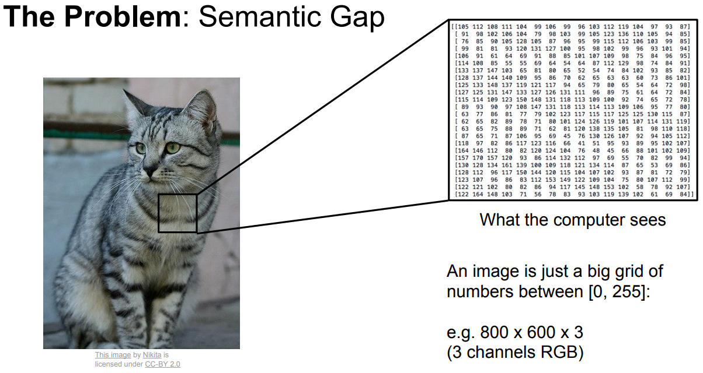
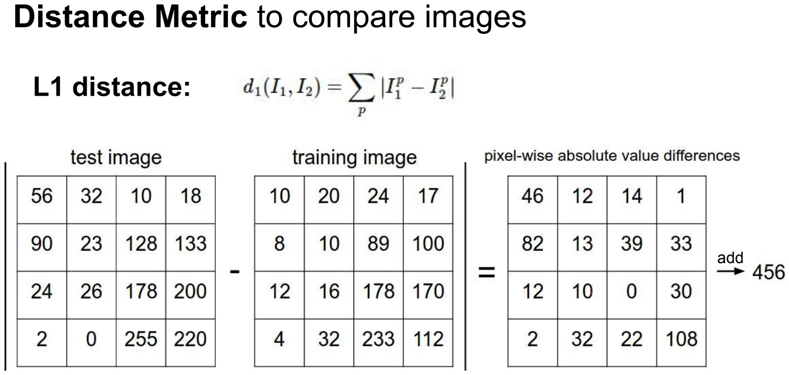
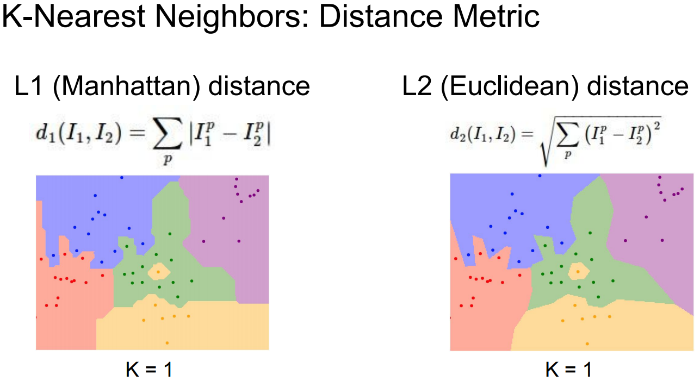
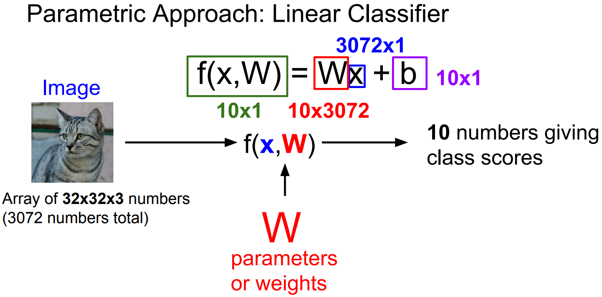
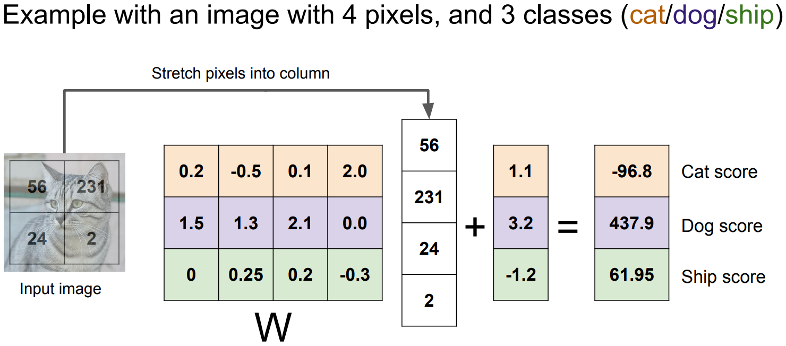
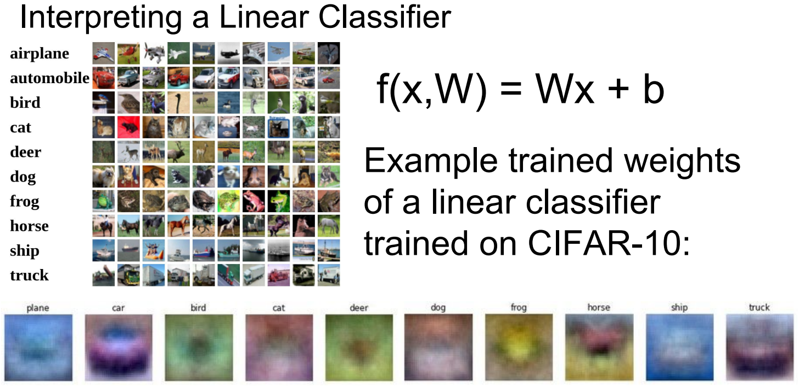

# lecture 2. Image Classfication

## Image Classification

```
컴퓨터비전 분야의 Core Task
이미지 분류?: 입력 이미지가 정해놓은 카테고리의 어디에 속하는지 고르는 일.
```



```
고도화된 시각체계를 가진 인간에게는 쉽지만 기계에게는 정말 어려운 일.
의미론적 차이(Semantic Gap) 발생: 컴퓨터에겐 이미지는 단순히 격자형태의 숫자집합.
```

컴퓨터비전 Challenges: 동일한 물체라도 그 픽셀값들이 모조리 바뀌는 환경요소들.

```
Viewpoint variation: 시점 변화에도 동일한 물체로 인식함
Illumination: 물체가 밝은곳에 있던 어두운 곳에 있던 동일한 물체로 인식해야함.
Deformation: 물체의 형태가 변하더라도 동일한 물체로 인식해야함.
Occlusion: 물체의 일부만 볼 수 있더라도 물체로 인식해야함.
Background Clutter: 물체가 배경과 매우 유사하더라도 물체를 인식해야함.
Interclass variation: 하나의 개념(클래스)로 모든 물체의 다양한 모습을 전부 소화해 내야 한다.
```

## An image classifier

사물인식의 경우, 알고리즘 문제와 같이 직관적이고 명시적인 알고리즘은 존재하지 않는다.

```
def classify_image(image):
	# Some magic here?
	return class_label
```

- 지금까지 연구들은 사물을 인식하기위한 coded rules를 만들고자 시도해왔었다.

```
Hubel과 Wiesel의 연구 덕분에 Edges는 중요한 feature로 알려져있다.
우선 이미지에서 edges를 계산하고 다양한 corners와 egdes로 분류한다.
각 모퉁이와 엣지의 집합으로 사물을 인식하기 위한 명시적인 규칙 집합을 작성한다.
```

- 이런 접근의 문제점

```
강인하지 못하다.
확장성이 없다.
```

## Data-Driven Approach: 이 세상에 존재하는 다양한 객체들에게 유연하게 적용 가능한 확장성 있는 알고리즘

```
1. 데이터셋(이미지, 라벨)을 만든다.
2. 기계학습으로 classifier를 학습시킨다.
3. 새로운 이미지들에 대해 classifier를 평가한다.
```

머신러닝의 key insight: predict함수와 train함수의 분리.

```
def train(images, labels):
	# Machine Learning!
	return model
```

```
def predict(model, test_images):
	# Use model to predict labels
	return test_labels
```

### 1. First Classifier: Nearest Neighbor(NN)

```
import numpy as np

class NearestNeigbor:
    def __init__(self):
        pass
    
    def train(self, X, y):
        # X: N*D, 각 행이 example
        # Y: N*1
        
        # NN의 classifier는 단순히 모든 데이터들을 저장.
        self.X_tr = X # 데이터
        self.y_tr = y # 라벨
        
    def predict(self, X):
        # X: N*D, 각행이 example ... 우리가 예측하려는 대상
        
        nums_test = X.shape[0]
        
        # 예측 결과 저장변수 초기화
        Y_pred = np.zeros(num_test, dtype=self.y_tr.dtype)
        
        # 모든 row에 대해 확인
        for i in xrange(num_test):
            # i'th 테스트 이미지에 대해 가장 가까운 훈련 이미지를 찾자
            # L1 dist 사용
            dist = np.sum(np.abs(self.X_tr - X[i,:]), axis=1)
            min_idx = np.argmin(distances) # 가장 작은 l1 dist를 가지는 idx 확보
            Y_pred[i] = self.ytr[min_idx] # 가장 가까운 훈련데이터의 라벨로 예측
        
        return Y_pred
```

매우 간단하지만 Data-Driven Approach로 아주 좋은 알고리즘

```
def train: 데이터와 라벨을 저장하는 것 외 아무 동작도 하지 않음.
def predict: 입력과 가장 유사한 훈련 데이터를 찾아 그것의 라벨로 입력 데이터를 라벨링함.
```

중요한 점: 이미지 쌍이 있을 때 어떻게 비교할 것인가? 어떤 비교 함수를 사용할 것인가?



```
Q. N개의 예제가 있을 때, training과 prediction의 시간복잡도는?
A. Train O(1), Predict O(N).
... 뒤집어짐: 실제로 Train Time은 느려도 되지만 Test Time에서는 빠르게 동작하길 원한다.
```

NN의 일반화 모델: K-Nearest Neighbors

```
단순히 가장 가까운 데이터 포인트를 복사하기 보다, K개의 가까운 데이터 포인트들의 다수결로 결정.
```

거리 척도(distance metric)의 선택

```
서로 다른 척도에서는 공간의 근본적인 기하학 구조가 달라짐.
L1은 좌표 시스템에 따라 많은 영향을 받음.
가령 기존 좌표계를 회전시킨다면 L1 거리는 달라지게 됨.
반면 L2 거리는 좌표계와 아무 연관이 없음.
... 만일 특징 벡터들이 각각 요소의 개별적인 의미를 가지고 있다면(e.g. 키, 몸무게) L1 거리가 더 잘 어울릴 수 있음.
... 하지만 특징 벡터가 일반적인 벡터이고, 요소들간 실질적인 의미를 잘 모른다면, 아마도 L2 거리가 조금은 더 잘 어울릴 수 있음.
... 거리 척도만 정해준다면 어떤 종류의 데이터도 다룰 수 있다는 것.
```



매우 간단하기에 새로운 문제를 접했을 때 시도해 볼만한 아주 좋은 알고리즘.

단, 입력이 이미지인 경우 k-NN 분류기를 잘 사용하지 않는다.

```
1. test time에서 너무나 느린 알고리즘.
2. 벡터 간 거리 척도는 이미지들 간의 '공간적 유사성'을 측정함에 적절하지 않다.
3. 차원의 저주(Curse of dimensionality)
... k-NN은 데이터 샘플을 통해 공간을 나누는 알고리즘
... 잘 동작하려면 전체 공간을 조밀하게 커버할 만큼의 충분한 트레이닝 샘플이 필요하다.
... 고차원의 이미지라면 모든 공간을 조밀하게 메울만큼의 데이터를 모으는 일은 현실적으로 불가하다.
```

```
가장 적절한 k값은 무엇인가? 가장 적절한 거리척도는 무엇일까?
k와 거리척도가 k-NN의 하이퍼 파라미터: 프로그래머가 학습 전에 반드시 선택해야한다.

하이퍼 파라미터는 문제의존적
... 가장 간단하게는 다양한 값을 시도해 보고 가장 좋은 값을 찾는다.
```

### 2. 하이퍼 파라미터 설정

idea #1: 전체 학습데이터의 정확도와 성능을 최대화하는 하이퍼파라미터를 선택.

```
최악의 방법.
학습데이터셋에 과적합.
```

idea #2: 전체 데이터셋을 쪼개서 일부를 테스트 데이터로 사용. 학습한 모델의 성능을 테스트 데이터에서 확인.

```
합리적일거 같지만 역시나 끔찍한 방법.
기계학습의 궁극적인 목적은 한번도 보지 못한 데이터에서 잘 동작해야 한다!
... 테스트셋으로는 한번도 보지못한 데이터를 선택해야한다.
```

idea #3: 전체 데이터셋의 대부분은 트레이닝 셋으로, 일부는 밸리데이션셋, 나머지는 테스트셋으로 사용. 트레이닝셋을 학습시킨 모델을 밸리데이션셋으로 검증!

idea #4: 크로스 밸리데이션(교차 검증)

```
우선 테스트 데이터를 정해놓음. (마지막에만 사용)
트레이닝 데이터를 여러 부분으로 나눠주고, 번갈아 가면서 밸리데이션셋을 설정.

이 방식은 데이터가 작은 경우 거의 표준이긴 하지만,
딥러닝과 같은 큰 모델을 학습시킬 때는 학습 자체가 계산량이 많기에 실제로 잘 쓰지 않음.
```

### 3. Second Classification: Linear Classification

Parametric Approach



```
트레이닝셋의 정보를 W에 요약.
이 방식은 Test time에서 더이상 트레이닝셋이 필요 없게됨.
W에 요약된 트레이닝셋 정보로 작은 디바이스에서 모델을 동작시킬 수 있음.

딥러닝은 이 함수 F의 구조를 적절히 잘 설계하는 일.
어떤 식으로 가중치 W와 데이터를 조합할지 여러 복잡한 방법으로 고려해 볼 수 있음.
이 과정들이 모두 다양한 NN 아키텍쳐를 설계하는 과정.

가중치 W와 데이터 X를 조합하는 가장 간단한 방법이 그냥 둘을 곱하는 것.
이 방법이 바로 Linear classification: F(x, W) = Wx

F(x, W) = Wx + b
Bias term(b)을 사용하기도 한다.
그 사이즈는 F의 사이즈와 같고, 입력과 직접 연결되지 않으며 데이터에 무관하게 특정 클래스에 우선권을 부여하는 역할이다.
데이터셋이 불균등한 경우 바이어스를 조정하여 모델을 조정한다.
```

Linear Classification의 동작: Template Matching



```
입력 데이터 x: 4*1 벡터(픽셀)
가중치 행렬 W: 3*4 행렬
바이어스 b: 3*1 벡터

템플릿 매칭과 거의 유사한 동작.
W의 각 행: 각 이미지에 대한 템플릿.
W*x의 내적: 각 클래스 템플릿과 입력의 유사도 측정
b: 각 클래스에 scailing offsets을 더해줌.
```



```
Linear classifier의 각 클래스 템플릿이 하는 일을 짐작 가능.

비행기의 경우: Linear classifier가 비행기를 분류할 때, 푸르스름한 것들을 찾고 있다는 것.
자동차의 경우: 중앙에 불그스름한 불빛과 앞유리 같은듯...? 조금 이상하다.

각 클래스에 대해 오직 하나의 템플릿만 학습하는 것이 Linear Classifier의 약점.
한 클래스에 다양한 특징들이 존재할 수 있지만, 그 모든 것들을 평균하기에 활용할 수 가없다.

한 클래스에 여러개의 템플릿을 학습할 수 있는 딥러닝에선 보다 좋은 성능을 기대할 수 있다.
```