# Lecture 6. Training Neural Networks 1

```
네트워크 파라미터: Optimization을 통해서 학습
... Loss로 표현된 W의 공간에서 Loss가 줄어드는 방향으로 이동.
... gradient의 반대방향으로 이동하는 것과 같음.

== Mini-batch SGD(Stochastic Gradient Descent)
... 실행 속도를 높이기 위해 일부 데이터(Batch)만으로 학습을 진행.
... Forward pass를 수행한 뒤 Loss 계산.
... Backprop하여 gradient 계산.
... 얻은 gradient를 이용해 파라미터 업데이트.
...
```

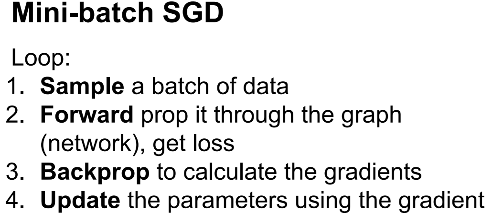

## Overview Training Neural Networks

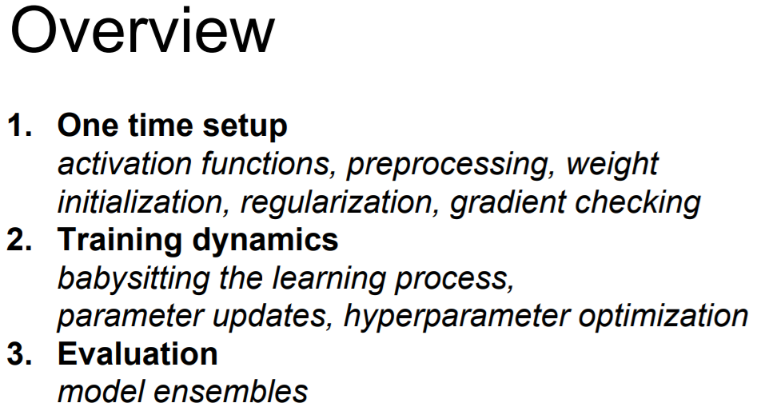

```
1. NN 학습을 시작하기 앞서 필요한 기본 설정?
... 활성화함수 선택.
... 데이터 전처리. 
... 가중치 초기화.

2. Training Dynamics?
... 학습이 잘 되고 있는지 확인하는 방법.
... 파라미터를 업데이트하는 방식.
... 가장 적절한 하이퍼파라미터를 찾기위한 Optimization.

3. 평가?
... 모델 앙상블.
```

## Part 1

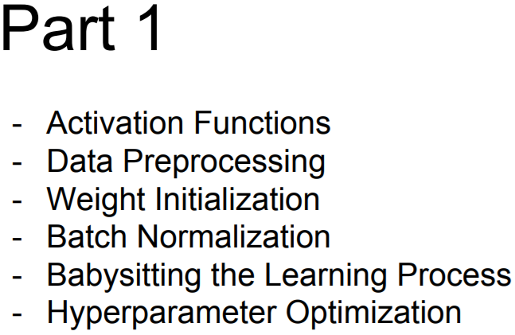

### Activation Functions

```
다양한 종류의 활성함수와 그들간의 Trade-off를 다뤄보자.
```

- Sigmoid

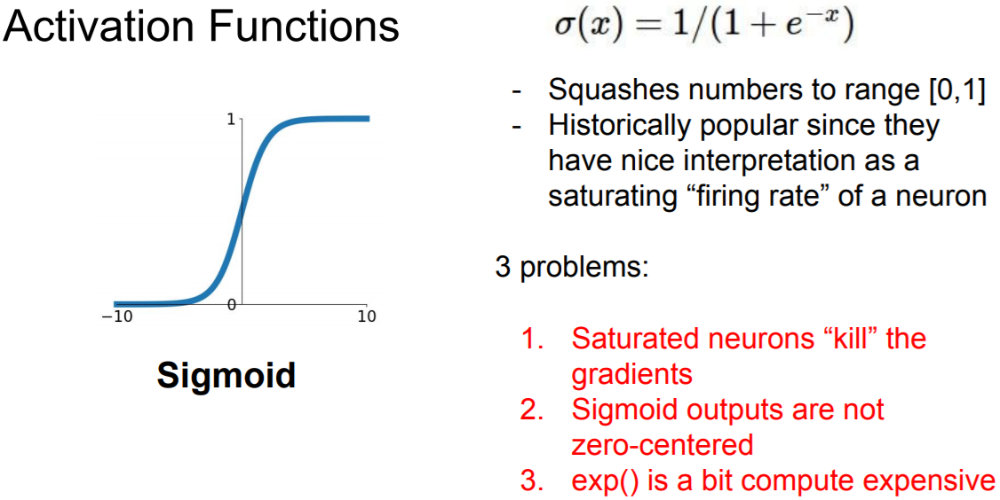

```
Sigmoid의 역할: 입력을 받아 [0, 1] 사이의 값으로 만듦.
... 입력이 크면, Sigmoid(입력) ≒ 1.
... 입력이 작으면, Sigmoid(입력) ≒ 0.
... 0근처 구간: 선형함수와 유사.

... 뉴런의 Firing rate를 saturation 시키는 것으로 해석가능.
```

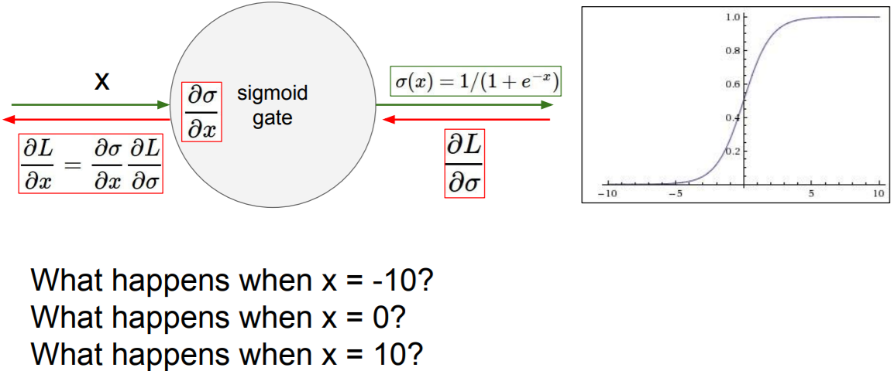

```
Sigmoid의 문제점 1. Saturation된 뉴런은 gradient를 없앤다.
... x = -10일때 sigmoid는 flat, gradient = 0 ... 밑으로 0이 계속 전달됨.
... x = 0 ... 잘 동작함.
... x = 10일때 sigmoid는 flat, gradient = 0 ... 밑으로 0이 계속 전달됨.
```

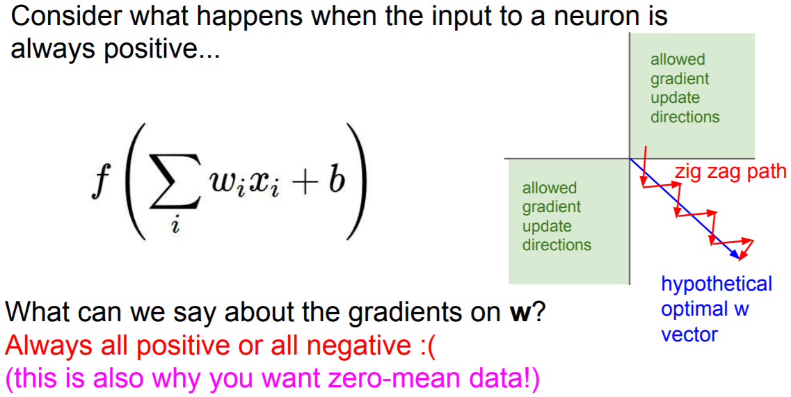

```
Sigmoid의 문제점 2. sigmoid의 출력이 zero-centered 하지 않다.
... 위어서 dL/df(활성함수)가 넘어옴 ... 이 값이 음수 또는 양수가 됨.
... local gradient는 이 값이랑 곱해지고 df(활성함수)/dW는 그냥 X가 됨.

... gradient 부호는 그저 위에서 내려온 gradient와 같은 부호를 가짐.
... W가 모두 같은 방향으로만 움직이게된다는 것을 의미함.
... 이런 gradient 업데이트는 아주 비효율적.

일반적으로 zero-mean data를 원하는 이유.
... 입력 X가 양수/음수를 모두 가지고 있으면 전부 같은 방향으로 움직이는 일이 발생하지 않을 것.
... 즉, 적절한 파라미터 업데이트 방향으로 움직일 수 있음.

Sigmoid의 문제점 3. exp연산량이 크다.
... 그렇게 큰 문제는 안됨 ... 다른 연산(내적)의 계산량이 더 큼.
```

- Tanh

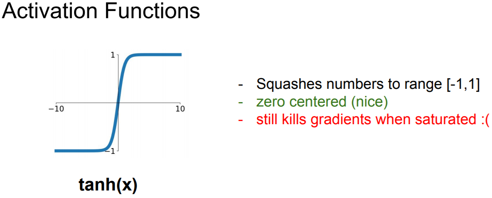

```
Sigmoid와 유사. 하지만 범위가 [-1, 1].
가장 큰 차이점: zero-centered.

여전히 flat한 구간으로 인해 gradient를 없앤다.
```

- ReLU

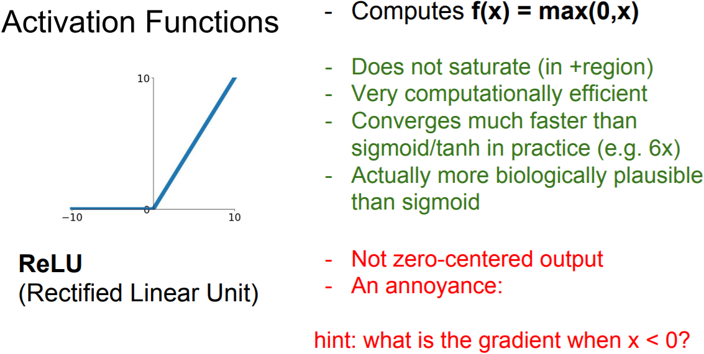

```
ReLU의 역할: element-wise 연산을 수행하며 음수면 0, 양수면 그대로 출력.

Sigmoid & Tanh 대비 개선사항.
1. 적어도 입력스페이스의 절반은 saturation 되지 않음.
... ReLU의 가장 큰 장점.

2. 뛰어난 계산효율.
... 단순한 max 연산으로 빠른 계산.
... Sigmoid, Tanh 대비 6배 빠른 수렴 속도.

3. 생물학적 타당성.
... 실제 뉴런의 입/출력 형태와 비슷함.

2012 ImageNet 우승한 AlexNet에서 처음 ReLU를 사용하기 시작함.

ReLU의 문제점.
- zero-centered가 아니다.
- 음의 입력에 대해서는 Saturation ... dead ReLU 발생.
```

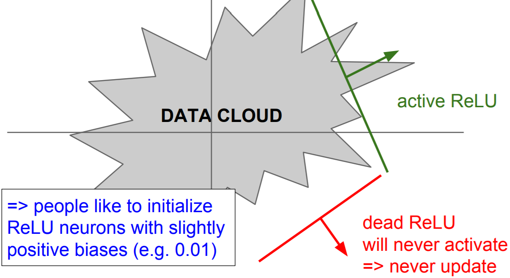

```
Dead ReLU: 평면의 절반만 activate됨.

원인.
1. 잘 못된 초기화.
... Dead ReLU와 같은 경우.
... 가중치 평면(W)가 Data cloud(트레이닝셋)에서 멀리 떨어진 경우.
... 모든 데이터 입력에 대해 activate되지 않아 backprop이 발생하지 않음.
... positive biases(e.g. 0.01)을 추가하여 update시 activate ReLU가 될 가능성을 조금이라도 높여줌.

2. Learning rate가 지나치게 높은 경우: 보다 흔한 경우.
... 처음에 적절한 ReLU로 시작하더라도 update를 지나치에 크게 해버려 가중치가 날뜀.
... ReLU가 데이터의 manifold를 벗어나게 됨.
... 학습과정에서 충분히 일어나는 경우 ... 네트워크 학습에 크게 지장이 있진 않음.
```

- Leaky ReLU

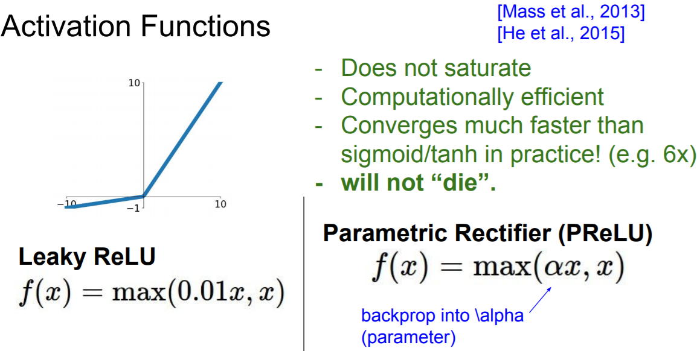

```
ReLU의 단점 개선1: Leaky ReLU, PReLU.
... ReLU와 유사하지만 음수에서 더 이상 0이 아님 ... Dead ReLU 현상 해결.
... 여전히 효율적 계산.

PReLU: Negative space의 기울기를 학습하는 Leaky ReLU.
... 정해진 alpha가 아닌 backpro으로 학습하여 보다 유연한 활성함수.
```

- ELU

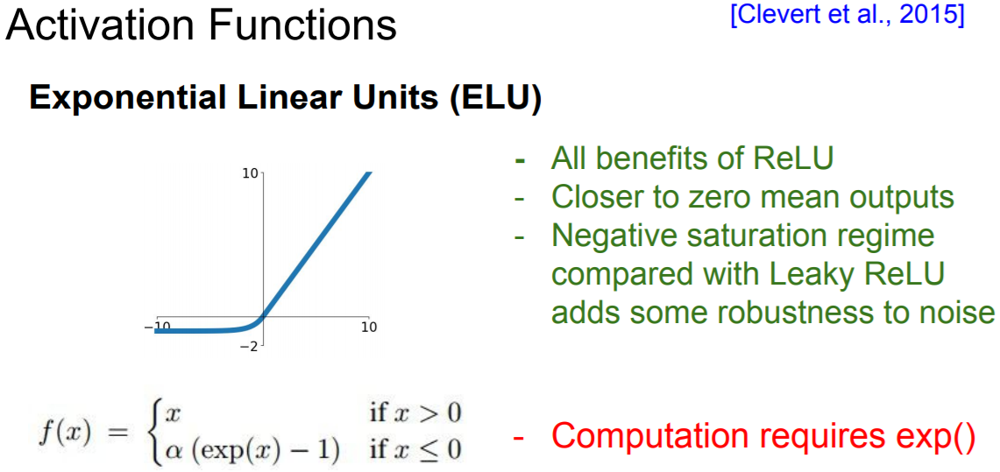

```
ELU
... 음수부에서 기울기 대신 다시 Saturation.
... deactivation으로 보다 noise에 강한 활성함수.

ReLU + Leaky ReLU
... Saturation의 관점: ReLU의 특성.
... zero-mean의 관점: Leaky ReLU의 특성.
```

- Maxout ''Neuron''

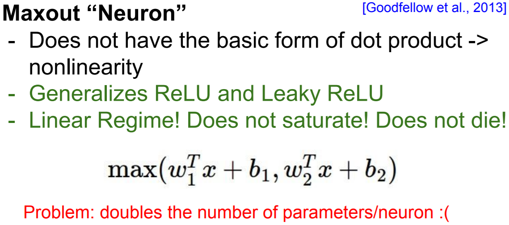

```
ReLU와 Leaky ReLU의 좀 더 일반화된 형태.
... 이 둘의 선형함수를 취하기 때문.
... Maxout 또한 선형이기에 Saturation이 없어 gradient가 죽지 않음.

문제점: 뉴런당 두배의 파라미터.
```

- 활성화함수 정리.

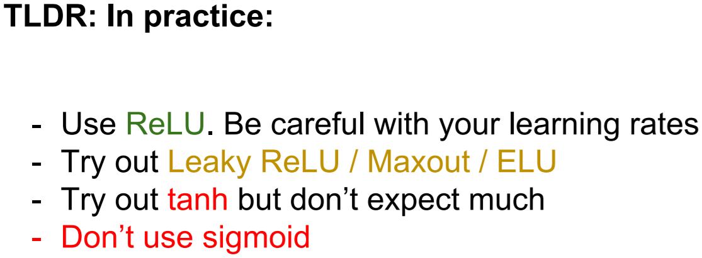

```
ReLU가 가장 일반적.
LU계열 중 실험적으로 사용.
```

### Data Preprocessing

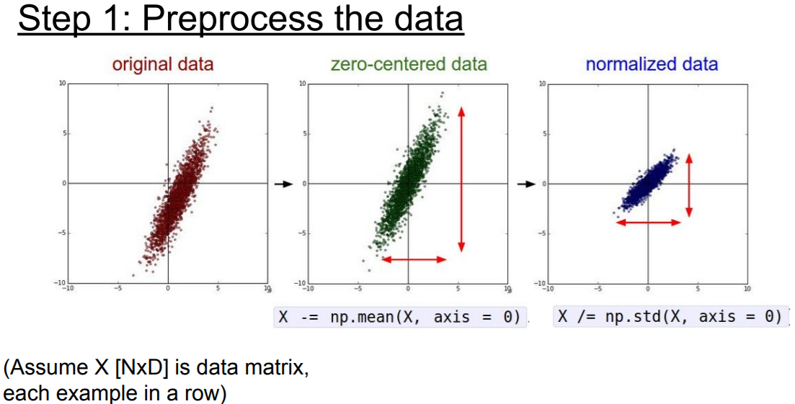

```
가장 대표적인 전처리 과정.
zero-mean: zero-centering으로 적절한 학습 방향 제공.
normalize(표준편차): 모든 차원의 영향력을 동일하게 설정.

이미지 입력의 경우 zero-mean만 수행.
... 이미지는 이미 각 차원 간 스케일이 어느정도 맞춰져 있음.
... ML에서 주로 사용되는 PCA나 Whiteing의 복잡한 전처리는 잘 해주지 않음.
... 이미지 그자체의 공간적 정보를 얻기위해 최소한의 전처리만 하는 것.

이미지 전처리는 전체 데이터셋에 적용.
... 미니배치의 평군이 아니라 트레이닝셋의 평균으로.
... 평균을 채널별로(VGG방식) 구할지, 채널전체(Alex방식)에 대해 구할지는 판단하기 나름.

전처리는 활성화함수의 문제를 해결해내지 못함.
... 전처리된 데이터는 오직 첫번째 layer의 입력일 뿐임.
```

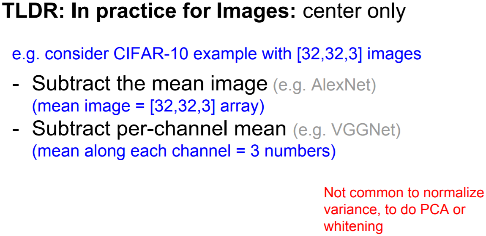

### Weight Initialization

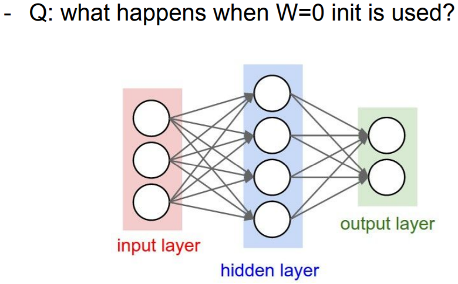

```
Q. W = 0으로 세팅한다면 어떻게 될까?
A. 가중치가 0이라서 모든 뉴런이 모두 같은 연산을 수행한다.
... 출력도 모두 같고, gradient도 서로 같다.
... 결국 모든 W가 똑같은 값으로 업데이트 된다.
... 모든 뉴런이 똑같이 생기게 되고 똑같은 역할을 한다. 우리가 원하는 결과가 아님.

W를 모두 같게 설정하면 Symmetry breaking이 발생할 수 없다.
```

- 초기화 문제 해결방법 1. 임의의 작은 값으로 초기화

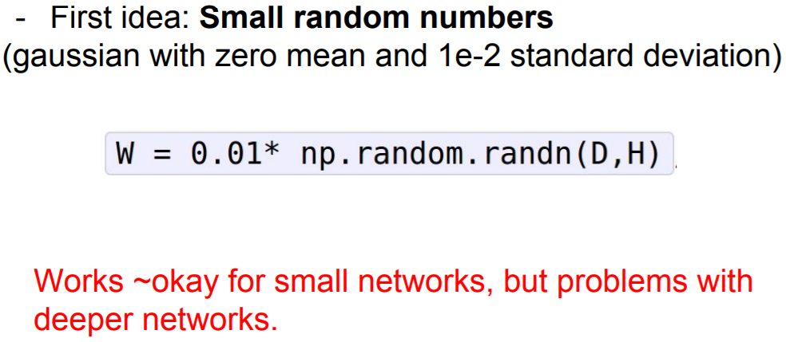

```
네트워크가 작을 경우 충분히 Symmetry breaking.
하지만 네트워크가 깊어지면 문제 발생.
... forward pass: W가 너무 작은 값들이라 곱하면 곱할수록 값이 급격히 줄어들게 됨 ... 결국엔 0에 수렴하고 Symmetry breaking 실패.
... backward pass: W가 계속 곱해져 gradient값이 작아지다가 0으로 수렴.
```

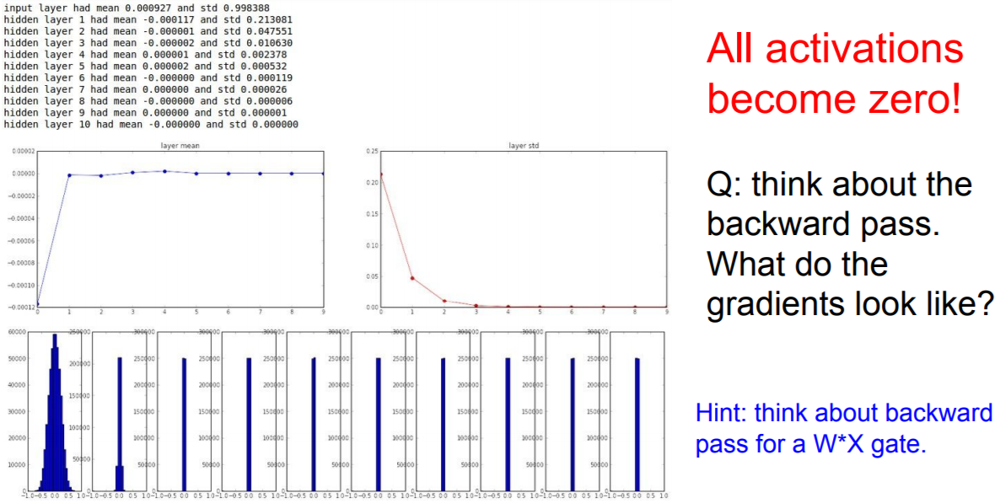

- 초기화 문제 해결방법 2. 임의의 큰 값으로 초기화

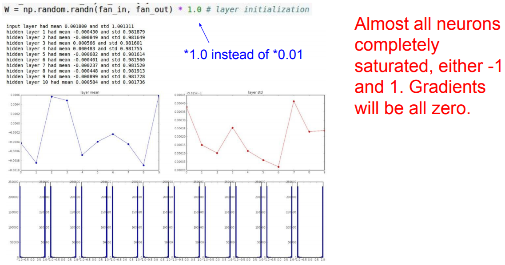

```
활성화함수(tanh)의 입력이 커지면서 Saturation.
... gradient는 0이되어 가중치 업데이트가 발생하지 않음.
```

- 초기화 문제 해결방법 3. Xavier initialization

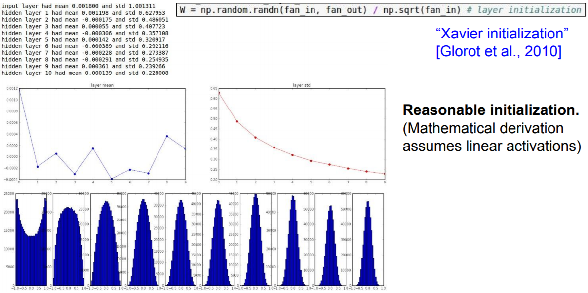

```
W: Standard gaussian으로 뽑은 값을 입력의 수로 스케일링.
... 입/출력의 분산을 맞춰주는 역할.
... 각 layer의 입력을 Unit gaussian으로 만듦.

입력의 수가 작으면 더 큰 가중치가 필요함.
... 작은 입력의 수가 가중치와 곱해지기 때문에 가중치가 커야 분산 만큼 큰 값을 얻을 수 있음.

반대로 입력의 수가 많은 경우, 더 작은 가중치가 필요함.

단 ReLU에서는 정규화된 입력의 반을 죽여버리기에 출력의 분산도 반토막 남.
... 결국 0으로 수렴하면서 비활성화됨.
```

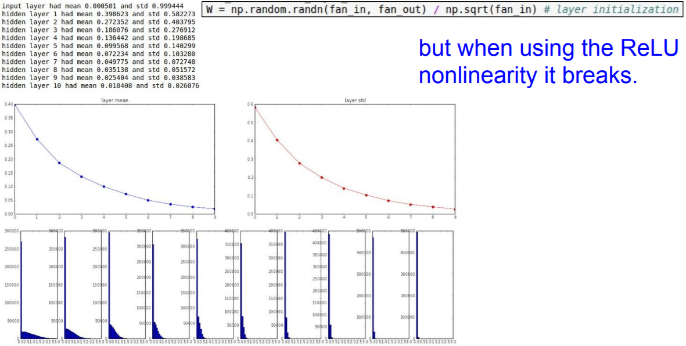

```
해결법: 입력이 반토막 남을 고려하여 fan_in에 /2를 해줌.
```

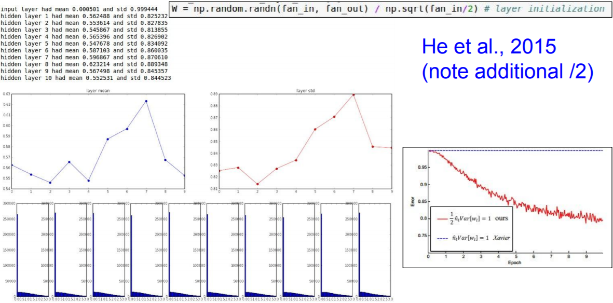

- Weight Initialization 정리

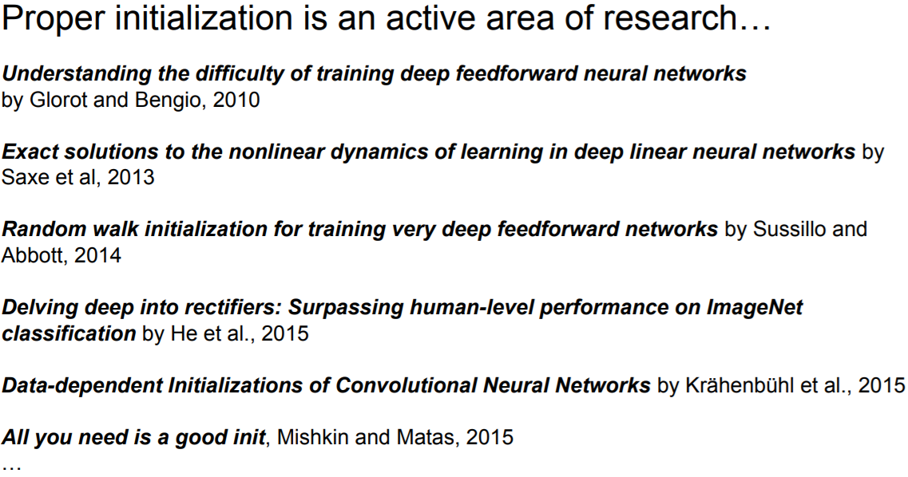

```
Weight Initialization: 연구가 활발한 분야.

W의 초기화는 Xavier initailization으로 시작해서 다른 방법들을 시도해보자.
```

### Batch Normalization

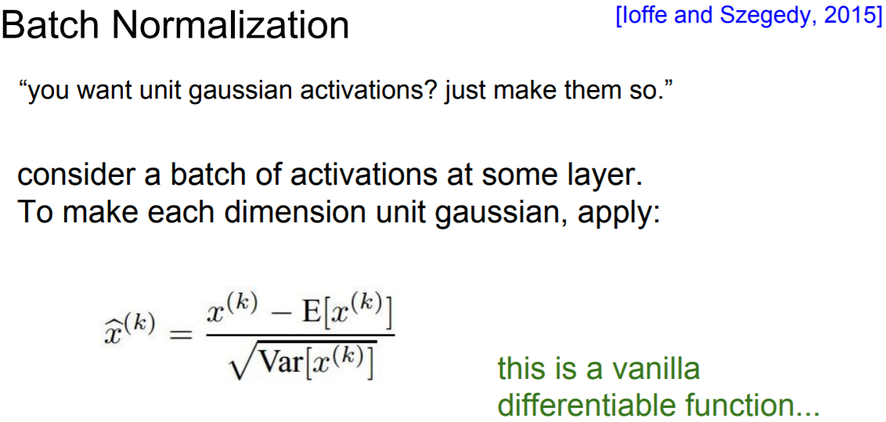

```
gaussizan의 범위로 activation을 유지시키는 또 다른 아이디어.

Batch normalization은 layer의 출력이 강제로 unit gaussian을 만듦.
... 어떤 layer의 출력이 Batch 단위 만큼의 activations가 있다 할때, 우리는 이 값이 Unit gaussian이길 원함.
... Batch의 mean과 variance를 이용해 layer의 출력을 Normalization.

Batch norm의 함수는 미분 가능한 함수.
... 평균과 분산의 상수만 가지고 있으면 언제든지 미분 가능.
... 따라서 Backprop이 가능하다. 
```

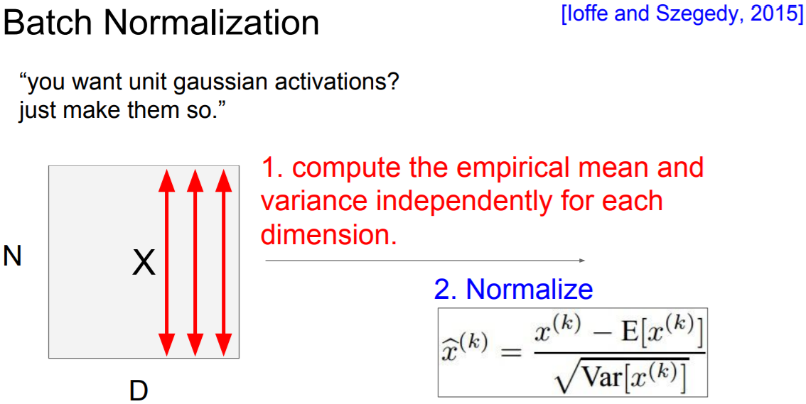

```
Batch X에 N개의 학습 데이터가 있고, 각 데이터가 D차원일때.
1. 각 차원별(feature element별로) 평균과 분산을 구해준다.
2. 그리고 Batch X를 element-wise로 Normalize.
```

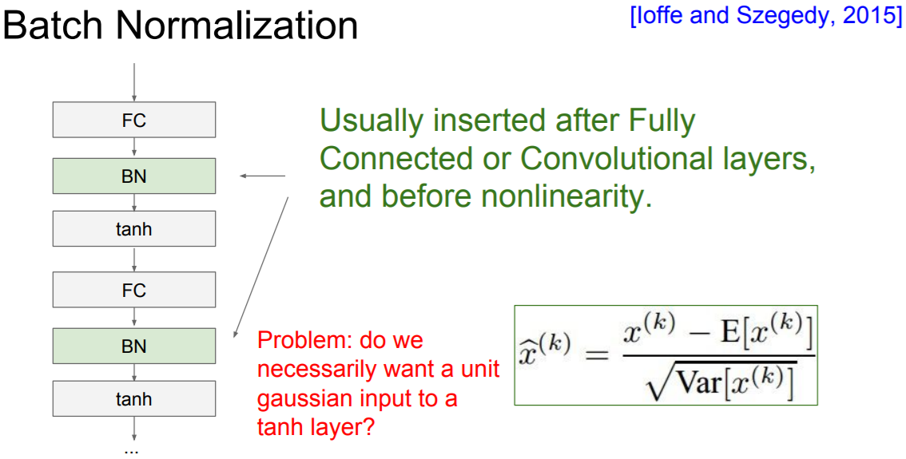

```
Batch Norm은 FC나 Conv layer 직후에 넣어줌.
... BN은 입력의 스케일만 살짝 조정해주는 역할이기에 FC, Conv 어디에든 적용 가능.
... 깊은 네트워크에서 W가 곱해지면서 0으로 수렴하는 Bad scaling effect를 상쇄.

Conv layer에서의 차이점.
... Normalization을 차원마다 독립적으로 수행함이 아닌 같은 Activation map의 같은 체널 요소들을 같이 Normalize.
... Conv는 특성상 같은 방식으로 Normalize 시켜야 하기 때문에 Activation map(체널, depth)마다 평균과 분산을 하나만 구함.
```

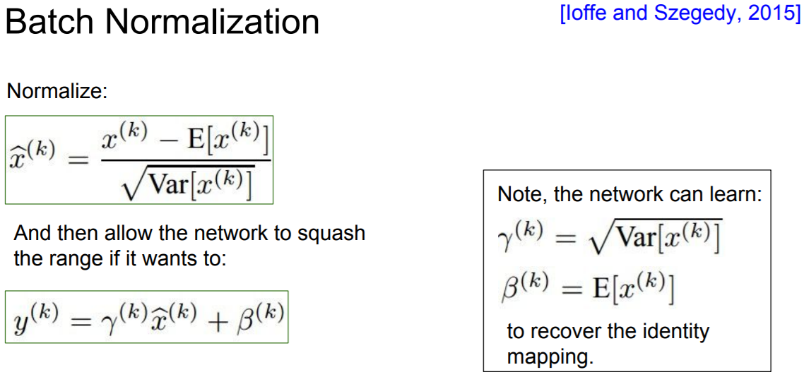

```
BN의 Scaling 연산: Normalized 된 값들을 원상복구하는 방법 ... Saturation의 정도를 조정하기 위함.
... Unit gaussian으로 normalize된 값들을 감마로 스케일링 효과를, 베타로 평행 이동 효과를 준다.
... 네트워크의 값을 복구하고 싶다면 감마 = 분산, 베타 = 평균을 주면 됨.
... 네트워크가 데이터를 tanh에서 얼마나 Saturation 시킬지 학습하면서 유연성을 얻을 수 있음.
```

- Batch Normalization 정리

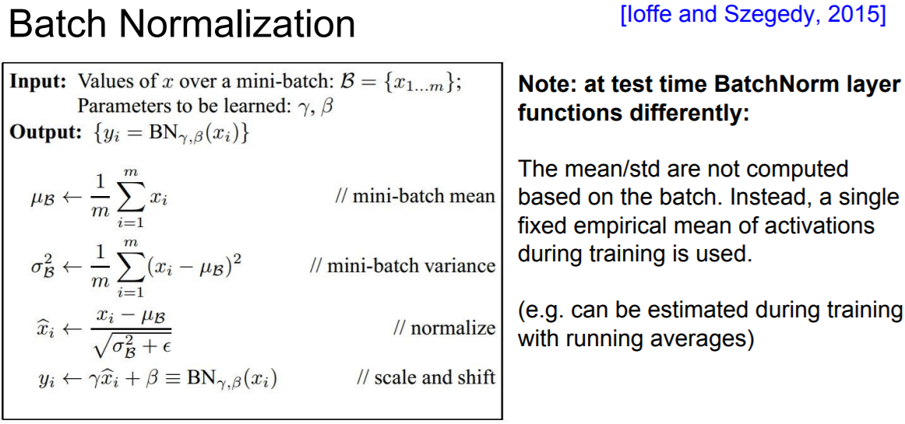

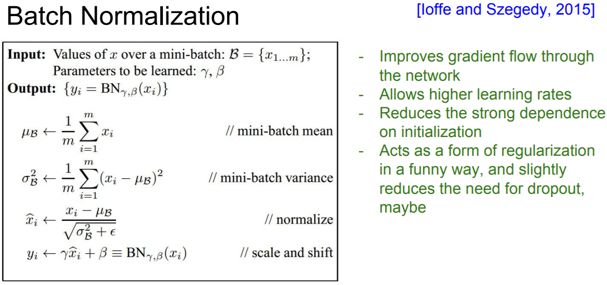

```
입력이 있고, 모든 미니베치 마다 각각 평균과 분산을 계산.
각 평균과 분산으로 Batch Norm한 이후 다시 추가적인 Scaling, Shifting factor를 사용.

BN은 gradient의 흐름을 보다 원할하게 하여 학습을 잘되게(robust) 함.
BN을 쓰면 learning rates를 더 키울 수도, 다양한 초기화 기법을 사용할 수도 있음.

또, BN은 미니배치의 평균, 분산을 사용해 출력을 제어하기에 Regularization의 기능도 있음.
... 단순히 입력데이터 하나로 결정되지 않고 미니배치 전체에 영향을 받음.
... layer의 출력이 deterministic하지 않고 조금씩 바뀌어 Regularization 효과를 냄.
```

-  Test time에서의 BN의 동작


```
Test time에서는 추가적인 계산없이 트레이닝셋에서 구한 평균과 분산을 사용.
```

### 학습과정을 다루는 방법

```
지금까지는 네트워크 설계를 배웠다.
이제는 학습과정을 어떻게 모니터링하고 하이퍼파라미터를 조절할 것인지 배워보자.
```

- Step 1: Preprocess the data

```
zero-mean 사용.
```

- Step 2: Choose the architecture

- Step 3: Initialize the Network

```
Loss 초기값 확인: Forward pass한 후 Loss가 그럴듯 해야함.
```

- Step 4: Start Train

```
처음 시작할 때 데이터의 일부만 먼저 학습시켜 보자.
... 데이터가 적으면 당연히 Overfit이 생기고 Loss가 줄어든다.
... Regularization을 사용하지 않고 Loss가 내려가는지 확인하는 것.

실제 학습을 위해 전체 데이터셋을 사용하고 약간의 Regularization을 주면서 적절한 learning rate를 찾자.
... learning rate는 가장 중요한 하이퍼 파라미터 중 하나, 가장 먼저 정해야한다.
... 몇가지 learning rate를 정하고 실험해보자.
... Loss가 잘 줄어들지 않는다?: Learning rate가 지나치게 작은 경우.
... cost가 발산(NaNs)?: Learning rate가 지나치게 큰 경우.
... 보통 learning rate는 1e-3에서 1e-5 사이의 값을 사용.
```

### Hyperparameter Optimization

```
하이퍼 파라미터를 최적화하고 가장 좋은 값을 선택하려면 어떻게 해야할까?
```

- Cross-validation 전략

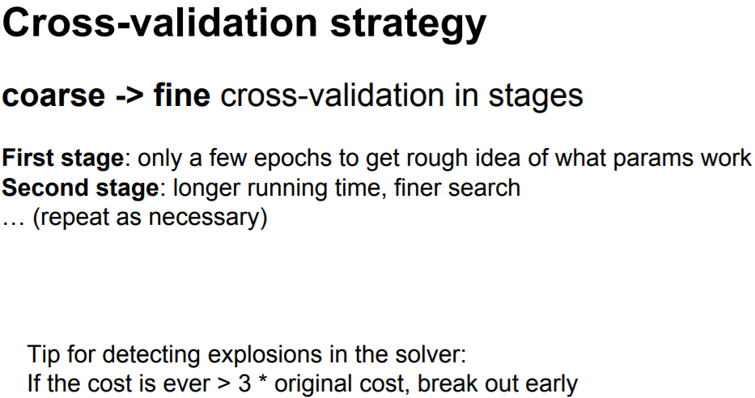

```
Cross-validation: 트레이닝셋으로 학습시키고 발리데이션셋으로 평가하는 방법.

Coarse stage: 적절한 범위를 확인하는 과정.
... Epoch 몇 번 만으로도 현재 값이 잘 동작하는지 확인 가능.
... NaNs이 뜨거나 Loss가 줄지 않는 것을 보면서 적절히 조절.
... NaNs: 발산의 징조. Cost가 엄청 크고 빠르게 오르고 있다면(3배이상) 다른 하이퍼 파라미터를 선택.

Fine stage: 좀 더 좁은 범위를 설정하고 학습을 길게시키면서 최적 값을 확인.

파라미터 값 샘플링: 10의 차수 값만 샘플링.
... learning rate는 gradient와 곱해지기에 log scale을 사용하는 편이 좋음.
```

- Grid Search 전략

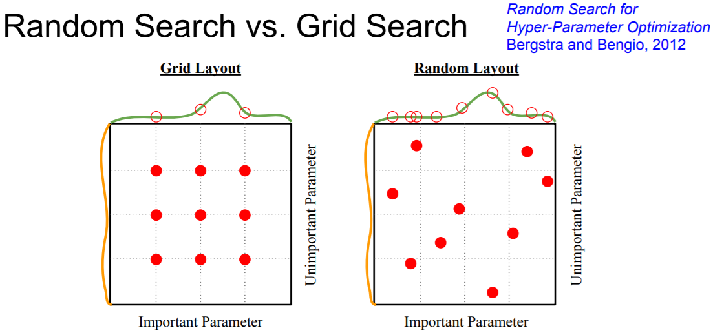

```
Grid search: 하이퍼 파라미터를 고정된 값과 간격으로 샘플링.
하지만 실제로는 random search를 하는 것이 더 좋다.
... 모델이 특정 파라미터의 변화에 더 민감하게 반응한다면 (노랑 < 초록) Grid search는 좋은 탐색이 아니다.
... Random search는 중요한 파라미터에대해 더 많은 샘플링이 가능.
```

- Monitor and visualize the loss curve

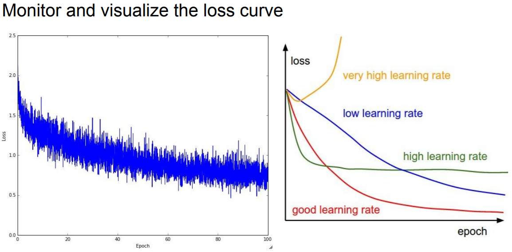

```
Loss curve와 Learning rate
```

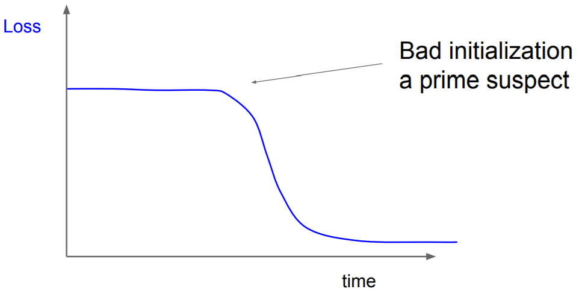

```
Loss curve와 Weight initialization
```

- Monitor and visualize the accuracy

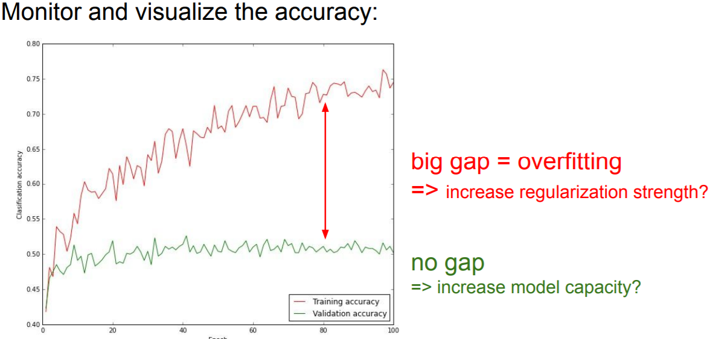

```
train_acc과 val_acc간의 gap이 크다?: Overfitting ... Regularization의 강도를 높여라.
train_acc과 val_acc간의 gap이 없다?: 아직 Overfit하지 않은 것 ... 모델의 capacity를 높힐 충분한 여유가 있음.
```

- W 크기 대비 W 업데이트 비율 추적

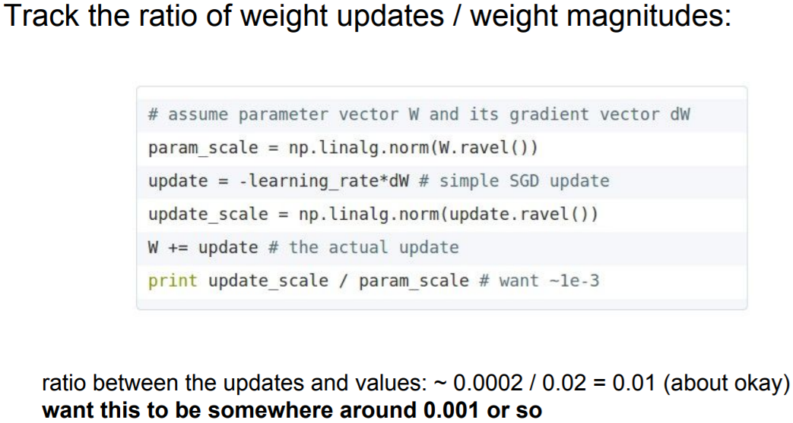

```
W의 norm을 구해 가중치의 규모를 계산.
업데이트 규모 또한 norm을 통해 계산.

업데이트 규모/파라미터 규모 ≅ 0.001 정도 되길 원함.
... 변동이 커서 정확하지 않을 수 있음.
... 하지만 업데이트가 지나치게 크거나 작은지에 대한 감을 가질 수 있음.
... 디버깅에 유용한 스킬.
```

## Summary

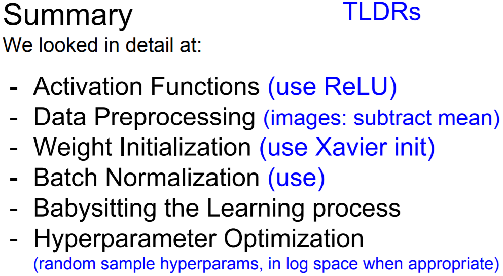

