# lecture 7. Training Neural Networks 2

## 학습목표

```
1. Fancier optimization.
2. Regularization: 네트워크의 Train/Test error 간 격차를 줄이고자 사용하는 방법.
3. Transfer learning: 원하는 양보다 더 적은 데이터를 가지고 있을 때 사용하는 방법.
```

## Fancier optimization


```
Neural Net에서 가장 중요한 것은 결국 Optimization.
... 결정해둔 손실함수를 가장 작게 만드는 W를 찾는 일.
... 손실함수: W의 landscape

우측은 가장 간단한 최적화 예제.
... 2차원의 손실함수를 최소로 만드는 W(W_1, W_2)를 찾는 일.
```

- SGD: 가장 간단한 Optimization

```
우선 미니배치 안의 데이터에서 Loss 계산.
그리고 gradient의 반대 방향을 이용해서 파라미터 벡터를 업데이트.
```


```
SGD의 문제점 1: 불균형한 손실함수에서 느린 업데이트.
... 불균형한 손실함수에서는 gradient의 방향이 고르지 못함.
... Loss에 영향력이 작은 차원의 가중치 업데이트는 아주 느리게, 영향력이 큰 차원은 아주 빠르게 진행됨.
... 고차원의 손실함수에서 더욱 빈번하게 발생.
```

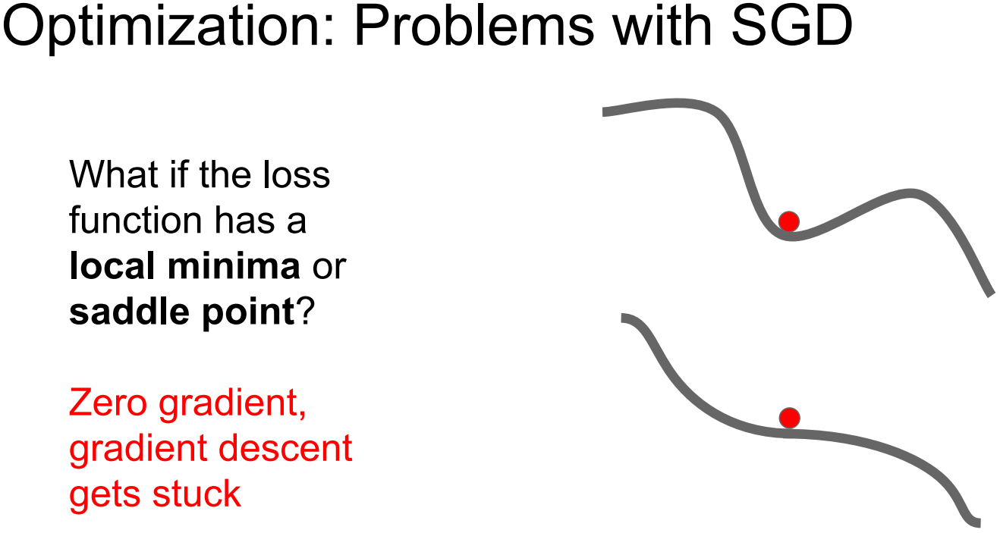

```
SGD의 문제점 2: local minima & saddle point에서 학습을 끝냄.
... SGD: gradient 계산 후 반대 방향으로 이동하는 알고리즘.
... local minima & saddle point: gradient == 0 ... 학습이 멈춤.

고차원이 될 수록 saddle point는 빈번하게 발생.
... 큰 Neural Net일 수록 local minima보다 saddle point에 취약.
... saddle point 근처의 gradient는 0에 근사하기에 학습이 느리게 진행됨 ... saddle point에 빠질 확률이 커짐.
```


```
SGD의 문제점 3: gradient의 추청치를 사용하기에 noisy할 수 있다.
... 학습이 느려질 수 있음.
```

- SGD + Momentum


```
단순히 velocity를 유지하여서 SGD의 모든 문제를 해결.
gradient를 계산할 때 velocity를 이용.
... rho: momentum의 비율 == velocity의 영향력 ... 보통 0.9와 같은 높은 값으로 설정.

gradient의 반대방향이 아닌 velocity의 방향으로 W가 업데이트됨.
```

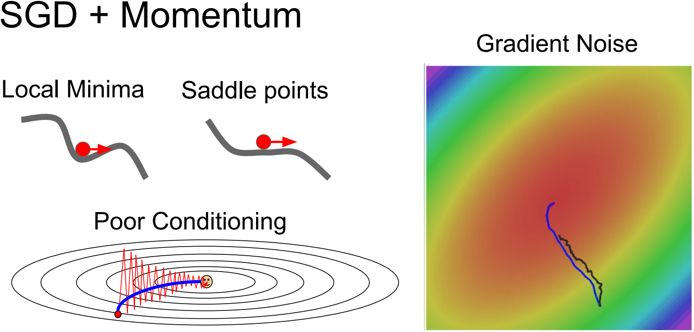

- Nesterov Momentum

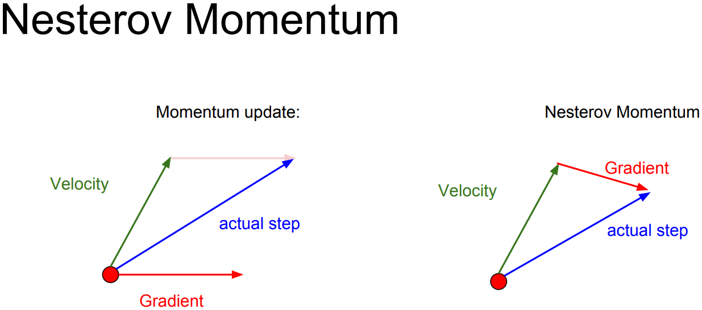

```
SGD Momentum: 가중평균(gradient, velocity)로 실제 가중치를 업데이트.

Nesterov Momentum: 벡터합(velocity, gradient)으로 실제 가중치를 업데이트.
... velocity의 방향이 잘못됐을 경우 현재 gradient의 방향을 좀더 활용할 수 있도록 개선한 것.
```

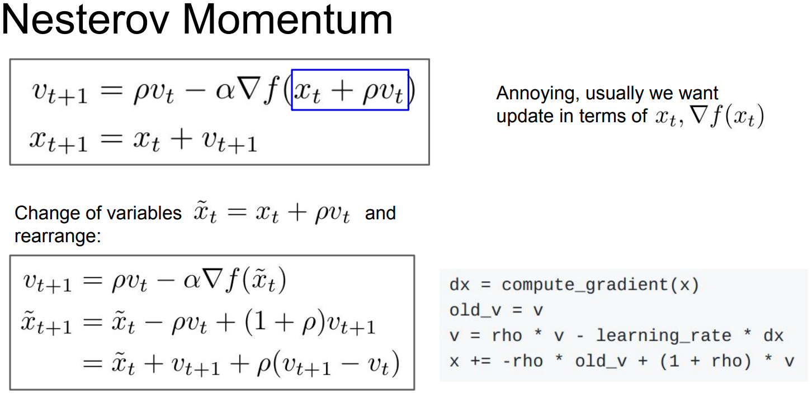

```
Nesterov Momentum 계산 변형식.
... 첫 번째 수식: 기존의 momentum과 동일 ... velocity와 계산한 gradient를 일정 비율로 섞어주는 역할.
... 마지막 수식: (현재 velocity - 이전 velocity) * rho하여 더해줌 ...  현재/이전 velocity간 에러보정(error-correctin term)이 추가됨.
```

```
Q. Momentum이 Narrow한 global minima를 지나칠 수 있지 않느냐?
A. 그럴 수 있다. 하지만 그것이 Momentum의 장점이다.
... 사실 Narrow minima는 Overfit을 야기한다.
... 데이터셋이 조금만 더 모이면 일반화되어 flatten해진다는 것.
... 즉 우리가 찾는 global minima는 Flatten minima이고, 그렇기에 Momentum의 장점이 되는 것.
```

- AdaGrad

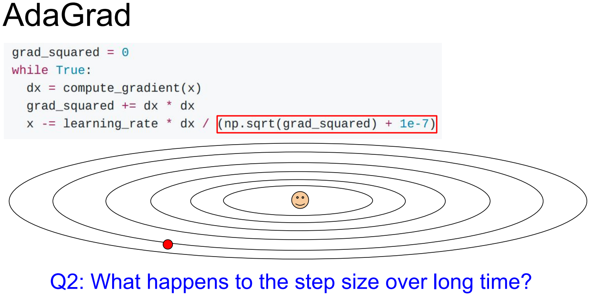

```
AdaGrad: 훈련도중 계산되는 gradient를 활용하는 방법.
... W를 업데이트할 때 Update term을 gradient의 제곱항으로 나눠줌.
... 차원의 영향력(gradient)가 크면 보다 큰 수로 나눠줘서 속도를 줄임.
... 차원의 영향력(gradient)가 작으면 보다 작은수로 나눠줘서 속도를 높임.

AdaGrad의 문제점: 학습횟수가 많아지면 AdaGrad가 계속 작아짐.
... 업데이트 동안 gradient는 점점 커지고 그만큼 step size는 작아짐.
... Convex case(Flatten minima)에서는 좋은 특징.
... 하지만 Non-convex case(Saddle point 같은 경우)에서는 멈춰버릴 수 있음.
```

- RMSProp

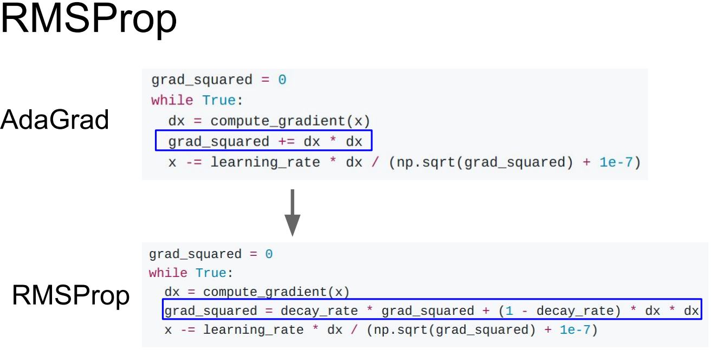

```
RMSProp: step size를 그저 누적하지 않고 (1-decay_rate)를 곱하여 AdaGrad의 문제점을 개선.
... decay_rate(보통 0.9 ~ 0.99): step의 속도를 가속/감속.
```

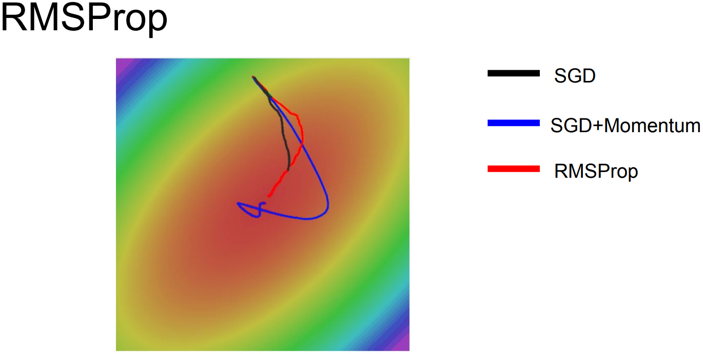

```
Momentum 계열 vs. Grad 계열.
... Momentum은 Overshoot한 뒤에 돌아오지만 Grad는 상황에 맞게 적절히 궤적을 수정.

AdaGrad vs. RMSProp.
... AdaGrad는 일반적으로 사용되지 않음.
```

- Adam


```
Adam: Momentum + RMSProp.
단, velocity가 0으로 초기화 된다면 어떤값/0에 가까운 수로 step size가 갱신되어 매우 커질 수 있음.
... Bias correction을 해줘야함.

Adam 초기 설정: 거의 모든 아키텍쳐에서 잘 동작하는 기본 설정.
... beta1 = 0.9.
... beta2 = 0.999.
... learnin_rate = 1e-3 or 5e-4
```

```
Optimization 알고리즘들의 문제점: 회전된 차원은 해결할 수 없다.
```

- Learning_rate decay

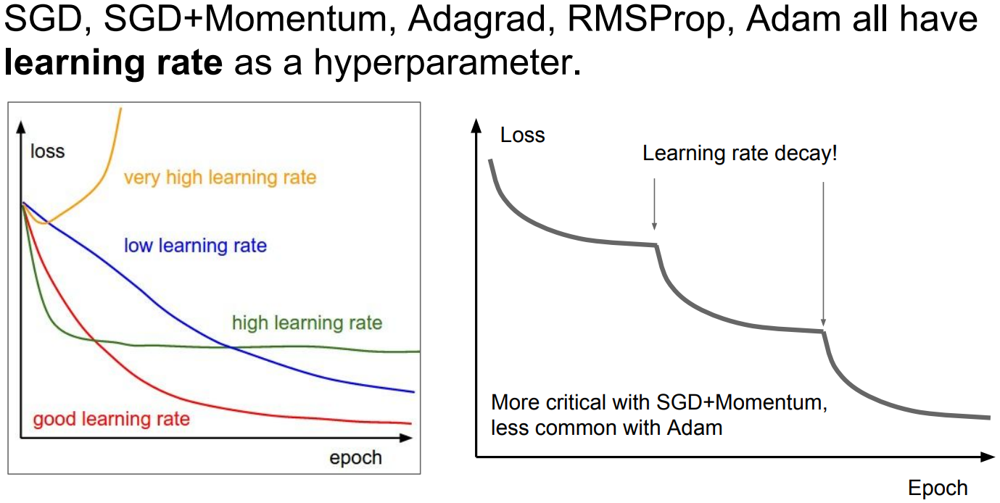

```
Learning_rate: Optimization을 사용하기 위해 반드시 설정해야하는 값.
... 적절한 Learning_rate는 어떻게 구할까?

Learning_rate decay 방법.
1. 일정수준 학습된 후 Learning_rate를 낮춰서 다시 학습.
... 수렴을 잘 하고 있는 상황에서 gradient가 점점 작아지고 있을 때.
... Learnin_rate가 너무 높아 더 깊이 들어가지 못하는 상황에 사용.
2. Learning_rate decay 활용.

Adam보다 SGD Momentum을 사용할 때 자주 사용.

Leaning_rate decay 설정 순서.
... 우선 decay없이 학습을 시켜 봄.
... Loss curve를 보면서 decay가 필요한 곳이 어딘지 고려해보자.
```

- Second-Order Optimization

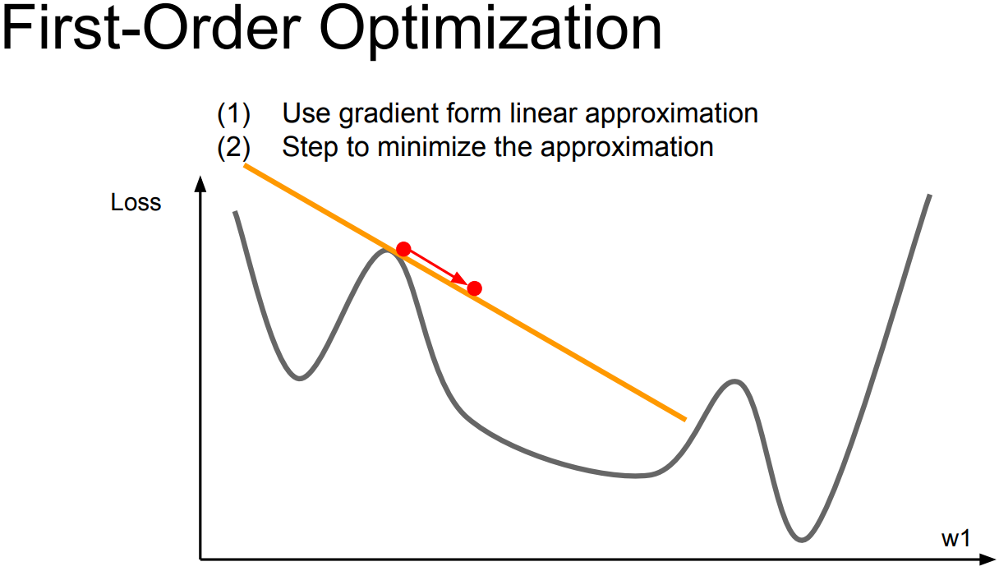

```
지금까지의 Optimization은 전부 First-order(1차미분).
Second-Order를 사용하면 보다 효과적이다.
```


```
기초적인 Second-order Optimization은 learning_rate가 없지만 실제로는 필요하다.
... minima 방향으로 이동하는 것이지 minima로 가는 것이 아니기 때문.

딥러닝에서 사용할 수 없다.
... N*N의 행렬을 저장할 방법이 없다.
... 역행렬을 계산할 방법이 없다.
```


```
그래서 실제로는 quasi-Newton methods를 이용.
... Full Hessian을 Low-rank approximations하는 방법.

L-BFGS 또한 Hessian을 근사하는 방법.
... 사실상 DNN에서 잘 사용하지 않는다.
... 2차근사가 stochastic case에서 잘 동작하지 않기 때문.
```


```
실제로는 Adam을 가장 많이 사용.

경우에 따라 L-BFGS가 유용할 수 있음.
... full batch update가 가능: stochastic case가 아닐 때.
```

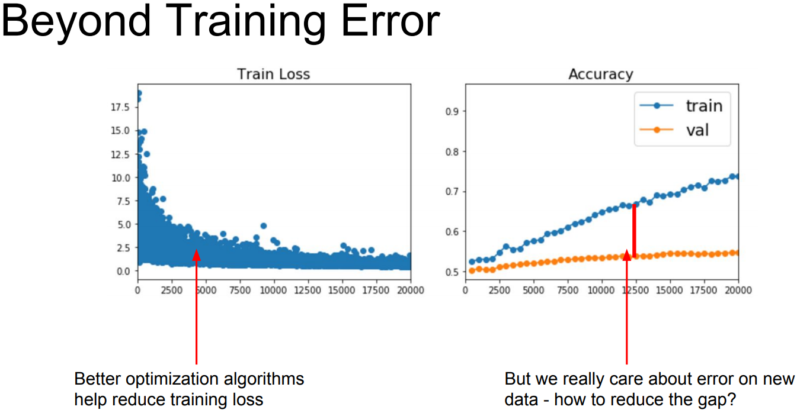

```
Optimization을 잘 하여 Training error를 줄였다.
하지만 실제로 관심있는 것은 Training - Test error간 gap을 줄이는 것.
어떻게 해야할까?
```

## Model Ensembles

```
가장 쉽고 빠르게 모델의 성능을 최대화 시키는 방법.
ML 분야에서 종종 사용되는 기법.

아이디어: 모델을 하나만 학습시키는 것이 아니라 10개의 모델을 독립적으로 학습시키는 것.
결과: 10개 모델 결과의 평균.
... 모델이 늘어날 수록 Overfitting이 줄고 성능이 조금씩 향상.
... 보통 2%정도 증가.
```

- 창의적인 앙상블

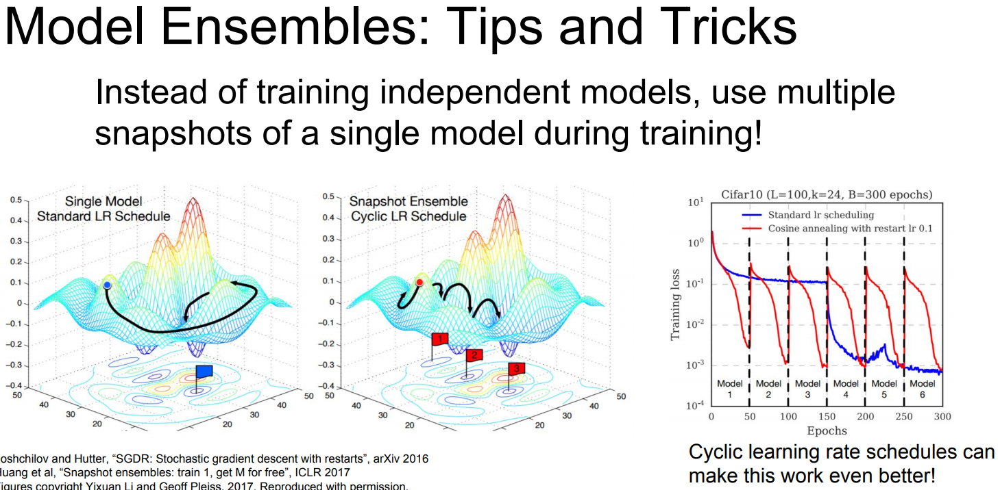

```
학습 도중 중간 모델들을 저장(snapshot)하고 앙상블로 사용.
그리고 Test time에는 여러 snapshot에서 나온 예측값들의 평균을 사용.

Learning rate를 엄청 낮췄다고 엄청 높혔다가를 반복하면서 손실함수의 다양한 지역에서 수렴할 수 있도록 할 수 있음.
```

- Smooth Ensemble: Polyak averaging


```
Polyak averaging.
... 학습하는 동안 파라미터의 exponentially decay average를 계속 계산.
... checkpoint에서의 파라미터를 그대로 쓰지 않고 smoothly decaying average를 사용.

시도해 볼만하지만 실제로 자주 쓰이지는 않음.
```

## Regularization

```
앙상블이 아닌 단일 모델의 성능을 향상시키기 위한 방법.
... 앙상블은 10개의 모델을 돌려야한다. 그렇게 좋은 방법이 아님.
... 단일 모델의 성능을 높이기 위한 방법이 바로 Regularization.

Regularization: 모델이 트레이닝셋에 fit하는 것을 막아줌 ... 일반화하여 unseen 데이터에 보다 잘 동작함.
```


```
손실함수: 기존항 + Regularization term.
... 기존항: 스코어를 계산하여 gradient의 - 방향으로 업데이트할 때 트레이닝셋에 fit하게됨.
... Regularization term: 파라미터 W에 대한 함수로 Loss값을 높여 트레이닝셋에 fit하는 것을 방해함.
... L2 Regularization: 계산량이 많아 DNN에서 잘 활용되지 않음.
```

### Dropout


```
Dropout: forward pass 과정에서 한 layer씩 임의로 일부 뉴런을 0으로 만듬.
... NN에서 가장 많이 사용되는 Regularization.
... forward pass 마다 0이 되는 뉴런이 바뀜 ... forward pass iteration 마다 그 모양이 계속 바뀜.

0으로 설정하는 값: activation.
... 각 레이어에서 next activ = prev activ * weight
... 현재 activations의 일부를 0으로 만들면 다음 layer의 일부는 0과 곱해짐.

FC layer에서 흔히 사용됨.
... Conv layer의 경우 전체 feature map에서 dropout을 시행.
... 또, Conv layer에는 여러 체널이 있기에 일부 체널을 자체를 dropout할 수도 있음.
```

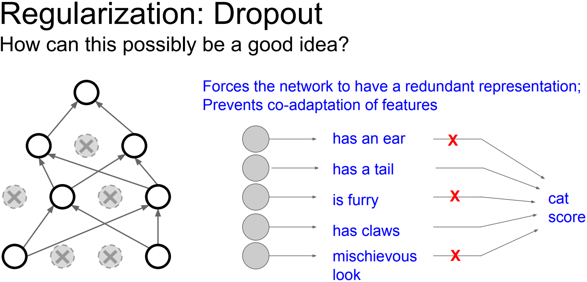

```
일부 값을 0으로 만들며 Training time의 네트워크를 심각하게 훼손하는 Dropout이 어떻게 성능을 향상시킬까?
... 특징들 간의 상호작용(co-adaptation)을 방지한다!

위 네트워크는 고양이를 분류하는 역할을 수행.
각 뉴런마다 고양이 신체의 일부(눈, 꼬리, 털)에 대해 학습한다.
이 모든 정보들을 취합한 cat score로 고양이 여부를 판단한다.
여기서 Dropout을 적용하게 되면 네트워크가 어떤 일부 feature들에만 의존하지 못하게 만든다.
... 고양이를 판단하기 위해 다양한 feature들을 활용하게 됨.
... 일부 데이터에 overfit하는 것을 방지하는 효과.
```

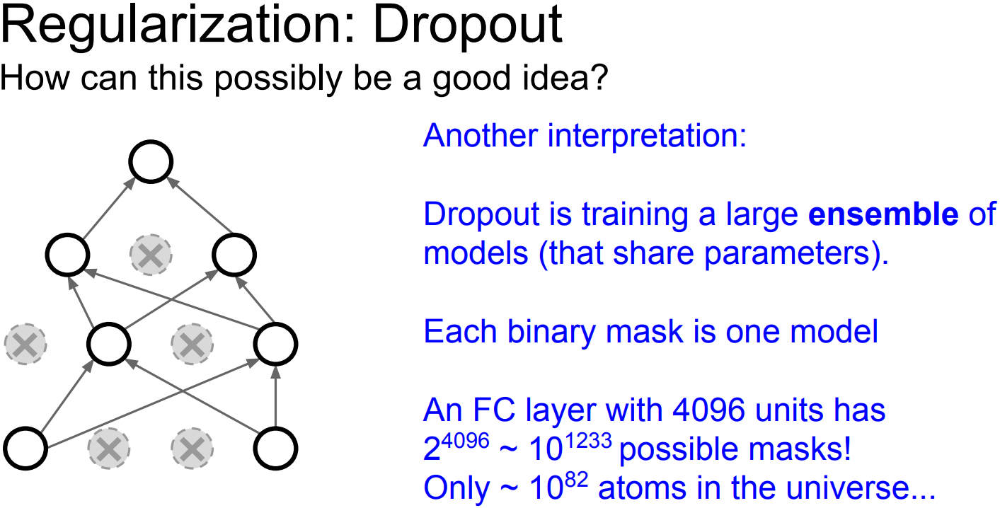

```
Dropout 효과에 대한 새로운 해석: 단일 모델로 앙상블 효과.
... 일부 뉴런만 사용하는 서브네트워크.
... Dropout으로 만들 수 있는 서브네트워크의 경우는 정말 다양하다.
... 따라서 Dropout은 서로 파라미터를 공유하는 서브네트워크 앙상블을 동시에 학습시키는 것.

다만 뉴런의 수에 따라 앙상블 가능한 서브네트워크 수가 기하급수적으로 증가.
... 가능한 모든 서브네트워크를 사용하는것은 사실상 불가능.
... Dropout은 아주 거대한 앙상블 모델을 동시에 학습시키는 것.
```

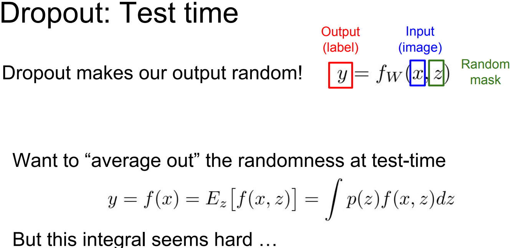

```
Test time의 Dropout

Dropout을 사용하면 기본적으로 NN의 동작 자체가 변함.
... 기존의 NN: f(x) = Wx
... Dropout 사용 시: Network에 입력에 z, random dropout mask가 추가.
... z: random ... 하지만 Test time에 임의읨 값을 부여하는 것은 좋지 못함.

가령, 오늘은 고양이로 분류한 사진이 내일 개로 분류된다면 곤란하다.
... 이렇게 Test time의 임의성(stochasticity)는 적절하지 못함.
... 대신 그 임의성(randomness)을 average out: z를 여러번 샘플링하여 Test time에서 이를 average out.
... 하지만 이 또한 Test time에 randomness를 만들어 내기 때문에 좋지 않은 방법.
```

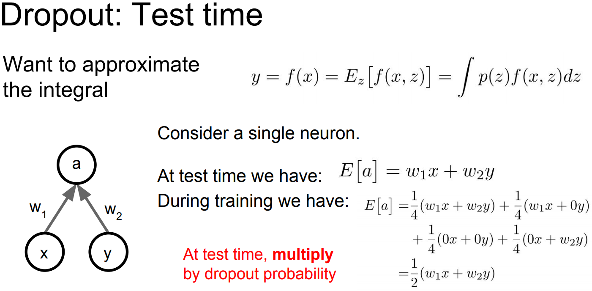

```
위의 네트워크의 Test time에서 a = W_1*x + W_2*y.
이 네트워크에서 Dropout(p = 0.5)를 적용해 Train하면 dropout mask에는 4가지의 경우가 존재.
... 이제 4개의 마스크에 대해 평균화를 수행.
... 여기서 Train/Test time 간의 기댓값이 서로 상이함 ... Train time의 기댓값 = Test time의 기댓값/2.
... Test time에서 stochasticity를 사용하지 않고 할 수 있는 값 싼 방법: Dropout probability를 네트워크 출력에 곱해줌.
```

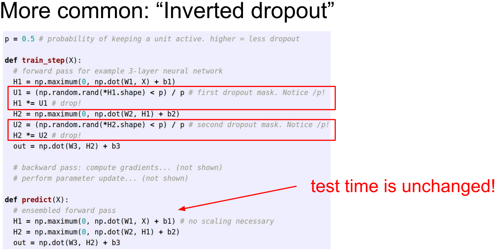

```
실제 구현에서는 최대한 Test time을 줄이기 위해 Train time에서 /p를 수행함.
... Train은 보통 GPU로하기에 *, / 연산에 강함.
... Train은 곱셈이 몇번 추가되는 것을 신경쓰지 않아도 됨.
```

- 일반적인 Regularization 전략

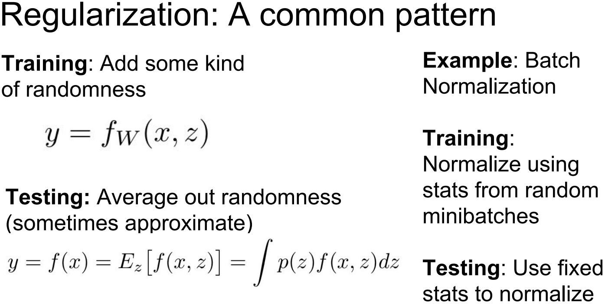

```
일반적인 Regularization 전략.
... Train time: 네트워크에 무작위성(randomness)을 추가: 트레이닝셋에 너무 fit하지 않게 함.
... Test time: randomness를 평균화 시켜 generalization 효과를 줌.

Dropout vs BN.
BN: Dropout과 유사한 Regularization 성능.
... 미니배치로 하나의 데이터가 샘플링 될때 마다 서로 다른 데이터들과 만나 정규화: Train time의 randomness.
... 하지만 Test time에서는 미니배치가 아닌 Global 단위로 정규화를 수행: Test time의 randomness 평균화.

실제로 BN 사용 시 Dropout을 사용하지 않음: BN만으로 충분한 Regularization효과.
하지만 Dropout에는 자유롭게 조절 가능한 파라미터 p가 있어 여전히 쓸모있음.
```

### Data augmentation

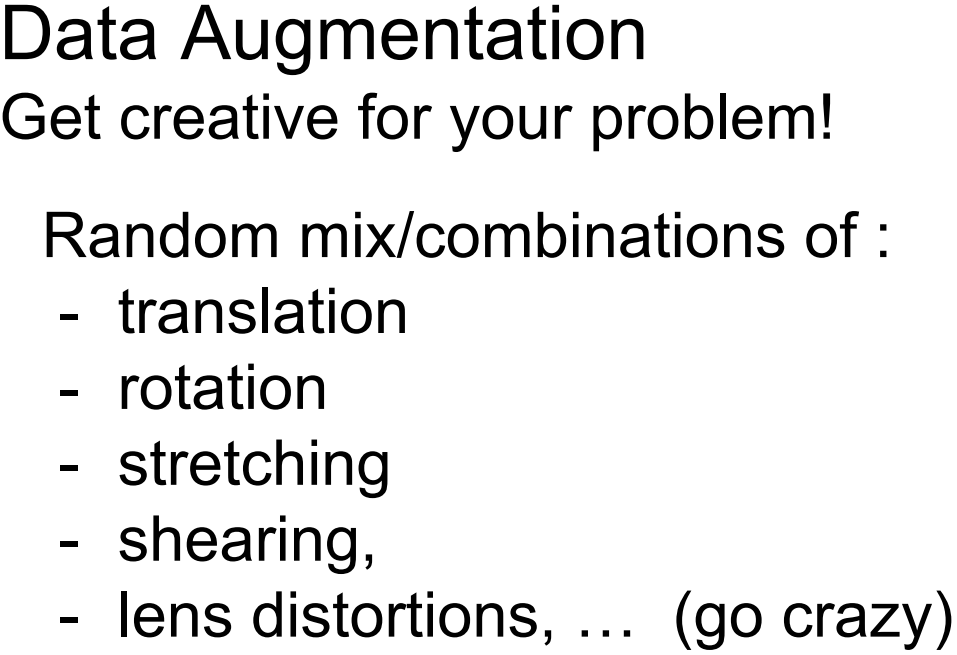

```
Data augmentation: 어떤 문제에도 적용해 볼 수 있는 아주 일반적인 방법.
... 이미지의 label을 바꾸지 않으면서 이미지를 변환시킬 수 있는 많은 방법들이 있다: translation, rotation, stretching, shearing, lens distortions, ...
... Train time에는 stochasticity가 추가, Test time: marginalize out.
```

### 그외의 Regualrization

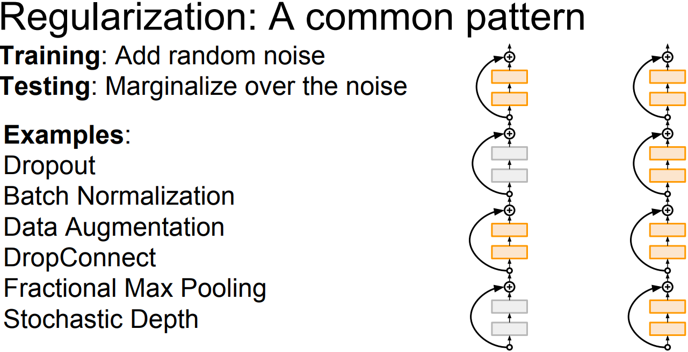

```
Dropout, Batch Normalization, Data Augmentation.

DropConnect: Dropout과 유사, activation이 아닌 Weight matrix를 임의적으로 0으로 만듦.

Fractional max pooling: Pooling연산 수행 지역을 임의로 선정, 이후 Test time에서는 Pooling region을 고정 혹은 여러개를 만들어 averaging out.

Stochastic Depth: Train time에 layer 중 일부만 사용해서 학습, Test time에는 전체 네트워크를 다 사용.
```

### Q & A

```
Q. Dropout이 Train time의 gradient에 어떤 영향을 주는가?
A. Dropout이 0으로 만들지 않은 노드에서만 Backprop이 발생.
... 따라서 Dropout을 사용하면 전체 학습기간이 늘어남: 각 스텝에서 업데이트되는 파라미터 수가 줄기 때문.
... 전체 학습시간은 늘어나지만 모델이 수렴한 후 더 좋은 일반화 능력을 얻음.
```

```
Q. 보통 하나 이상의 Regularization 방법을 사용하는가?
A. 일반적으로 BN을 많이 사용. 대부분의 Network에서 잘 동작하고 아주 깊은 네트워크에서도 수렴을 잘 하도록 도와줌.
... 대게는 BN만으로 충분하지만 Overfitting이 발생한다 싶으면 Dropout과 같은 방법을 추가해 볼 수 있음.
... 이를 가지고 blind cross-validation을 수행하지는 않음.
... 대신 네트워크에 Overfit 조짐이 보이면 하나씩 추가시켜 봄.
```

## Transfer Learning

```
Overfitting이 발생하는 주된 원인 중 하나가 작은 트레이닝셋의 크기.
이런 Overfitting을 방지하기 위한 방법에 Regularization 외에도 Transfer learning이 있다.

'CNN 학습에 엄청난 데이턱 필요하다.'는 미신을 무너뜨림.
```

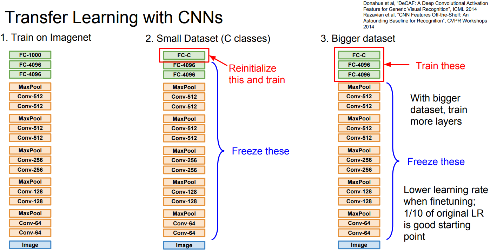

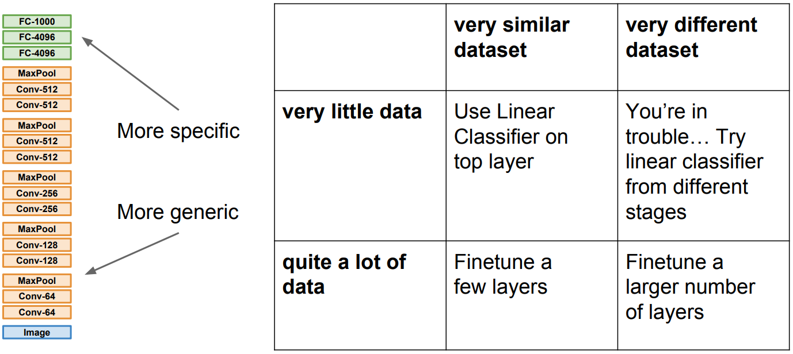

```
Transfer learning 시나리오.
... 기존의 데이터와 유사, 데이터양이 극소: 마지막 layer(Linear Classifier)만 학습.
... 기존의 데이터와 유사, 데이터양이 꽤 됨: 모델 전체를 fine tunning.
... 기존의 데이터와 다름: 좀 더 창의적, 경험적인 방법이 필요 ... 데이터셋이 크면: 더 많은 layer를 fine tunning하면서 완화할 수 있음.
```

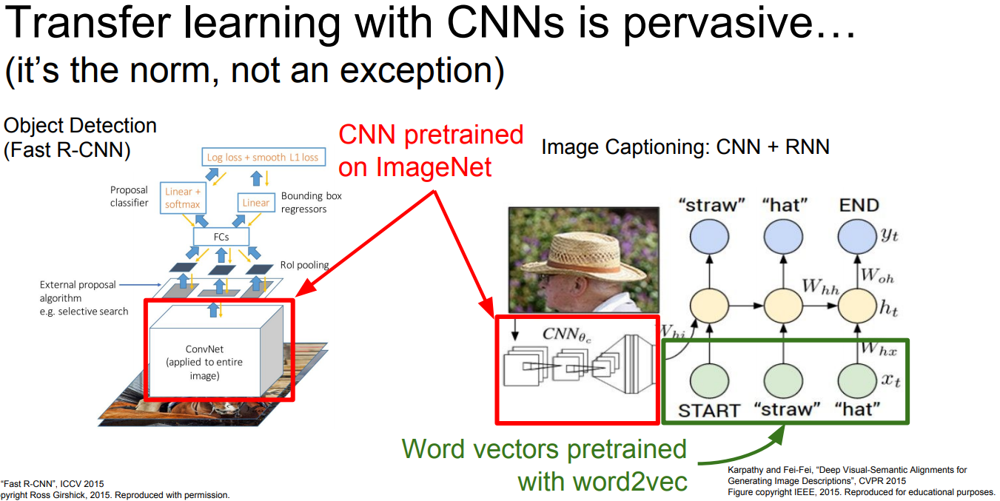

```
요즘 거의 모든 Computer vision 관련 응용 알고리즘들이 모델들을 밑바닥부터(from scratch) 학습시키지 않음.
... 대부분 imagenet pretrained-model을 사용하여 본인의 task에 맞도록 fine tunning.
... captioning의 경우 word vectors를 pretrain하기도 함.
```

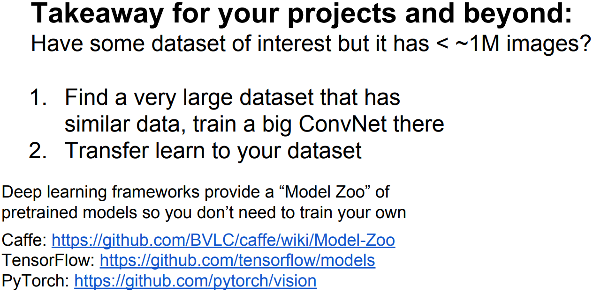

```
문제에 대한 데이터셋이 크지 않은 경우,
1. 유사한 데이터셋으로 학습된 pretrained model을 다운.
2. 모델의 일부를 초기화 시키고 문제의 데이터셋으로 fine tunning.

대부분의 딥러닝 소프트웨어 패키지가 model zoo를 제공.
... 다양한 모델들의 pretrained 버전을 손쉽게 다운로드.
```

## Summary

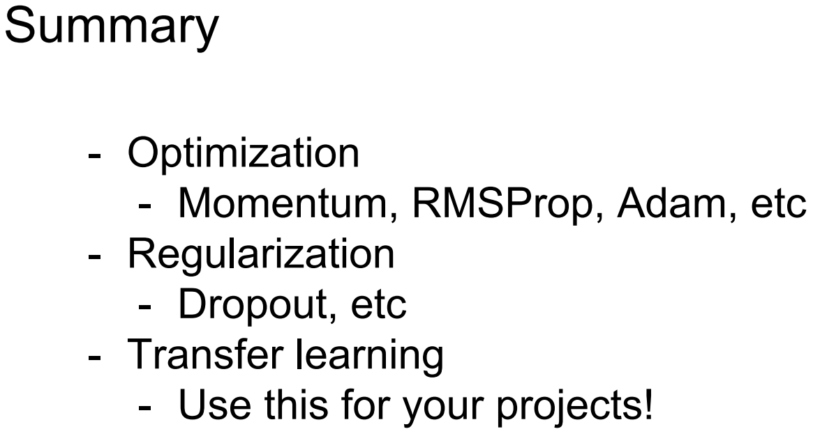
