# lecture 8. Deep Learning Software

## 학습목표

```
Deep learning software: 매년 아주 많은 변화가 생기는 재미있는 주제.

CPU vs GPU.

Deep learning frameworks
... Caffe/Caffe2
... Theano/TensorFlow
... Torch/PyTorch
```

## CPU vs GPU

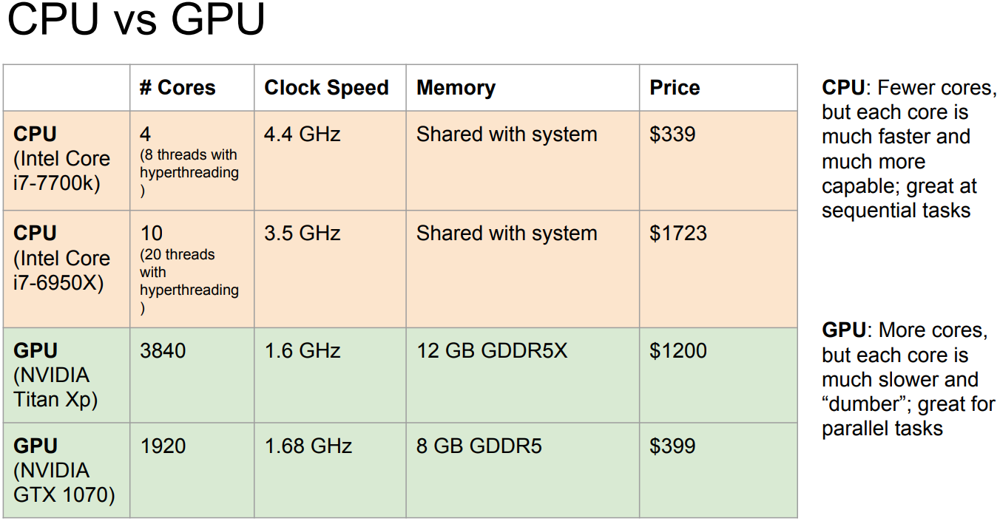

```
공통점.
... CPU와 GPU 모두 임의의 명령어를 수행할 수 있는 범용 컴퓨팅 머신.

차이점 1. 코어.
... CPU: core 적은 코어 수, hyperthreading 기술과 더불어 8~20개의 스레드(일) 동시 수행(멀티 스레드).
... GPU: 수천개의 코어 수, 각각 코어가 더 느린 clock speed에서 동작, 각 코어들이 독립적으로 동작하지 않고 한 일으 병렬 처리.

차이점 2. 메모리.
... CPU: 비교적 작은 캐시, 대부분의 메모리를 RAM(일반적으로 8, 12, 16, 32GB)에서 끌어다 씀.
... GPU: 칩 안에 RAM이 내장 ... RAM과 GPU의 통신은 보틀넥, 메모리와 GPU 코어 간을 캐싱하기 위한 다계층 캐싱시스템.

정리.
CPU: 범용처리.
GPU: 벙렬처리 ... 행렬곱 연산 수행에 아주 적합.
```

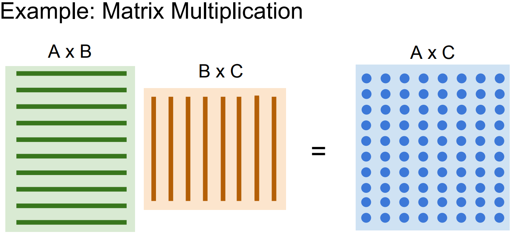

```
행렬곱의 내적 연산은 서로 입력데이터만 다를 뿐 모두 서로 독립적.

massive한 병렬화 문제에서는 GPU의 처리량이 압도적.
... GPU: 결과 행렬의 각 요소들을 병렬로 계산할 수 있어서 엄청나게 빠름.
... CPU: 각 원소를 하나씩 계산/Vectorized instructions으로 여러개 코어로 계산.

가령, 행렬의 크기가 엄청 큰 경우, Convolution의 경우 GPU의 연산속도가 우월하다.
```

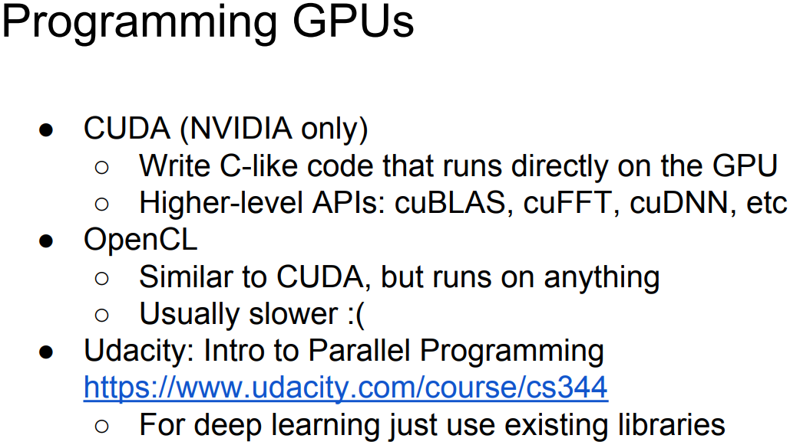

```
CUDA: C-like, GPU에서 실행되는 코드.
... 세심한 메모리 관리로 코드 작성이 까다로움.
... NVIDIA가 고도로 최적화 시킨 기본연산 라이브러리 배포: cuBLAS, cuFFT, cuDNN, etc.

OpenCL: GPU, CPU 모두에서 실행가능한 코드.
... 딥러닝에 극도로 최적화된 라이브러리가 없음 ... CUDA보다는 성능이 떨어짐.
```

### CPU/GPU Communication

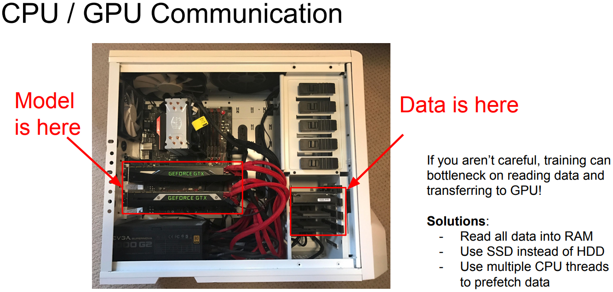

```
GPU는 forward/backward가 아주 빠르지만, 디스크에서 데이터를 읽어드리는 것이 보틀넥.
... Model과 가중치: GPU RAM.
... 실제 트레이닝셋: 하드디스크.
... 디스크에서 GPU로 데이터를 읽어드리는 작업을 세심히 신경쓰지 않으면 보틀넥 발생.

GPU 보틀넥 해결책 1: 데이터셋이 작은 경우, 전체를 RAM의에 올림.
... 데이터셋이 작지 않더라도, 서버에 RAM 용량이 크다면 가능.

GPU 보틀넥 해결책 2: HDD보다 SDD를 사용.
... 디스크 읽는 속도 개선.

GPU 보틀넥 해결책 3: 데이터 -(pre-fetching)-> CPU -(buffer)-> GPU
... pre-fetching: CPU의 다중스레드를 이용해 데이터를 RAM에 미리 올림.
... buffer: buffer에서 GPU로 데이터를 전송시키면 성능향상 기대.
```

## Deep Learning Frameworks

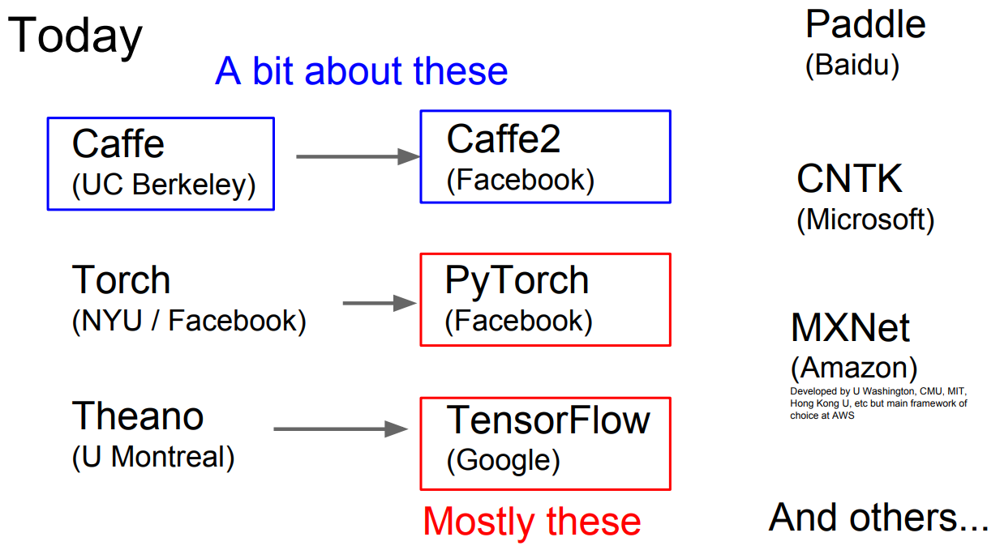

```
최근 몇 년간 흥미로운 변화: academia에서 industry로의 이동.

대부분이 PyTorch와 TensorFlow를, 소수가 Caffe2를 사용.
```

### Deep learning frameworks를 사용하는 이유

```
(1) 복잡한 Computational graphs를 간단히 생성 가능.

(2) Computational graphs의 gradients를 자동 계산.
... foward pss만 잘 구현해 놓음녀 backprop은 알아서 구성됨.

(3) GPU의 효율적인 활용.
... 딥러닝 GPU 라이브러리를 지원.
```

### PyTorch

#### 세가지 추상화 레벨

```
Tensor: Numpy array(ndarray)와 유사, 명령형(imperative) 배열, GPU에서 수행 가능.

Variable: Computational graph의 노드 ... 그래프를 구성하고 gradient 등을 계산 가능.

Module: NN layer ... state, 가중치 저장 가능.
... 이미 고수준의 추상화를 내장.
... Tensorflow처럼 어떤 모듈으 선택할 지 고민할 필요없이 module 객체 사용.
```

#### PyTorch: Tensor = Numpy + GPU

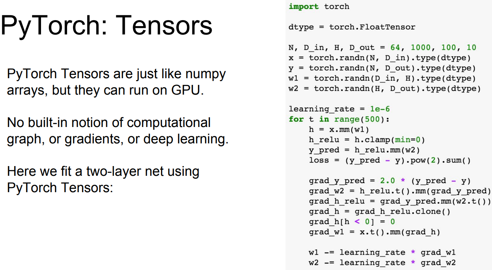

```
PyTorch tensor는 Numpy array와 매우 유사, 실제로는 Numpy array를 사용하지 않고 PyTorch tesnor를 이용.

다만, PyTorch tensor는 GPU에서도 돌아감.
```

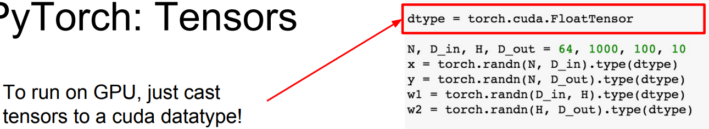

```
GPU에서 실행시키려면 data type만 조금 변경해주면 됨.
... FloatTensor 대신 cuda.FloatTensor 
```

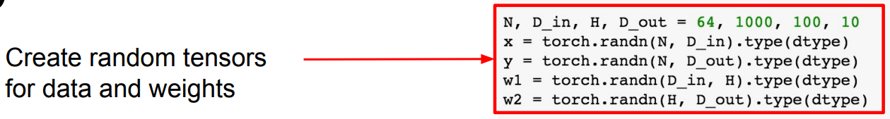

```
Tensor 선언 및 초기화.
```

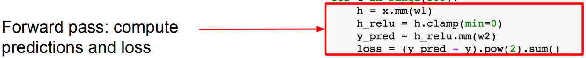

```
Forward pass: prediction 및 loss 계산.
```

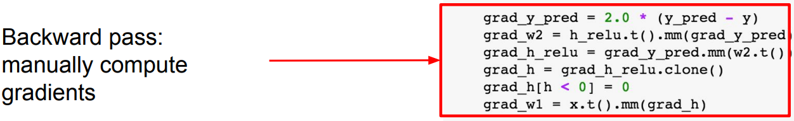

```
Backward pass: gradient 손수 계산.
```

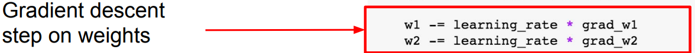

```
Gradient descent: W 업데이트
```

#### PyTorch: Autograd

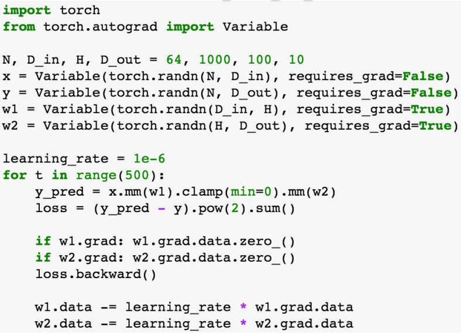

```
Variable: Computational graphs를 만들고 이를 통해 gradient를 자동으로 계산하는 목적.
... X = X.data(tensor) + X.grad(gradient).
... PyTorch의 tensors와 variables는 같은 API를 공유: PyTorch.tensors로 동작하는 모든 코드는 variables로 만들 수 있음.
... 연산자를 수행하는 것이 아니라 Computational graph를 만들게 됨.
```

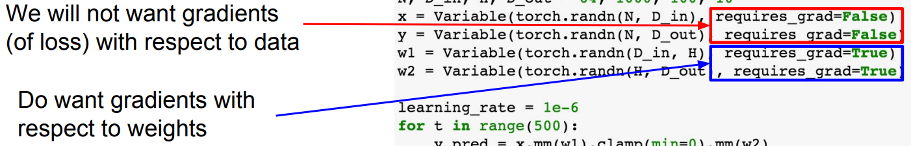

```
Variables 선언 시 해당 변수에 대한 gradient 계산 여부 지정.
```

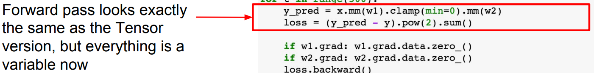

```
Forward pass: Tensor 사용 시와 같은 코드 ... 같은 API.
... 예측값(y_pred)와 손실(loss) 계산 시 이런 imperative한 방법을 사용.
```

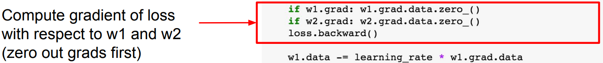

```
Backward pass: loss.backwards를 호출하면 gradient가 알아서 반환.
```

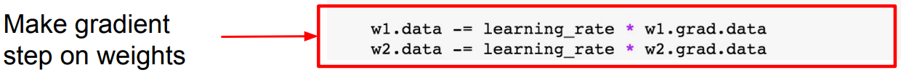

```
Gradient descent: Variable.grad.data의 값을 이용하여 가중치 업데이트.

gradient가 자동으로 계산된다는 것 이외에는 Numpy와 아주 유사.
```

#### PyTorch: 사용자 정의 AutoGrad Function

```
Tensorflow와 PyTorch의 차이점.
... Tensorflow: 그래프를 명시적으로 구성한 다음 그래프를 돌림.
... PyTorch: Forward pass마다 매번 그래프를 다시 구성.

... PyTorch의 코드가 좀 더 깔끔해 보임.
```

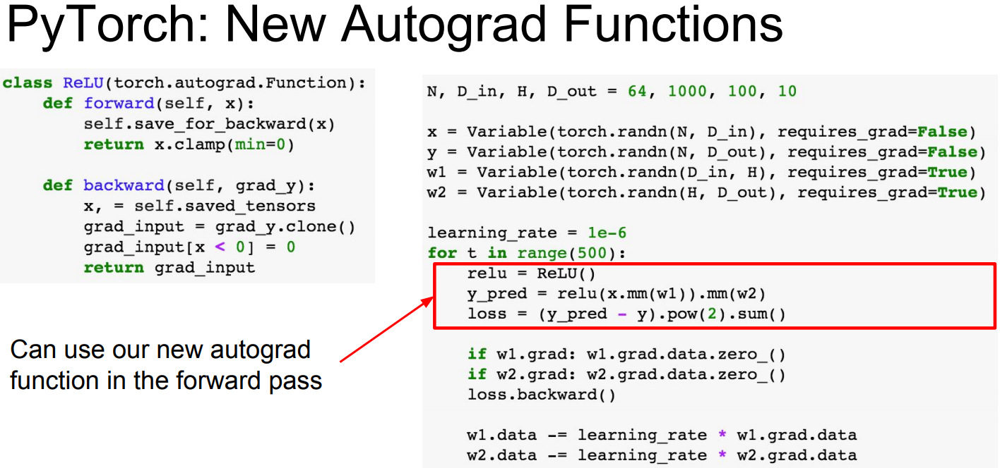

```
PyTorch의 사용자 정의 AutoGrad 함수.
... Tensor operations를 이용해 Foward/Backward만 구현하면 그래프에 넣을 수 있음.
```

#### PyTorch: nn

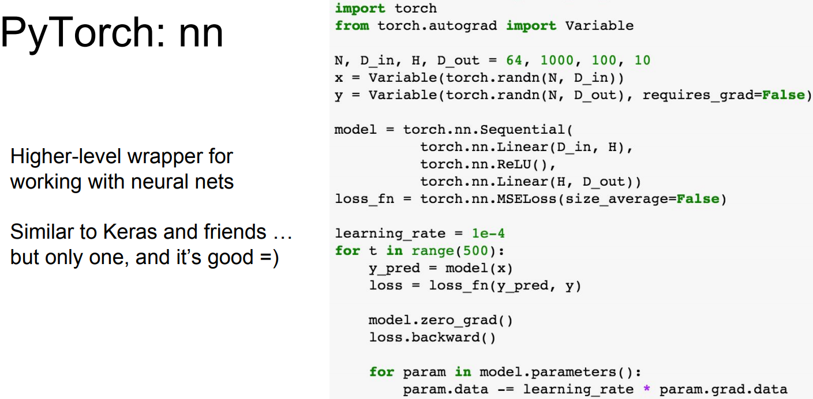

```
PyToch.nn: Tensorflow의 Keras, TF.Learn과 같은 higher level API의 역할.
... high level wrappers 제공.
```

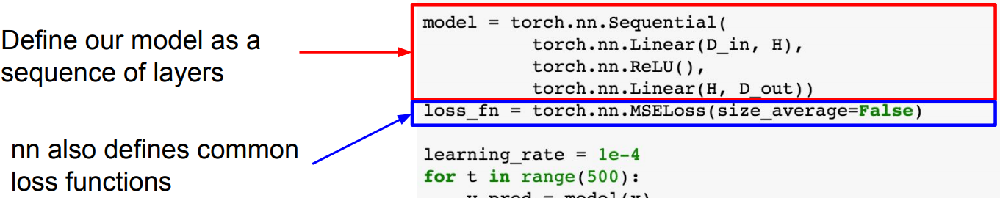

```
Linear/ReLU layer를 model sequence에 추가하는 부분은 Keras와 유사.
바로 밑에 nn package에서 제공하는 손실함수를 정의.
```

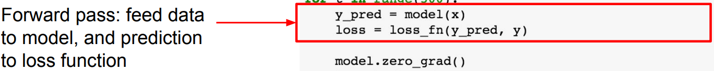

```
Forward pass: 매 반복마다 forward pass를 수행하여 prediction 결과를 도출하고 손실함수를 실행하여 loss도 도출.
```

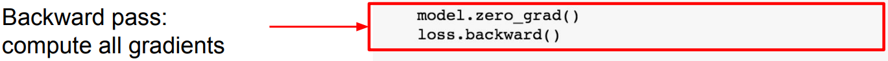

```
Backward pass: loss.backward를 호출하면 매 반복마다 gradient가 저절로 계산됨.
```

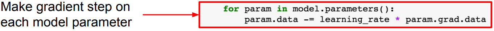

```
Gradient descent: 가중치 업데이트.
```

##### PyTorch: optim

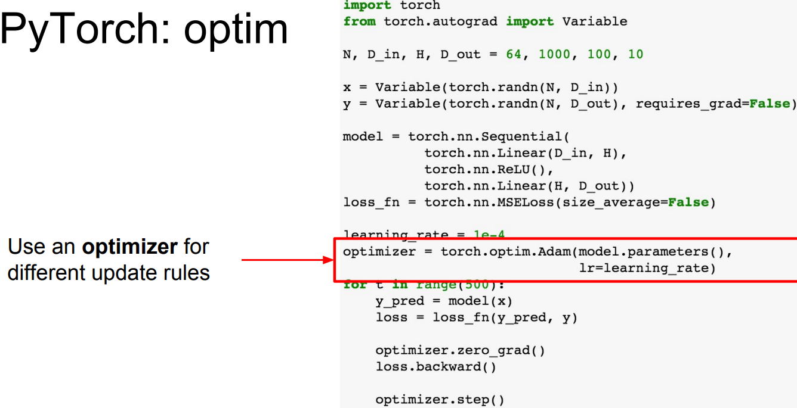

```
Tensorflow와 같이 PyTorch도 optimizer operations를 제공.

가중치 업데이트 부분을 추상화시켜 Adam과 같은 알고리즘을 더 쉽게 사용.
... optimizer 객체를 구성하는 것은 모델에게 파라미터를 optimize하겠다고 선언하는 것.
```


```
gradient 계산 후 optimizer.step을 호출하면 모델 파라미터가 업데이트.
```

##### PyTorch: nn, 나만의 module 정의

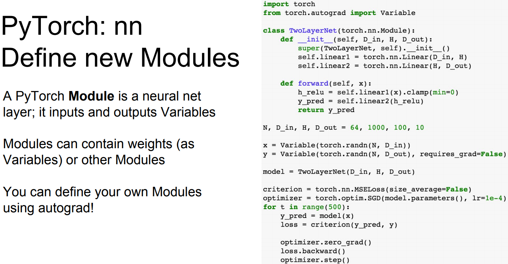

```
PyTorch 사용시 가장 많이 할 부분: 자신만의 nn.module 정의.
... 전체 네트워크 모델이 정의되어 있는 class를 nn modul class로 작성.

nn.module: 일종의 네트워크 레이어.
... module이 포함될 수도, 학습가능한 가중치가 포함 될 수도 있음.

PyTorch로 학습하는 가장 일반적인 패턴.
... 모델을 구성하는 클래스를 정의하고 반복문을 돌면서 모델을 업데이트하는 것.
```

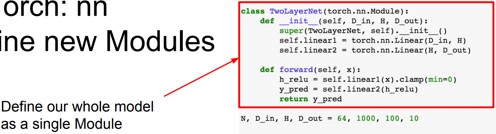

```
생성자.
... linear1과 linear2를 선언
... 이 두 module objects를 클래스에 저장.

forward.
... 네트워크 출력을 계산하기 위해 정의한 모듈 객체와 다양한 autograd 사용.
... 입력 x를 받아 linear1을 지나고 linear2를 지나서 결과값을 출력.
```

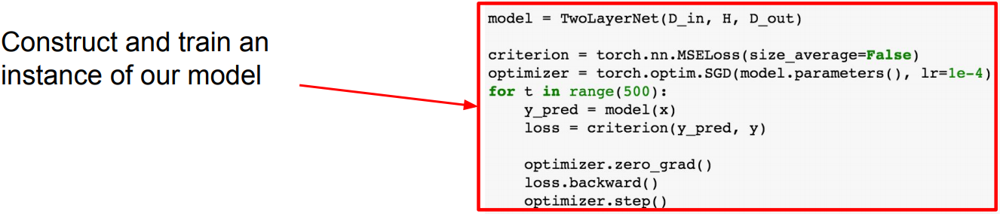

```
optimizer를 정의.
반복문을 돌면서,
... 데이터 입력.
... backwards로 gradient를 구하고.
... step으로 업데이트.
```

#### PyTorch: DataLoader

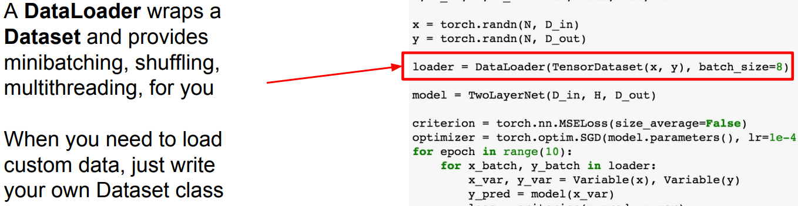

```
미니배치를 관리하는 PyTorch의 아주 유용한 기능.
학습 도중 Disk에서 minibatches를 가져오는 일련의 작업들을 multi-threading을 통해 알아서 관리.

Dataloader는 dataset을 wrapping하는 일종의 추상화 객체를 제공.
... 데이터를 읽는 방식만 명시해 dataset class 객체를 정의하면, 아래와 같이 객체를 순회하며 데이터의 미니배치를 적절히 변환.

내부적으로 Data shuffling, multithreaded, dataloading을 알아서 관리.
```

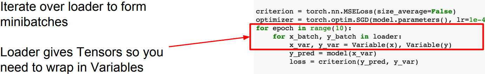

#### PyTorch: Pretrained Models

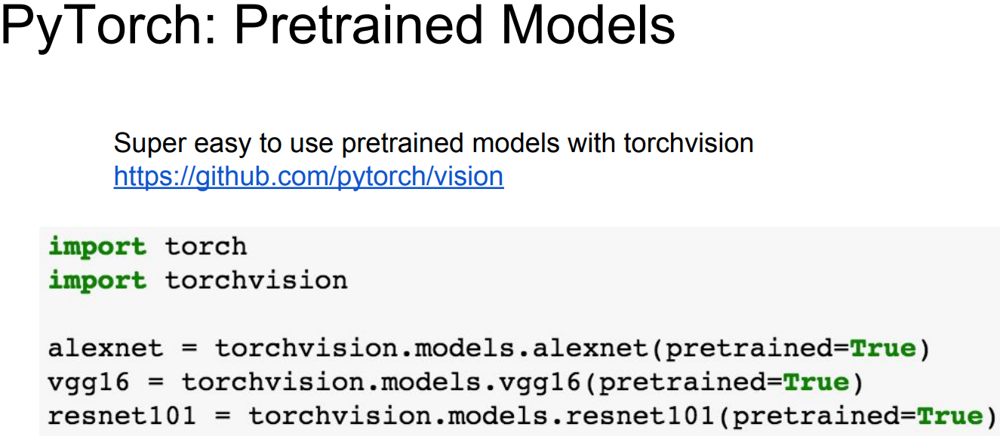

#### PyTorch: Visdom

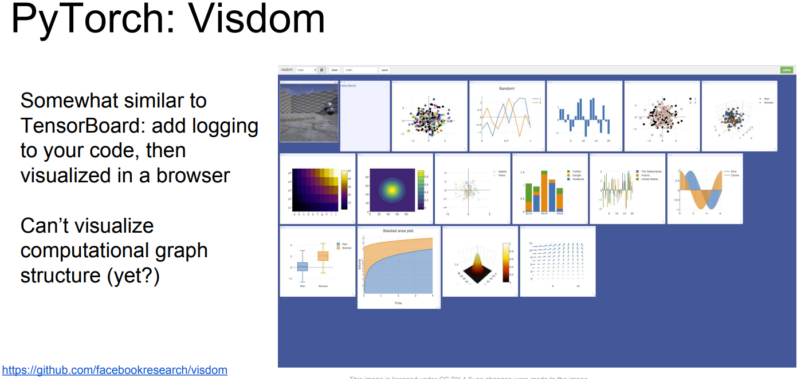

### Static Computational Graphs vs Dynamic Computational Graphs

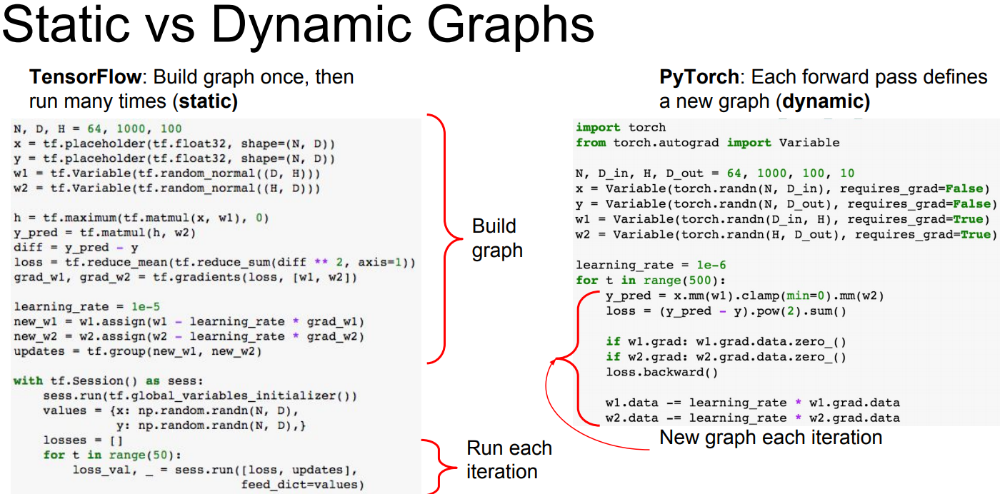

```
PyTorch와 Tensorflow의 주된 차이점.

Tensorflow:
... Static Computational Graph를 구성.
... Computational Graph를 반복적으로 돌리는 단계.

PyTorch:
... 매번의 forward pass마다 새로운 Dynamic Computational Graph를 구성.
```

#### Static Computational Graphs vs Dynamic Computational Graphs: Tradeoffs

##### Optimization

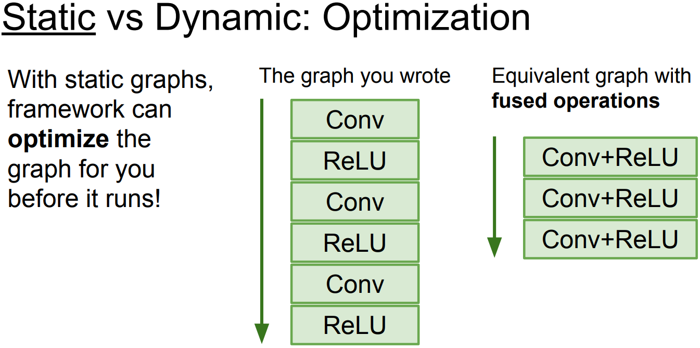

```
Static Computational Graph: Optimization에 용이.
... 한번 구성해 둔 그래프를 최적화시킬 기회가 있음.
... 일부 연산들을 합쳐버리고 재배열시키는 등 가장 효율적인 방법을 찾아 갈 수 있음.
... 처음의 최적화작업이 조금 오래 걸릴순 있음.

Dynamic Computational Graph는 그래프 최적화를 다루기 어려움.
```

##### Serialization

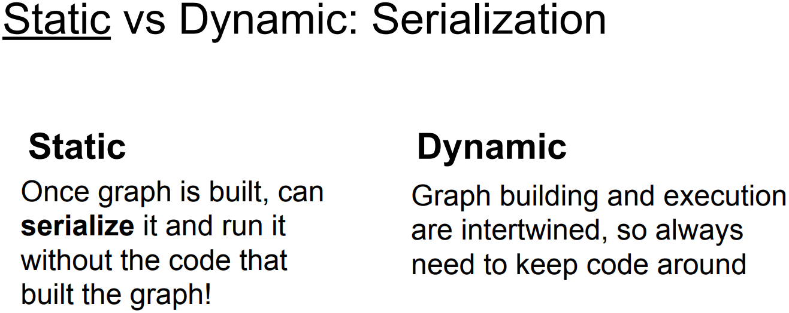

```
ㅍ: Serialization에 용이.
... 그래프를 한번 구성해 두면 메모리 내에 그 네트워크 구조를 가지고 있음.
... 네트워크 자체를 Disk에 파일형태로 저장할 수 있음.
... 원본 코드 없이 그래프를 불러 올 수 있음 ... Python으로 학습하고 기존의 코드없이 C++로 불러 올 수 있음.

Dynamic Computational Graph: 그래프 구성과 실행 과정이 얽혀(interleaving)있기에 모델 재사용을 위해서는 항상 원본코드가 필요.
```

##### Conditional

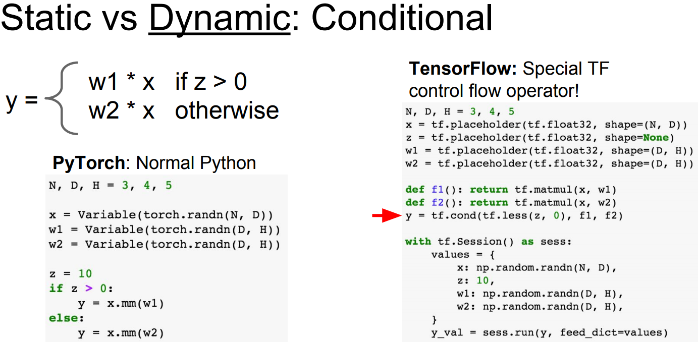

```
Dynamic Computational Graph: 깔끔한 코드 작성.
... 매번 Computational Graph를 만들기에 Forward pass만 잘 구성하면 됨.

Dynamic Computational Graph: 가능한 모든 control flow를 고려해서 Computational Graph를 미리 정의해야함.
... 반드시 특수한 Tensorflow 연산자를 요구함.
... Tensorflow에서 필요한 control flow 연산자들을 전부 익혀야함.
```

##### Dynamic Computational Graph: Application

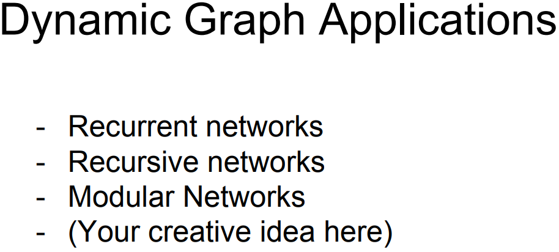