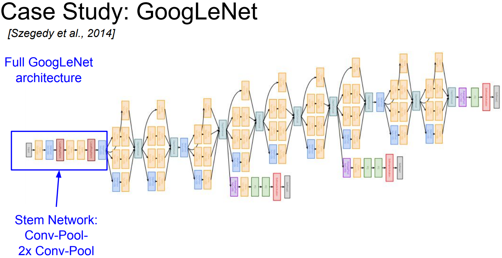
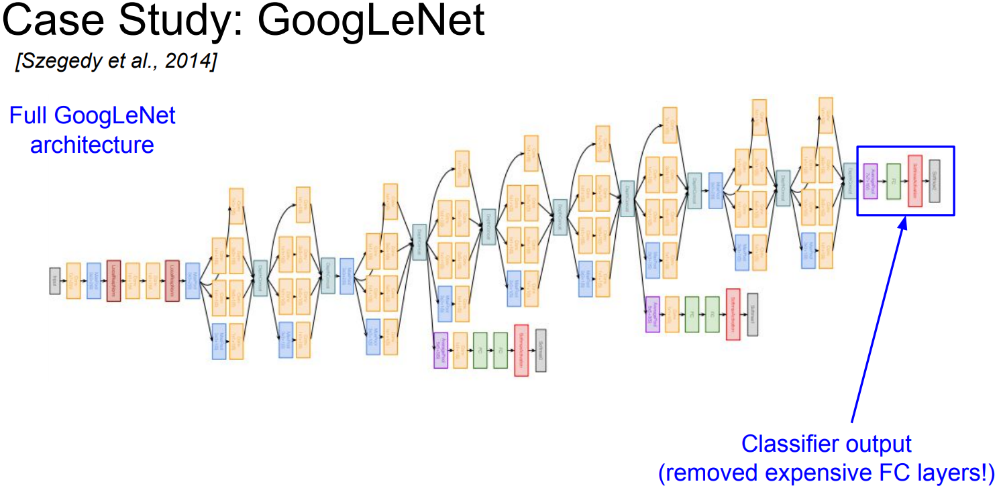
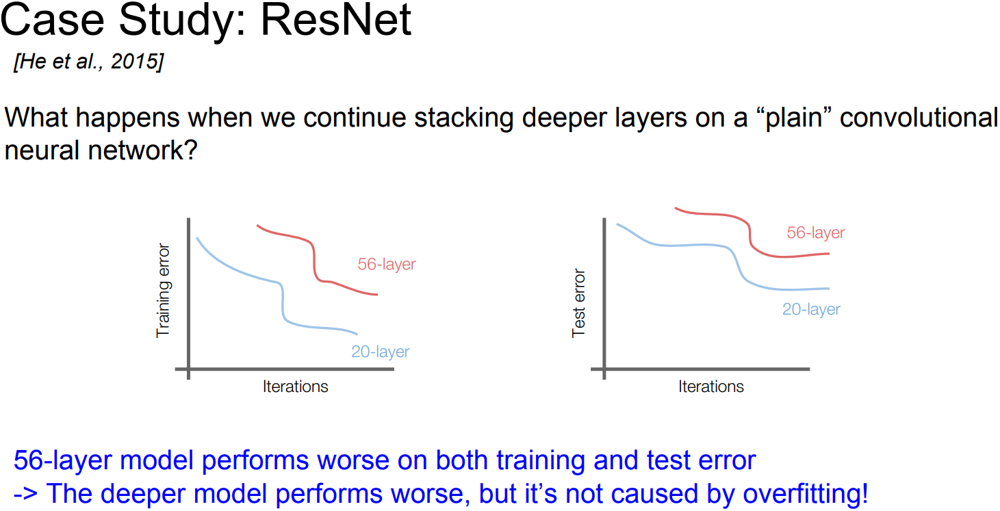

# lecture 9. CNN Architectures

## 학습목표

```
CNN Architectures

사람들이 가장 많이 사용하는 아키텍처들
... AlexNet/VGG/GoogLeNet/ResNet

엄청 잘 사용하지는 않지만 역사적인 관점에서 아주 흥미로운 모델들, 최신의 모델들
... NiN (Network in Network)/Wide ResNet/ResNeXT/Stochastic Depth
... DenseNet/FractalNet/SqueezeNet
```

## Case Study

### LeNet-5: 산업에 아주 성공적으로 적용된 최초의 ConvNet


```
이미지를 입력으로 받아 stride = 1인 5*5 필터를 거치고 면개의 Conv layer와 pooling layer를 거침. 그리고 끝 단에 FC layer.
... 엄청 간단한 모델이지만 숫자 인식에서 엄청난 성공을 거둠.
```

### AlexNet: 최초의 Large scale CNN


```
2012년 등장, 기존의 non-딥러닝 모델들ㅇ르 능가하는 놀라운 성능을 보임.
... ConvNet 연구를 부흥시킨 장본인.

기본적으로 Conv-Pool-Normalization 구조가 두 번 반복.
그 뒤에 Conv layer들(CONV 3, 4, 5),
그 뒤에 Pooling layer(Max POOL3),
... LeNet과 상당히 유사. 레이어만 많아짐.
```

#### AlexNet의 모델 크기

##### CONV 1


```
AlexNet을 ImageNet으로 학습시키는 경우, 입력의 크기가 227*227*3.

CONV 1: stride = 4의 11*11 필터가 96개.
... 출력 사이즈: 55*55*96.
... width == height == (227-11)/4 + 1 == 55.
... depth == 필터 갯수 == 96.

CONV 1 파라미터 갯수: 11*11*3*96 ... 35K개
```

##### POOL 1


```
POOL 1: stride =2의 3*3 필터.
... 출력 사이즈: 27*27*96.
... width == height == (55-3)/2 + 1 == 27.
... depth: 변함없음.

POOL 1 파라미터 갯수: 0개
```

#### AlexNet의 전체 구조


```
FC8은 Softmax를 거쳐 class score 계산.

AlexNet의 상세 구현.
... ReLU 사용.
... local reponse normalization layer: 채널간 normalization ... 큰 효과가 없는 것으로 알려짐.
... 엄청난 data augumentation: flipping, jittering, color norm 등.
... Dropout 사용.
... Batch size 128.
... SGD momentum 사용.
... learning rate: 초기 1e-2 ... val accuuracy를 올리기 위해 learning rate를 1e-10까지 줄임.
... weight decay 사용.
... 모델 앙상블 사용.
```


```
다른 Conv Net 다이어그램과 유사하지만 한 가지 차이점: 네트워크를 GPU에 분산시켜 넣음.
... AlexNet 학습 당시 GTX850의 메모리는 3GB.
... 두 GPU에 모델의 뉴런과 Feature map을 반반씩 분산.
```


```
CONV 1, 2, 4, 5: 전체 96개의 Feature map을 볼 수 없음.
... 48개의 Feature map만 사용.
```


```
CONV 3, FC 6, 7, 8: 전체 Feature map과 연결됨.
... 이 layer들에서는 GPU간 통신을 수행하기에 이전 layer의 전체 Feature map Depth를 전부 가져올 수 있는 것.
```

### ZFNet: AlexNet의 하이퍼파라미터 개선.


```
AlexNet과 같은 레이어 수, 기본적인 구조도 동일.
다만 stride size, 필터 수 같은 하이퍼 파라미터를 조절해서 AlexNet의 Error rate를 좀 더 개선. 
```


### VGGNet

#### VGGNet의 특징


```
훨씬 더 깊어짐.
... AlexNet에서는 8개의 layer였으나 VGGNet은 16에서 19개의 레이어.

아주 작은 필터만 사용 ... 항상 3*3 필터: 이웃픽셀을 포함할 수 있는 가장 작은 필터.
작은 필터를 유지하고 주기적으로 Pooling을 수행하면서 전체 네트워크를 구성.

VGGNet은 아주 심플하면서도 고급진 아키텍쳐.
ImageNet에서 7.3%의 Error를 기록.
```

#### VGGNet은 왜 더 작은 필터를 사용했을까?


```
필터 크기가 작으면 큰 필터에 비해 레이어를 조금 더 많이 쌓을 수 있음.
... 입력의 사이즈가 조금씩 줄어듬.

3*3 필터 3개를 쌓는 것은 결국 7*7 필터를 한번 쌓는 것과 동일한 Receptive field를 가짐.
... 3*3 필터 3개 쌓을 때의 파라미터 개수: 3개의 Feature map * Depth 3 * 3*3 = 81.
... 7*7 필터 1개 쌓을 때의 파라미터 개수: 7*7 = 49.
```

#### VGGNet의 전체 네트워크


```
Conv layer와 Pooling layer가 반복적으로 진행되는 패턴.

메모리 사용량 계산.
... 각 노드가 4 bytes의 메모리를 차지하므로 Forward pass 전체 약 100MB의 메모리가 필요.
... Backward pass를 고려한다면 더 많은 메모리가 필요.
... 전체 메모리가 5GB라면 이미지 하나당 100MB이므로 50장 밖에 처리할 수 없음.

전체 파라미터 개수: 138M개.

메모리 사용 분포.
... 초기 레이어 CONV에 많은 파라미터 수로 많은 메모리를 사용 ... Sparial diemention이 큼.
... FC 레이어들에 많은 파라미터로 많은 메모리를 사용 ... Dense connection 때문.
... 일부 네트워크들은 아얘 FC layer를 없에 파라미터 수를 줄이기도 함.

네트워크 표기법.
... 3X3 conv, 64: 64개의 필터를 가진 3*3 CONV layer.
... 각 필터를 묶어 그룹(G)별로 표현 ... convG-1, convG-2, ...
```

#### VGGNet의 상세구현


```
ImageNet 2014 Classification Challenge 2등, Localization 우승.
Local response normalization 사용하지 않음 ... 크게 도움되지 않기 때문.
VGG19는 VGG16에 비해 조금 더 깊고 조금 더 많은 메모리를 사용.
... 보통 16을 더 많이 사용.
AlexNet에서 처럼 모델 성능을 높이기 위해 앙상블 기법 사용.
마지막 FC layer, FC7은 이미지넷 1000 class의 바로 직전에 위치한 레이어.
... 4096사이즈의 레이어는 아주좋은 feature representation을 가지고 있는 것으로 알려져있음.
... 다른 데이터에서도 특징(feature) 추출이 잘되며 다른 Task에서도 일반화 능력이 뛰어남.
```

### GoogLeNet


```
22개의 layer로 엄청 깊은 네트워크.
Inception module을 쌓아서 구성.
... GoogLeNet에서 가장 중요한 것: 효율적인 계산에 대한 특별한 관점과 많은 계산량을 효율적으로 수행하도록 네트워크를 디자인. 
FC layer가 없음.
... 파라미터 개수를 줄임 ... 전체 파라미터 수 5M < 60M개의 AlexNet ... 그럼에도 훨씬 깊다.
ILSVRC'14 classification winner.
... 6.7% Error rate.
```

#### Inception module


```
Inception module이 만들어진 배경: a good local network typology 디자인.
... Network withIn a Network의 개념으로 local topology를 구현하고 이를 쌓아올림.
... 이 local network를 Inception module이라고 함.
```


```
Naive inception module의 연산.

Inception module 내부에는 동일한 입력을 받는 서로 다른 다양한 필터들이 병렬로 존재.
... 이전 레이어의 입력을 받아 다양한 Conv 연산을 수행.
... 1*1/3*3/5*5 CONV, POOL.
... 그 출력들을 모두 Depth 방향으로 합침(Concatenate) ... 하나의 Tensor로 출력이 결정되고 다음 레이어로 전달.

Q. 이 구조의 문제점은?
A. 계산 비용.
```


```
이 경우 입력의 Depth는 256이었으나 출력은 672가 됨. 그리고 layer를 거칠수록 점점 더 늘어나게 됨.

GoogLeNet에서 사용한 key insight: "Bottleneck layer"를 이용하는 것.
... Conv 연산을 수행하기에 앞서 입력의 Depth를 낮춤.
```


```
1*1 conv는 각 Spatial location에서만 내적을 수행.
... 그러면서 depth만 줄일 수 있음. 입력의 depth를 더 낮은 차원으로 projection하는 것.
... 그 값은 Feature map들의 해당 Spatial location에 대한 선형 결합.
```


```
각 레이어의 계산량은 1*1 conv를 통해 줄어듬.
... 1*1 conv가 bottleneck layer의 역할로 추가됨.

일부 정보손실이 발생할 수 있으나 redundancy를 제거하는 것으로도 해석할 수 있다.
... 이는 완벽한 해석은 아니지만 일반적으로 1*1 conv를 추가하면 여러모로 도움이 되고 더 잘 동작한다.

Inception module에서 1*1 conv를 사용하는 기본적인 기본적인 이유는 계산복잡도를 조절하기 위함이다.
```

#### GoogLenet의 전체 구현



```
초기 6개의 layer: 일반적인 네트워크구조.
... 처음에는 conv, pool을 몇번 반복.
```


```
이후 Inception module들이 쌓이는데 모두 조금씩 다름.
```



```
마지막에는 Classifier 결과를 도출.
GoogLeNet에서는 계산량이 많은 FC-layer를 대부분 걷어냈고, 파라미터가 줄어들어도 모델이 잘 동작함을 확인함.
```


```
network 중간중간 추가적인 줄기가 뻗어있는데, 이들은 보조분류기(auxiliary classifier).
... 사이즈가 작은 일반적인 네트워크 구조.
... Average Pooling과 1*1 conv, FC layer로 구성.
... SoftMax로 1000개의 ImageNet class를 구분.
... 보조분류기에서도 트레이닝셋 Loss를 계산 ... 추가적인 gradient를 얻어 중간 layer의 학습을 도울 수 있음.
```

```
Q. 보조분류기 결과를 최종 분류결과로 사용할 수 있는가?
A. GoogLeNet 학습 시, 각 보조분류기의 Loss를 모두 합친 평균을 계산.

Q. Bottleneck layer 구성 시 1*1 conv 말고 다른 방법으로 차원을 축소시켜도 되는가?
A. Inception module에서 1*1 conv를 쓴 이유는 차원 축소의 효과도 있고 다른 layer들 처럼 conv layer이기 때문.
... 차원 축소 과정에서 이전의 Feature map과 연관이 있는지 학습하려면 전체 네트워크를 Backprop으로 학습시킬 수 있어야 한다.

Q. 왜 보조분류기에서 gradient를 전달해야하는가?
A. 네트워크의 맨 마지막부터 Backprop해올 때, 그 깊이가 엄청 깊다면 gradient 신호가 0에 가깝게된다.
... 그렇기 때문에 보조 분류기를 이용해서 추가적인 gradient 신호를 흘려줘야한다.
```


```
GoogLeNet에는 기본적으로 22개의 layer가 있음.
... 아주 효율적인 Inception module이 있고, FC layer들을 줄였음.
AlexNet보다 12배 작은 파라미터를 가지고있음.
ILSVRC 2014 classificaiton의 winner.
... 6.7% Error rate.
```

### ResNet: 혁명적으로 깊어진 딥러닝 모델.


```
ResNet은 혁명적으로 네트워크의 깊이가 깊어진 모델.
2014년부터 네트워크가 깊어지긴 했지만 ResNet 아키텍처는 152 layer로 엄청나게 깊어짐.
```

#### Residual connections


```
ImageNet데이터셋 classification을 위해 152개의 layer로 구성.
ILSVRC'15의 winner.
... 3.57% Error rate.
ImageNet 외에도 COCO classification/detecion 대회를 모두 석권.
```



```
ResNet과 Residual connection의 기본 Motivation.
... 일반 CNN을 쌓으면 어떻게 될까? 가령 VGG에서 CONV와 POOL을 계속 쌓으면 성능이 좋아질까?
... 대답은 NO!

56 layer 네트워크는 엄청나게 많은 파라미터가 있으니 Overfit하겠다 예상됨.
... Test error는 높더라도 Training error는 낮아야 정상.
... 그런데 56 layer의 Training error가 20 layer보다 좋지 않음.
... 단순히 Overfitting 때문에 성능이 낮은 것이 아니다!
```


```
저자들의 가설: 모델이 깊어질 수록 optimization에 문제가 생긴다! ... 학습해야할 파라미터의 수가 기하급수적으로 늘어나기 때문.
... 얕은 모델의 가중치를 복사하고 나머지 레이어는 Input을 그냥 output으로 보내버리는 Identity mapping.
... 이러면 깊은 모델은 적어도 얕은 모델의 성능은 보장됨.

이 직관을 구조화 한것이 Residual mapping.
```


```
Residual mapping: 모델이 출력 전체 H(x)를 학습하게 하지말고 잔차 F(x)만 학습하게 하자!
... 네트워크는 Residual만 학습하면 끝. 출력 값도 결국엔 입력 X에 가까운 값.
```

```
Q. layer의 출력과 Skip connection의 출력이 같은 차원인가?
A. 일반적으로는 같은 차원이지만 그렇지 않다면 Depth-wise padding으로 차원을 맞춰줌.

Q. 왜 Residual의 학습이 layer 전체 출력 학습보다 쉬운가?
A. 아주 깊은 네트워크에서는 H(x)를 잘 학습시키가 아주 어렵다.
... ResNet의 아이디어: H(x) = F(x) + X이니, F(x)를 잘 할습시켜보면 어떨까? 하는 것.
... H(x)를 직접 배우는 대신, X에 얼마의 값(Residual)을 더하고 빼야 할까?를 배우는 것이 더 쉽다고 가정한 것.
```

#### ResNet의 상세 구현


```
하나의 Residual block: 두 개의 3*3 conv layer들로 이루어짐.
... 이렇게 구성해야 잘 동작하는 것으로 알려져 있음.
... ResNet은 이 Residual block을 쌓아올림 ... 150 layers까지 쌓아올릴 수 있음.
... 주기적으로 필터를 두배씩 늘리고 stride 2를 이용해 Downsampling을 수행.
... 네트워크 초반에는 Conv layer가 추가적으로 붙음.
... 네트워크 끝단에는 FC layer 대신 Average pooling을 사용.
... 그리고 마지막에는 1000개의 클래스 분류를 위한 FC layer가 붙음.

ResNet은 심플하면서도 세련된 구조.
```


```
ResNet 모델의 경우, Depth가 50 이상일 때, Bottleneck layer를 도입.
... GoogLeNet에서 사용한 방법과 유사.
... Bottleneck layer는 1*1 conv를 도입하여 초기 필터의 Depth를 줄여줌.
... 가령 입력이 28*28*256일 때, 1*1 conv를 적용하면 depth가 줄어 28*28*64가 되서 3*3 conv의 계산량이 줄어들게 됨.
... 그런 뒤 다시 1*1 conv를 추가하여 Depth를 다시 256으로 늘림.
```


```
ResNet은 모든 Conv layer 다음 Batch norm을 사용.
초기화는 Xavier를 사용, 추가적인 Scaling factor를 추가(나누기 2).
... SGC + Momentum에서 좋은 초기화 성능을 보임.
Learning rate는 스케줄링을 통해 Validation error가 줄어들지 않는 시점에서 조금씩 줄여줌.
Minibatch 사이즈는 256.
Weight decay 적용.
Dropout은 사용하지 않음.
```

#### ResNet의 실험 결과


```
성능의 열화 없이 엄청 깊은 네트워크를 아주 잘 학습시킴.
... Backprop시 네트워크의 gradient flow를 아주 잘 가져갈 수 있었음.
ImageNet 학습을 위해 152 layer까지 시도해 보았으며 Cifar-10으로는 1200 layer까지 늘렸음.
네트워크가 깊어질수록 Train Error가 게속 줄어듬 ... 높아지는 경우가 없음.

인간 능력(5%)보다 뛰어난 3.6%의 분류 성능.
... 모든 대회에서 2위와 엄청난 격차로 우승.
```

### 모델 별 Complexity 비교


```
좌측 그래프: 모델의 성능 별 정렬.
... Top 1 Accuracy 기준, 높을수록 좋은 모델.
... GoogLeNet Inception-V4: ResNet + Inception 모델

우측 그래프: 계산 복잡성이 추가된 모델의 성능.
... y축: Top 1 Accuracy, x축: 연산량, 원의 크기: 메모리 사용량.
... VGGNet(초록색 원): 가장 효율성이 낮음, 메모리도 엄청 잡아먹고 계산량도 엄청 많음. 어쨌든 성능은 나쁘지 않음.
... GoogLeNet(파란색 원): 가장 효율적인 네트워크, x축에서 거의 왼쪽에 있고 메모리 사용량도 적음.
... AlexNet(주황색 원): Accuracy가 낮음, 몸집이 작아 계산량도 작음, 하지만 메모리 사용량이 매우 비효율적.
... ResNet(핑크색 원): 적당한 효율성을 가지고 있음. 메모리 사용량과 계산량은 중간정도지만 Accuracy는 최상위.
```


```
좌측 그래프: Forward pass 시간(ms 단위).
... VGGNet(초록색 선): 제일 오래걸림, 200ms로 초당 5정도 처리.

우측 그래프: 전력소모량.
```

### 추가적인 아키텍처

```
아키텍처 몇 가지 소개.
... 역사적으로 의미가 있거나, 최신 연구분야에 속하는 것들.
```

#### Network in Network (NiN)


```
NiN의 기본 아이디어: MLP conv layer ... 네트워크 안에 작은 네트워크를 삽입하는 것.
각 Conv layer 안에 MLP(Multi-layer Perceptron)을 쌓음 ... FC layer를 몇 개 쌓는 것.
맨 처음 기존의 Conv layer가 있고 FC layer를 통해 abstract features를 잘 뽑을수 있도록 함.
... 단순히 Conv filter만 사용하지 말고, 조금 복잡한 계층을 만들어 Activation map을 얻어보자는 아이디어.

NiN에서는 기본적으로 FC layer를 사용. 이를 1*1 Conv layer라고도 함.
... GoogLeNet, ResNet 보다 먼저 Bottleneck 개념을 적립했기에 아주 의미있는 아이디어.
```

#### ResNet의 성능을 향상시킨 최신의 연구들

```
워낙 빠르게 발전하고 있어 팔로우업하기 힘들다.
필요하면 찾아보자.
```


```
ResNet block path를 조절: Direct path를 늘려 정보들이 앞으로 더욱 잘 전달되고 Backprop도 더 잘 될 수 있게 개선.
```


```
Wide Residual Network: Residual이 Depth보다 더 중요하다.
... Residual block을 더 넣게 만듬 ... conv layer 필터를 더 많이 추가함.
... 가령 기존의 ResNet에서는 Block 당 F개의 filter만 있었다면 F*K개의 필터로 구성.
... 각 layer를 넓게 구성했더니 50 layer만으로 기존 ResNet-152 보다 성능이 좋은 것을 입증.

Depth 대신 filter의 Width를 늘릴 때 추가적인 이점: 계산 효율의 증가 ... 병렬화가 더 잘됨.
... Depth를 늘리는 것은 Sequential한 증가 ... Conv의 filter(Width)를 늘리는 편이 더 효율적.
```

```
네트워크의 Widht/Depth/Residual connection을 고찰하라는 뜻깊은 연구.
```


```
ResNeXt: ResNet의 저자가 계속 Residual block의 Width를 파고듬. Filter의 수를 늘리는 것.
... 각 Residual block 내에 다중 병렬 경로를 추가, pathwary의 총합 = Cardinality.
... 하나의 Bottleneck ResNet block은 비교적 작지만 이런 Thinner block들을 병렬로 여러개 묶음.

ResNeXt: ResNet + InEXception
... ResNeXt과 Wide ResNet의 연관성: Filter수 증가.
... ResNeXt와 Inception module의 연관성: Thinner block들을 병렬로 묶음.
```


```
Stochastic Depth: Depth를 Dropout!
... 네트워크가 깊어지면 깊어질수록 Vanishing gradient 문제가 발생.

기본 아이디어: Train time에서 layer의 일부를 Dropout!
... Train time에 일부 네트워크를 골라서 Identity connection을 만듦 ... Dropout과 유사.
... Shorter network는 보다 쉽게 학습함.
... Test time에서는 Full deep network를 사용.
```

#### FractalNet: Residual 없이 엄청 깊은 네트워크


```
기본 아이디어: Shallow/Deep 네트워크의 모든 정보를 잘 전달하는 것이 중요하다.
... Shallow/Deep 경로를 모두 출력에 연결.

다양한 경로가 존재하지만 Train time에는 Dropout처럼 일부 경로만을 이용해서 Train.
그리고 Test time에는 Full network를 사용.

Residual connection 없이 ResNet과 유사한 성능.
```

#### DenseNet(DENSEly Connected Convolutional NETworks)


```
DenseNet의 Dense Block: 한 layer가 그 하위의 모든 layer와 연결됨.
... Network의 입력이미지가 모든 layer의 입력으로 들어감.
... 그리고 모든 layer의 출력이 각 layer의 출력과 concat됨.
... 이 값이 각 Conv layer의 입력으로 들어감 ... 이 과정에서 Dimention을 줄여주는 과정이 포함됨.

Dense Connection.
... Gradient vanishing 문제를 완화한다고 주장.
... Feature를 더 잘 전달하고 더 잘 사용할 수 있게 해줌 ... 각 layer의 출력이 다른 layer에서도 여러번 사용될 수 있기 때문.
```

#### SqueezeNet


```
네트워크 연구는 대게 layer 간의 연결 구성, Depth 구성에 대한 연구로 진행된다.
SqueezeNet은 효율성에 치중한 네트워크.

GoogLeNet은 효율적인 모델에 대한 방향으 제시했다.
... 실질적인 활용을 위해 매우 중요한 주제.

Squeeze layer는 1*1 필터들로 구성되고, 이 출력값이 1*1/3*3 필터들로 구성되는 expand layer의 입력이 됨.
... ImageNet에서 AlexNet 만큼의 Accuracy를 보이지만 파라미터는 50배 적었음.
... SqueezeNet을 보다 압축하면 AlexNet 보다 500배는 작아짐(0.5Mb).
```

## Summary


```
네트워크가 점점 깊어지는 트렌드드와 layer를 어떻게 디자인할지가 가장 큰 관심사.
... skip connections 등.
Backprop이 잘 되도록 디자인하는 것도 중요.
Depth vs Width, Residual connection등 다양한 이슈 들.
```
