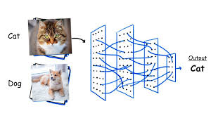

# lecture2. Image Classfication

## Image Classification
- 컴퓨터비전 분야의 Core Task
- 이미지 분류?: 입력 이미지가 정해놓은 카테고리의 어디에 속하는지 고르는 일.


- 고도화된 시각체계를 가진 인간에게는 쉽지만 기계에게는 정말 어려운 일.
>- 의미론적 차이(Semantic Gap) 발생
>>- 컴퓨터에겐 이미지는 단순히 격자형태의 숫자집합.

>- Challenges: Viewpoint variation
>>- 이미지의 미묘한 변화에도 픽셀값들은 모조리 바뀜.


>>- 이런 변화에 강인한 알고리즘이 필요함.

>- Challenges: Illumination
>>- 물체가 밝은곳에 있던 어두운 곳에 있던 동일한 물체로 인식해야함.
>>- 조명에 강인한 알고리즘이 필요함.

>- Challenges: Deformation
>>- 물체의 형태가 변하더라도 동일한 문체로 인식해야함.
>>- 변형에 강인한 알고리즘이 필요함.

>- Challenges: Occlusion
>>- 물체의 일부밖에 볼 수 없는 경우도 존재함.
>>- 가려짐에도 강인한 알고리즘이 필요하지만 너무 어려운 문제인듯 하다.

>- Challenges: Background Clutter
>>- 물체가 배경과 매우 유사할 수 있다.

>- Challenges: Interclass variation
>>- 하나의 개념(클래스)로 모든 물체의 다양한 모습을 전부 소화해 내야 한다.
>>- 객체에 따라 생김새, 크기, 색, 나이가 각양 각색일 것이다.

- An image classifier
'''
def classify_image(image):
	# Some magic here?
	return class_label
'''
>- 사물인식의 경우, 알고리즘 문제와 같이 직관적이고 명시적인 알고리즘은 존재하지 않는다.
>- 막상 프로그램을 만들라고 하면 다들 벙쪄있을 것.
>>- 지금까지 연구들은 사물을 인식하기위한 coded rules를 만들고자 시도해왔었다.
>>- Hubel과 Wiesel의 연구 덕분에 Edges는 중요한 feature로 알려져있다.
>>>- 우선 이미지에서 edges를 계산하고 다양한 corners와 egdes로 분류한다.
>>>- 각 모퉁이와 엣지의 집합으로 사물을 인식하기 위한 명시적인 규칙 집합을 작성한다.
>>- 이런 접근의 문제점
>>>- 강인하지 못하다.
>>>- 확장성이 없다.

- Data-Driven Approach: 이 세상에 존재하는 다양한 객체들에게 유연하게 적용 가능한 확장성 있는 알고리즘
```
def train(images, labels):
	# Machine Learning!
	return model
```
```
def predict(model, test_images):
	# Use model to predict labels
	return test_labels
```

