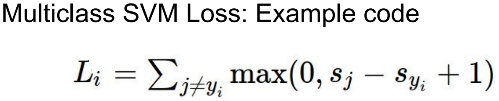
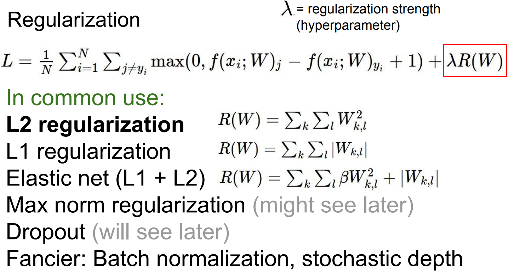

# lecture3. Loss Functions and Optimization

## 학습목표

```
1. Loss Function(손실함수): 임의의 W값의 성능을 정량화.
2. Optimization(최적화 과정): W가 가질될 수 있는 모든 경우에 대해서 가장 괜찮은 W를 찾는 일.
```

일반적인 딥러닝 알고리즘의 구조 이해

```
1. 데이터 구조 파악: 어떤 X와 Y가 존재하는가?
2. 손실함수 정의: 학습할 파라미터 W가 얼마나 좋은지 정량화하는 손실함수 L은 무엇인가?
3. 최적화 과정: W의 공간을 탐색하면서 loss를 최소화하는 최적의 W를 구하자!
```


## 1. Image Classification 손실함수

### Multiclass SVM loss

```
여러 클래스를 다루기 위한 이진 SVM의 일반화된 형태.

오직 정답 스코어와 그외 스코어와의 차이만 고려한다.
```



Multiclass SVM Loss 동작: L_i를 구하는 과정

```
1. 맞지 않는(True가 아닌) 모든 카테고리를 전부 합함.
2. 올바른 카테고리의 스코어와 올바르지 않은 카테고리의 스코어를 비교.
3-1. if 올바른 카테고리 점수가 일정 마진(saftey margin, 이 예에선 1) 이상이라면,
... True의 스코어 >> False 카테고리 스코어들의 합 ... loss = 0
3-2. else
... loss = False 카테고리 스코어들의 합

... Multiclass SVM: 정답 스코어가 다른 스코어들 보다 높으면 좋다는 것.
```


```
1. 정답이 아닌 클래스를 순회.
... Cat이 정답클래스인 경우, Car와 Frog 클래스를 순회
... j == Car 클래스: loss = max(0, 5.1 - 3.2 + 1) ... S_j(Car 스코어) = 5.1, S_y_i(Cat 스코어) = 3.2, margin = 1
... j == Frog 클래스: loss = max(0, -1.7 - 3.2 + 1) ... S_j(Frog 스코어) = -1.7, S_y_i(Cat 스코어) = 3.2, margin = 1

2. 순회한 loss들의 합으로 해당 클래스의 최종 loss값 계산
... Cat의 최종 loss = 순회한 loss 합 = 2.9 + 0 = 2.9

3. 전체 트레이닝셋 최종 loss는 각 트레이닝 이미지 loss들의 평균
... 전체 loss = (Cat 최종 loss + Car 최종 loss + Frog 최종 loss) / 3 = 5.3
... 우리의 분류기의 트레이닝셋을 분류 성능 지표 = 5.3 
```


Multiclass SVM 동작의 이해를 위한 질문들

- Q1. Car 스코어가 조금 변하면 loss에는 무슨일이 일어날까?

```
SVM Loss는 오직 정답 스코어와 그 외의 스코어와의 차이만 고려한다.
Car 스코어가 조금 변한다 해도, 서로의 간격(차이)은 여전히 유지되고 결국 loss에 변함은 없다.
... 계속 0일 것이다.
```

- Q2. SVM Loss가 가질 수 있는 최대/최소값은 무엇일까?

```
최소값은 0.
... 모든 클래스에 걸쳐 정답 스코어가 가장 크다면 모든 트레이닝 데이터에서 loss가 0이 될 것이다.
최대값은 +무한대.
... Hinge Loss의 형태를 고려하면, 정답 스코어가 충분히 작을 때, loss 값은 +무한대로 간다.
```

- Q3. 보통은 행렬 W를 임의의 작은 수로 초기화시킨다. 이 때(모든 s ≈ 0)의 Multiclass SVM은 어떤 loss값을 가질까?

```
클래스 개수 - 1.
... loss를 계산할 때 정답이 아닌 클래스들을 순회한다: C-1개의 클래스 순회
... 비교하는 두 스코어가 거의 비슷하니 margin 때문에 1의 스코어를 얻는다.
... 전체 C-1개의 클래스에서 1의 스코어를 가지니 loss = C - 1

이는 디버깅 전략으로 유용하다.
트레이닝을 처음 시작할 때 loss != C-1이라면, 버그가 있는 것이고 고쳐야한다.
실제로 아주 유용한 스킬.
```

- Q4. SVM Loss는 정답인 클래스는 빼고 더했다. 정답 클래스도 같이 더한다면(모든 클래스를 순회한다면) 어떻게 될까?

```
기존 loss에서 1이 증가한다.

실제로 정답 클래스만 빼고 계산하는 이유이기도 하다.
일반적으로 loss == 0이 되야만 직관적인 해석이 가능하다.
```

- Q5. loss에서 전체 합이 아니라 평균을 쓰면 어떻게 될까?

```
영향이 없다.
... 클래스 개수 C는 어차피 고정됐으니, 평균을 취한다는 것은 그저 손실함수를 리스케일 할 뿐이다.
```

- Q6. loss에서 제곱을 쓰면 어떻게 될까?

```
결과가 달라진다.
... 제곱은 비선형화 시키는 방법 중 하나.
... 이렇게 되면 손실함수의 계산 자체가 바뀐다.
... 실제로도 이런 목적에서 sqaured hinge loss를 종종 사용한다.

손실함수의 요지는 '얼마나 나쁜지'의 정량화.
... 분류기가 다양한 loss들 마다 상대적 패널티를 부여할 수 있을까에 대한 고민.
... 만일 loss에 제곱을 한다면, 안좋은 것은 곱절로 안좋아지는 것. 심하게 잘못 분류되는 것을 정말 원하지 않는 지표가 됨.
... 반면 Hinge Loss를 그대로 사용한다면, 안좋은 수준을 크게 신경쓰지 않게 됨.

어떤 loss를 선택하는가에 따라 우리가 에러에 얼마나 신경쓰고 있는지를 결정하게 된다.
... 이 문제는 손실함수를 만들 때 고려해야만 하는 부분.
```

- Q7. loss = 0인 W가 단 하나만 존재할까?

```
아니다! 2W 또한 loss = 0이다!

```

Multiclass SVM Loss: Example Code

```
def L_i_vectorized(x, y, W):
	scores = W.dot(x)
	margins = np.maximum(0, scores - scores[y] + 1) # S_j - S_y_i + 1
	margins[y] = 0 # 전체합을 구할 때, 제외하고 싶은 부분만 0으로 만들어주어서 전체 순회할 필요가 없게하는 vectorized 기법
	loss_i = np.sum(margins)
	return loss_i
```

Hinge Loss: 직선이 접힌 형태의 그래프


```
x축: S_Yi ... 실제 정답 클래스의 스코어
y축: loss값

정답 카테고리의 스코어가 올라갈수록 loss가 선형적으로 줄어들고있음.
정답 클래스의 스코어가 0이 된 이후에도 safety margin을 넘어설 때 까지 더 줄어듬.
```

## 2. Regularization


```
보통, 손실한수에 Regularization Term을 추가해준다.

Data loss: 모델이 트레이닝셋에 핏하게 하는 역할.
Regularization: 모델이 데이터셋에 완벽히 핏하지 못하도록 모델의 복잡도에 패널티를 부여하는 방법
... 모델이 더 복잡해지지 못하도록 하는 것.
... 모델에 soft penalty를 추가하는 것.
람다: 두 항간의 트레이드오프.
```



```
L2 regularization: 가중치 행렬 W에 대한 Euclidean norm(= squared norm) / 1/2*squared norm (보다 깔끔한 미분값)
L1 regularization: L1 norm ... W가 희소행렬이 되도록 함.
Elastic regularization: L1 + L2.
Max nore regularization: L1, L2 대신 max norm을 사용.

... 가장 보편적인 것은 L2 Regularization(= Weight decay)
```

Regularization에 대한 일반적인 직관

```
L1 regularization: W(모델)을 sparse하게 만듬.
... 0이 아닌 요소들의 갯수를 복잡하다고 느끼고 측정하는 듯.
L2 regularization: W(모델)을 전체적으로 퍼트림.
... 전체적인 요소들의 불균형을 복잡하다고 느끼고 측정하는 듯.
```

### Softmax Classifier(Multinomial Logistic Regression)

</img>

```
Multiclass SVM의 경우, 스코어 자체를 크게 신경쓰지 않는다. 단지 대소를 비교할 뿐 그 의미에 관심이 없음.
하지만 Softmax 손실함수는 스코어 자체에 추가적인 의미(확률)를 부여한다.

Softmax function: 스코어들에 지수를 취하여 양수로 만들고 그 지수들의 합으로 다시 정규화한다.
... 확률 분포를 얻음.

Softmax로 얻은 확률 값과 실제 값을 비교해보자.
만약 이미지가 고양이라면, 실제 고양이일 확률은 1, 나머지 클래스의 확률은 0이됨.
... 우리 모델의 목표는 softmax에서 나온 확률이 정답 클래스에 해당하는 확률은 1, 나머지는 0이 되게 하는 것이됨.

그렇게 되면 Loss는 -log(P(정답 클래스))이 될 것이다.
... log를 사용하는 이유: 그냥 확률값을 최대화 시키는 것 보다 log값을 최대화하는 것이 쉽고 단조증가함수.
... 마이너스를 붙이는 이유: 손실함수는 얼마나 좋은지가 아니라 얼마나 구린지를 측정하기 위한 것, 단조감소함수를 만들어 주기 위해.
```

Multiclass SVM 동작의 이해를 위한 질문들

- Q1. Softmax classifier L_i의 최대/최소값은 얼마일까요?

```
최소값은 0이고, 최대값은 무한대이다.

확률은 0~1의 값을, 로그를 씌우면 -무한대~0의값을 가진다.
여기에 -를 곱하니 무한대~0의 범위를 가지게 된다.

다만, 컴퓨터는 유한정밀도를 가지기에 실제로 최대/최소값에 도달할 수 없다.
... 지수승을 계산하는 과정에서 오차 발생.
```

- Q2. 보통은 행렬 W를 임의의 작은 수로 초기화시킨다. 이 때(모든 s ≈ 0)의 softmax loss는 어떤 loss값을 가질까?

```
-log(1/C) = log(C)

첫 iter에서 loss값이 log(C)가 아니라면 뭔가 잘못된 것.
유용한 디버깅 스킬이다.
```

### Softmax loss vs. SVM

</img>

```
SVM loss는 오직 정답 스코어와 다른 클래스 스코어의 차이(마진)가 얼마나 되는지에만 관심이 있음.
하지만 Softmax는 언제나 정답의 확률을 1로 만들려고 노력한다.
... SVM의 경우, 일정 선(margin)만 넘기면 더이상 성능 개선에 신경쓰지 않는다.
... 반면 softmax는 성능을 높이기 위해 끝없이 개선한다.

실제 딥러닝 애플리케이션에서는 두 함수간 성능차가 크진 않지만, 이 차이를 아는 것은 유용할 것.
```

### 정리: Supervised learning의 전반적인 개요

</img>

```
- 데이터셋 x, y
- 입력 x로부터 스코어를 얻기위해 Linear classifier를 사용.
- 모델의 예측값이 정답값에 비해 얼마나 구린지 측정하기위해 loss function을 사용.
- 이때 모델의 복잡함과 단순함을 통제하기 위해 손실함수에 regularization term을 추가.
```

## 3. Optimization

```
W의 공간을 탐색하면서 최소의 loss를 만드는 W를 찾는 일.

... 실제 NN을 사용하면 '예측함수', '손실함수', 'Regularizer' 같은 것들이 너무도 복잡해서 명시적인 최적 솔루션(minima)을 직접얻기는 불가.
... 다양한 iterative 방법들을 사용: 임의의 지점에서 시작해서 점차적으로 성능을 향샹시키는 방법.
```

Optimization Strategy
- 1. Random search: 가장 단순한 방법.

```
best_loss = float('inf')
for num in xrange(1000):
	W = np.random.randint(10, 3073 * 0.0001)
	loss = L(X_tr, Y_tr, W)
	if loss < best_loss:
		best_loss = loss
		bestW = W
	print('in attempt %d, the loss was %f, best %f'%(num, loss, best_loss))
```

- 2. Fllow the slope: 지역적인 기하학적 특성을 이용.

```
while True:
	weights_grad = evaluate_gradient(loss_func, data, weights)
	weights += - step_size * weights_grad # 파라미터 W 업데이트

# gradient: 함수에서 증가하는 방향.
# - gradient: 함수에서 감소하는 방향.
# ... step_size: 함수를 감소시킬 때 얼마나 나아가야 하는지 알려주는 하이퍼 파라미터.
```

- 3. Stochastic Gradient Descent: SGD

```
while True:
	data_batch = sample_training_data(data, 256) # 전체 데이터에서 256 examples만 추출.
	weights_grad = evaluate_gradient(loss_func, data-batch, weights)
	weights += - step_size * weights_grad # 파라미터 W 업데이트
```

```
기존의 loss와 gradient 계산은 전체 데이터셋을 몇번이고 돌아야 가능하다.
... 엄청 큰 데이터셋은 이 방법으로는 도저히 학습이 불가능함.

전체 데이터셋의 gradient와 loss를 계산하기보다 minibatch라는 작은 트레이닝 샘플 집합으로 나눠서 학습.
... minibatch의 크기는 보통 2의 승수로 32, 64, 128을 보통 사용.
작은 minibatch에서 실제 gradient와 loss의 추정치를 계산하는 것.
```

## 4. Aside: Image Features

</img>

```
영상 자체를 입력으로 사용하는 것은 성능이 좋지 못하다.

DNN이 유행하기 전 주로 쓰는 방법은 두가지 스테이지를 거쳐가는 방법.
1. 이미지의 여러가지 특징 표현을 계산.
... 특징 표현?: 이미지의 모양새와 관련된 것일 수 있음.
... 적절한 특징 변환으로 문제를 해결해 낼 수 있음.
2. 여러 특징 표현들을 한데 연결시켜(concat) 하나의 특징 벡터로 만듬.
... 이 특징 벡터가 linear classifier의 입력으로 들어가는 것.

... 분류기에 raw 이미지를 넣는거 보다 좋은 성능을 낼 수 있음.
```

Feature Representations: 특징 변환

- 1. Color Histogram

</img>

```
이미지의 픽셀이 해당하는 색의 양동이에 넣고, 각 양동이에 들어있는 픽셀의 개수를 세는 것.
... 이미지의 전체적인 색을 알려줌.
```

- 2. Histogram of Oriented Gradients: HoG

</img>

```
NN이 뜨기전 인기있었던 또 다른 특징 벡터 중 하나.
Hubel & Wiesel이 시각시스템에서 강조했던 oriented edges과 같은 직관을 공유.
Local orientation edges를 측정.
... 이미지가 있으면 8*8 지역으로 이미지를 나눔.
... 8*8의 각 지역에 대해 가장 지배적인 edge 방향을 계산, edge directions를 양자화하여 양동이에 넣음.
... 다양한 edge orientation들에 대한 히스토 그램을 계산.
... 전체 특징 벡터 = 각각의 모든 8*8 지역들이 가진 edge orientation에 대한 히스토그램.

HOG는 영상인식에서 정말 많이 활용한 특징벡터.
비교적 최신의 특징벡터.
```

- 3. Bag of Words

</img>

```
문단 내 단어의 발생빈도로 문단의 주제를 판단하는 NLP의 BOW를 착안, 이 직관을 그대로 이미지에 적용한 것.

BOW를 이미지에 적용하기위해 시각단어(visual words)라는 우리만의 언어를 정의.
... 입력 이미지에서 일부만을 추출하여 시각단어 내에 발생하는 codebook을 정의한다.
이제 다시 입력에서 각 codebook의 발생 빈도를 통해 이미지를 인코딩한다.
```

## 5. Image features vs ConvNets

</img>

Image features

```
5~10년 전까지의 컴퓨터 비전.
입력 이미지의 다양한 특징표현들을 계산, 계산한 특징들을 한데 모아 연결해 특징 벡터를 만듬.
이 특징벡터를 Linear classifier의 입력으로 사용.

... 추출된 특징벡터는 classifier를 트레이닝하는 동안 변하지 않음.
... 트레이닝 중에는 오직 Linear classifier만 훈련함.
```

CNN

```
실제로는 크게 다르지 않음.

유일하게 다른점은 이미 만들어 놓은 특징들을 쓰기보다. 데이터들로 특징벡터(파라미터)를 학습한다는 것.
... 그렇기에 raw 이미지가 CNN에 그대로 들어감.
... 여러 레이어를 거쳐서 데이터를 통한 특징 표현(파라미터)을 직접 만들어냄.
... 따라서 Linear classifier만 훈련하지 않고, 가중치 전체를 한꺼번에 학습하게 됨.
```