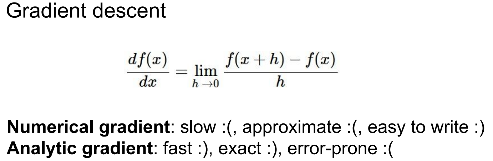
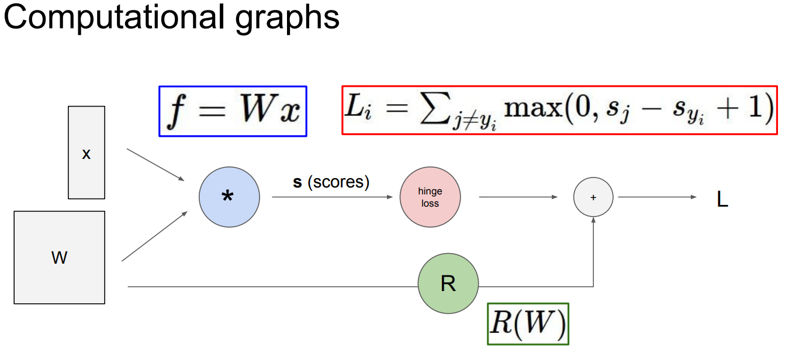
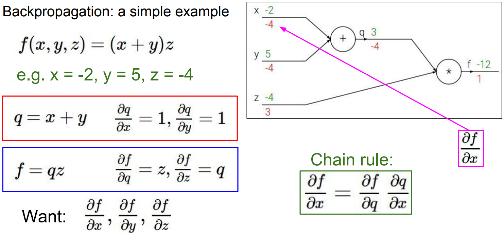
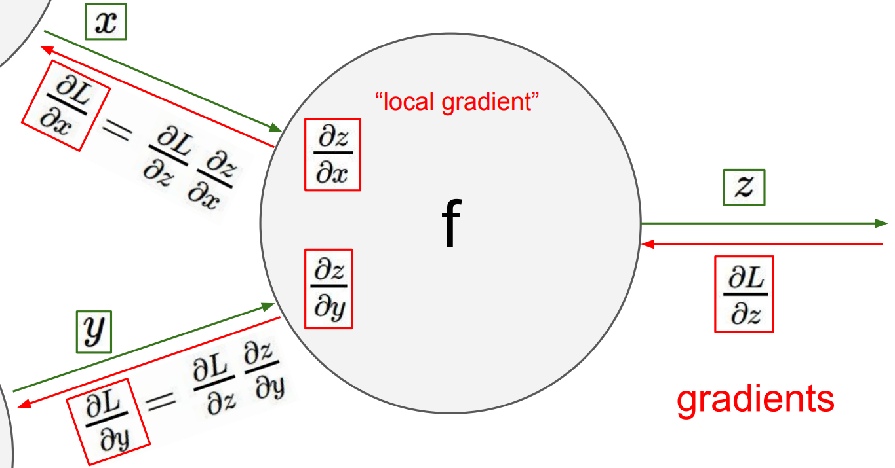
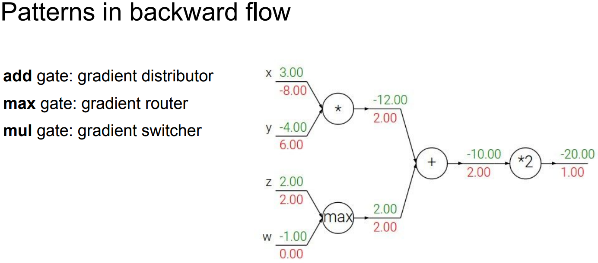
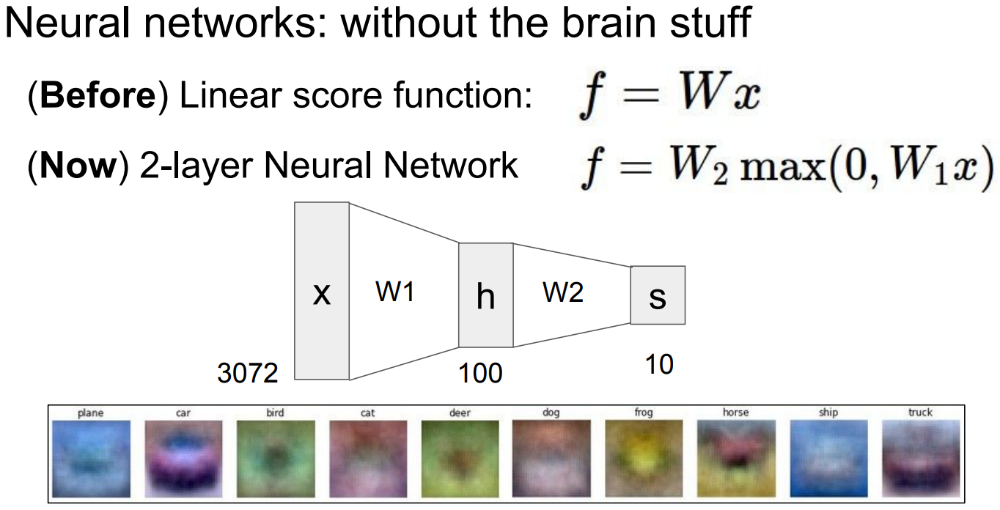
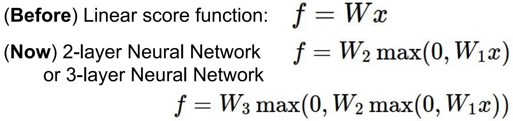
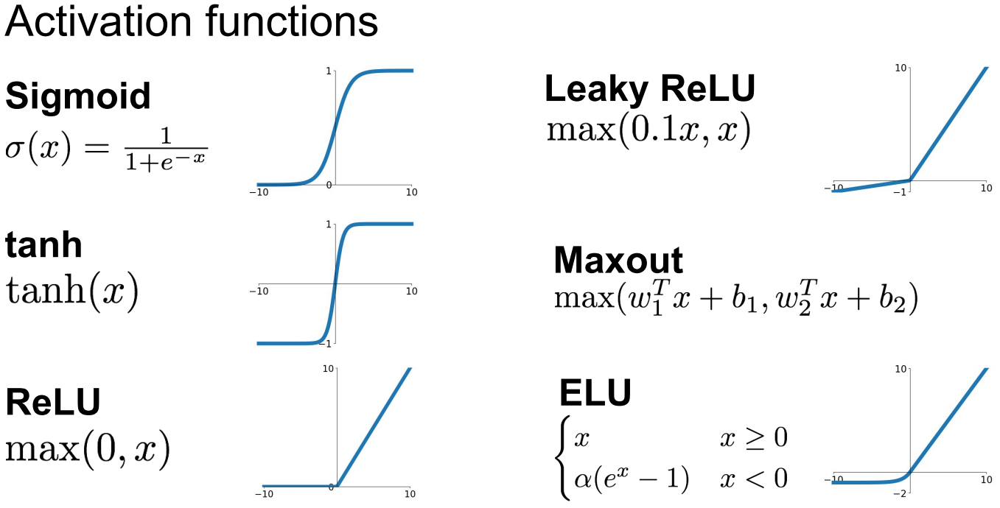
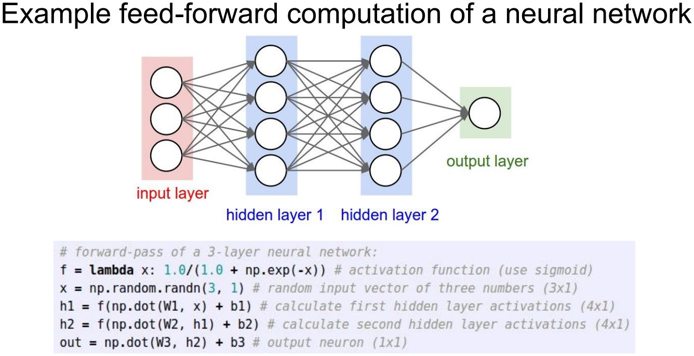

# lecture 4. Backpropagation and Neural Networks

## 1. Backpropagation



```
컴퓨터에서 활용하는 Analytic gradient는 어떻게 계산될까?
임의의 복잡한 함수에 대해 Analytic gradient가 어떻게 계산되는지 확인해보자!
```

Analytic gradient

- Computational graph



```
임의의 함수를 표현하는 그래프.

... Backpropagation 기술을 사용할 수 있게 됨.
```

- Backpropagation

```
Gradient를 얻기위해 Computational graph 내부의 모든 변수에 대해 chain rule을 재귀적으로 사용.

... 매우 복잡한 함수를 이용하여 작업할 때 아주 유용하게 사용됨.
```

- Backpropagation: a simple example



```
목표: 함수를 만드는 것

1. 함수 f를 Computational graph로 나타냄.
2. 네트워크에 우리가 가진 값(트레이닝 데이터)를 전달.
... 중간물들에 대해 변수명으로 나타냄
... q = x + y
... f = q * z
3. 입력 변수 x, y, z에 대한 f의 gradient를 각각 계산.
... backpropagation은 chain rule의 재귀적 응용 ... 뒤에서부터 gradient를 계산.

... Analytic gradient: 복잡한 미분을 Chain rule을 통하 간단한 미분으로 바꾸어 푸는 것.
```



인풋의 형태가 Scalar가 아닌 Vector라면?


```
결국에는 input의 각 element가 output에 얼마나 영향을 주는지(gradient)를 계산하게됨.
즉, input과 같은 shape의 gradient vector를 가짐.
... 유용한 디버깅 스킬!
```

Backpropagation의 직관적인 이해를 돕는 질문들



- Q1. add 게이트의 역할?

```
upstream gradient를 연결된 branch들에 정확히 같은 값으로 나눠줌.
```

- Q2. max 게이트의 역할?

```
하나에 전체가, 나머지는 0의 gradient가 전달.
```

- Q3. mul 게이트의 역할?

```
upstream gradient를 받아 다른 branch의 값으로 scaling.
```

Summary so far...

```
일반적인 신경망은 정말 크고 복잡하다.
... 모든 파라미터에 대해 gradient를 구해가는 것이 너무도 비효율적!
... 그래서 gradient를 계산하기 위해 backpropagation을 사용하게 된다!

backpropagation: computational graph에서 뒤에서 시작하여 거슬러 올라가며 chain rule을 재귀적으로 적용한 것.
... 입력, 파라미터 등 모든 중간 변수에 해당하는 gradient를 구하게 된다.

API들은 computational graph를 구현하기위해 forward() / backward() 함수를 제공한다.
... forward pass: 연산 결과를 계산하고 저장.
... backward pass: upstream gradient와 저장한 값들을 곱하여 각 input node에 대한 gradient를 구하고 이전 노드로 전달.
```

## 2. Neural Network

```
중간에 비선형 함수와 함께 선형 함수를 여러개 쌓아 계산하는 것.
즉, 함수의 집합.
```



```
다중레이어를 쌓는다면 파라미터의 갯수가 증가하고 각 클래스의 템플릿이 증가한다.
... 보다 모델을 일반화할 수 있다.

W1은 입력(사물 이미지)과 직접적으로 연결되어 있기에 해석이 가능하다.
W2는 h(사물 이미지에 대한 스코어)와 연결되어 있기에 예측할 수 없다.

비선형 함수를 한번 더 주고 층을 높여 3-레이어 신경망을 만들 수 있다.
... 3-레이어부터 심층 신경망이라는 용어를 사용한다.
```



- NN의 생물학적 영감




```
자극을 전달하는 형태를 activation function(비선형 함수)를 통해 표현.
그리고 그중 ReLU가 실제 뉴런과 가장 유사한 형태로 동작함.
```

