# lecture5. Convolutional Neural Networks

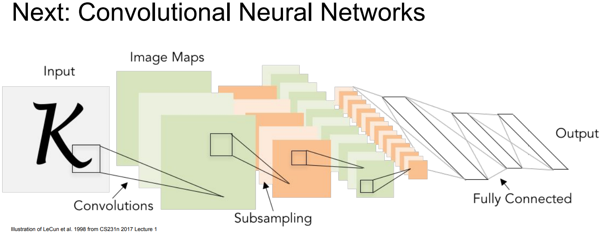

```
CNN: 기존의 NN과 같은 부류이지만 Convolutional layer를 통해 공간적 정보를 계산하는 NN.
```

## 1. Convolutional Neural Networks without the brain stuff

- Fully Connected layer

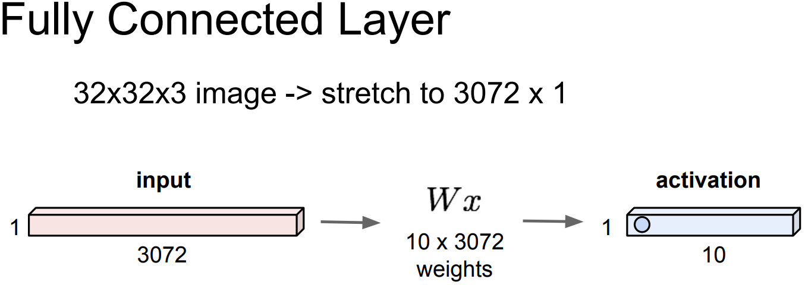

```
FC layer는 W(파라미터)를 가지고 내적 연산을 수행.
입력 32*32*3의 입력을 1*3072의 벡터로 만들어 W(10*3072)와 내적.
출력 1*10의 각 요소는 입력이 각 템플릿과 얼마나 유사한가(코사인 유사도)를 계산함. 
```

- Convolutional layer

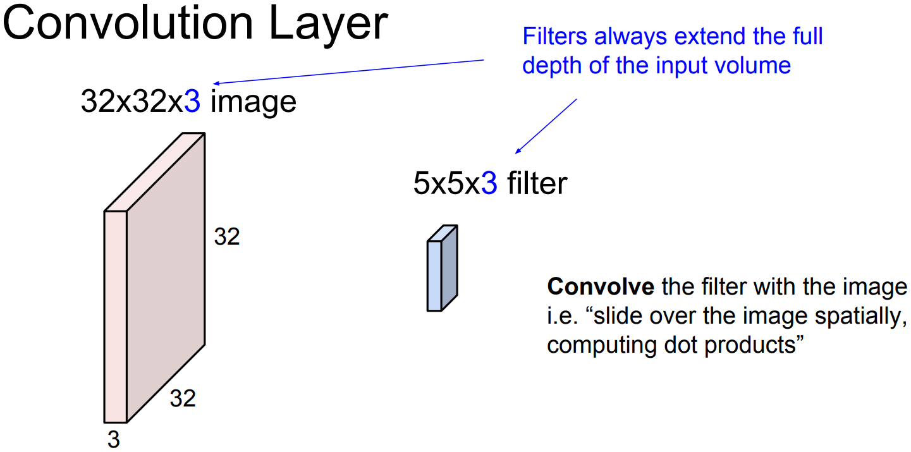
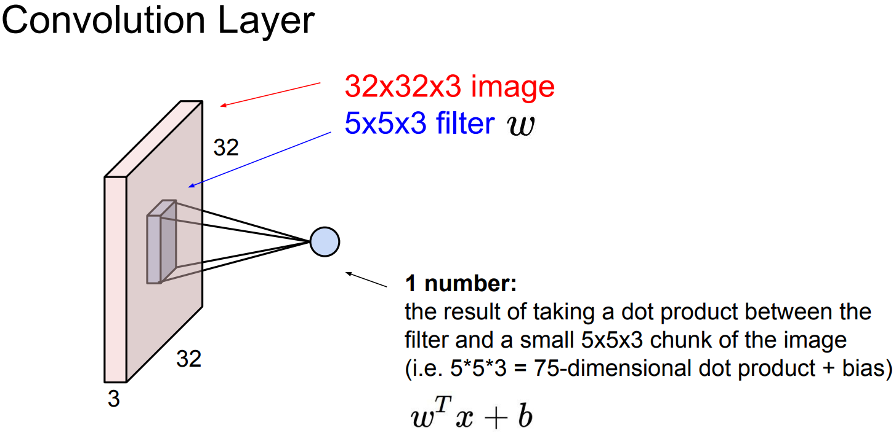

```
Convolutional layer의 FC layer와의 주된 차이점은 입력의 구조를 보존한다는 것.
... 기존 FC layer가 입력 이미지를 벡터화 했다면 Convolutional layer에서는 기존 이미지 그대로 유지.

파라미터로 filter를 가지고 이미지를 슬라이딩하면서 공간적으로 내적을 수행.
... 우선 필터는 입력의 깊이(혹은 채널 크기)만큼 확장됨.
... filter의 크기는 이미지에 비해 작지만 깊이는 전부 취하는 형태.
... 이제 fiter를 이미지의 어떤 공간에 겹쳐놓고 내적을 수행.
... 기본적으로 W^t * x + b, 즉 FC layer에 공간 정보를 포함하는 것.
... 실제 컴퓨터 연산에서는 결국 벡터화 시켜서 벡터연산을 수행, 보다 빠른 연산속도를 추구.
```

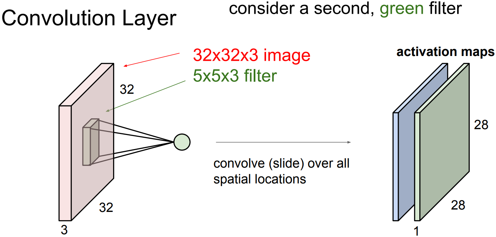

```
filter의 모든 요소를 가지고 내적을 수행하면 scalar값을 얻는다.
... 이미지 전체 공간에 대해 filter를 슬라이딩하며 내적하여 activation map을 구성한다.
... 입력 이미지와 출력 activation map의 크기가 다른 것은 수학적인 차원 계산의 결과.
... 기본적으로 어떻게 슬라이딩 할 것인지 선택 가능.

보통 Convolutional layer에서는 여러 filter를 사용.
... filter마다 다른 특징을 추출하기 위함.
... 가령 5*5*3의 filter가 6개 있다면 아래와 같이 총 6개의 activation map을 얻을 수 있고, 각각은 이미지의 다른 특징에 대한 정보를 저장.
```

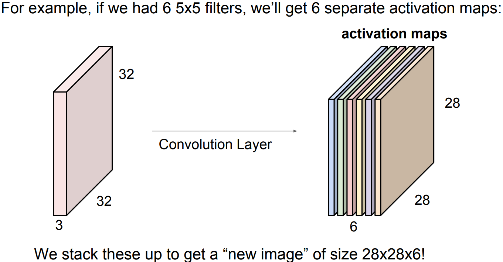

- CNN의 활용

```
단순히 Conv layer들의 연속된 형태.
... 각 layer의 출력은 다음 layer의 입력이 됨.
... 사이사이에 activation function을 사용하여 비선형성을 추가.
... Conv - ReLU의 형태.
... 가끔은 pooling layer도 들어감.
```

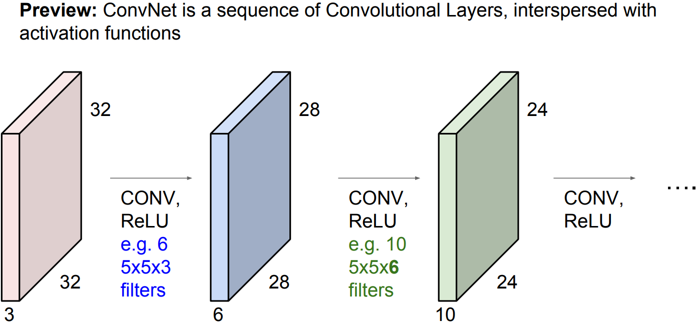

- filter(파라미터)의 계층적 학습

```
각 layer는 여러개의 filter를 가지고 각각이 다른 출력(activation map)을 만듦.
... 그러므로 여러개의 layer를 쌓으면 결국 각 filter들이 계층적으로 학습하는 것을 확인할 수 있음.
... 이는 이전 출력을 참고하여 다음 출력을 만들기 때문.

아래와 같이 점차 복잡한 feature를 학습해감.
... 그리드의 각 요소는 각 뉴런의 활성화를 최대화하는 입력의 모양을 나타냄.
... 이미지가 뉴런과 비슷하게 생겼다면 출력 값은 큰 값을 가지게 됨.
```

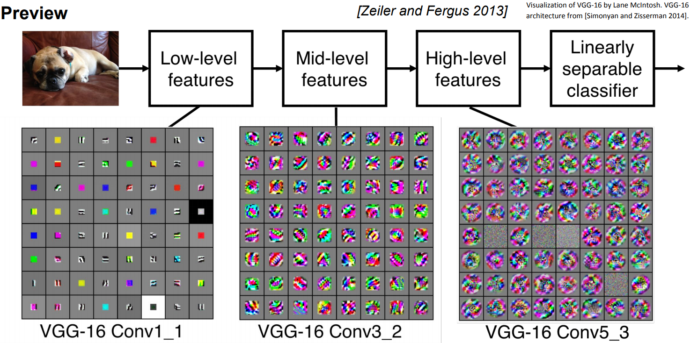

- CNN의 전체 구조

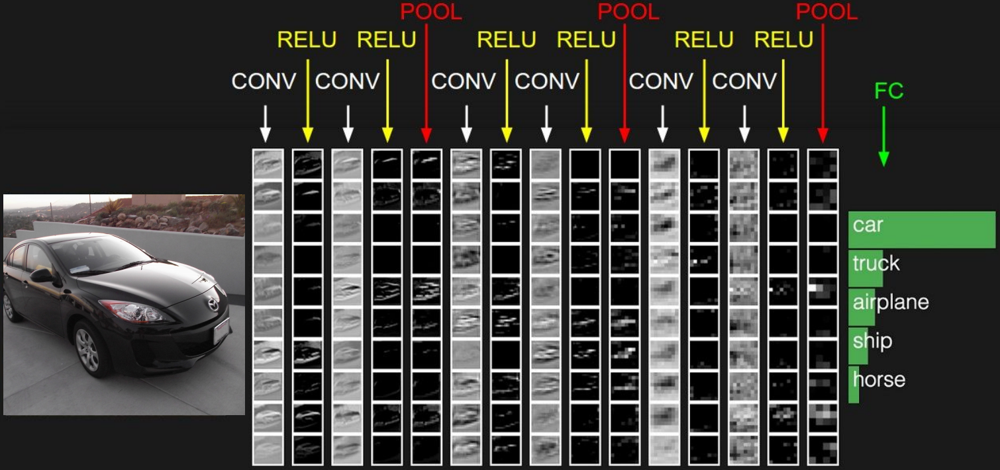

```
입력 이미지는 여러 layer를 통과하게 됨.

각 레이어는 기본적으로 Conv layer + Non-linear layer 형태.
... 일반적으로 ReLU를 가장 많이 사용.

가끔 Pooling layer도 사용.
... activation maps의 사이즈를 줄이는 역할.

CNN의 끝단에는 FC layer가 있음.
... 마지막 Conv layer 출력 모두와 연결되어 최종 스코어(유사도)를 계산하기 위해 사용.
```

- Spatial dimensions

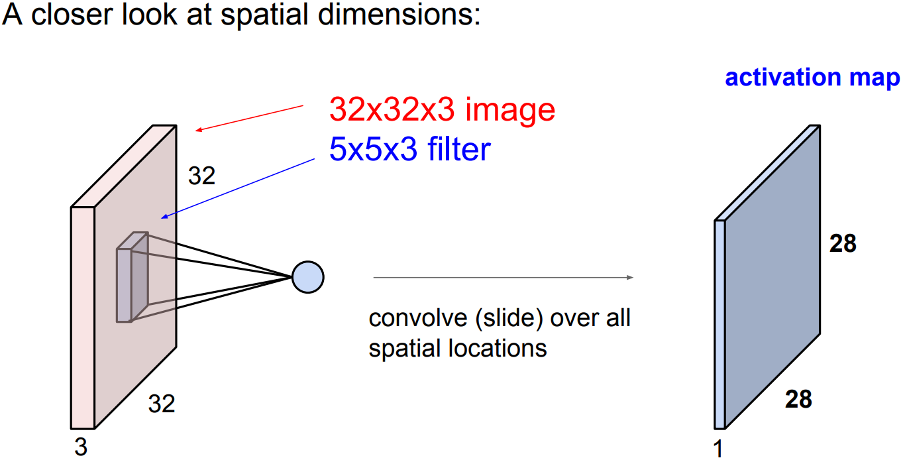

```
어떻게 32*32*3의 입력에서 28*28*1의 출력이 됐는가?

입력의 차원이 N, fiter 사이즈가 F 그리고 stride가 주어질 때, 출력의 사이즈는 (N - F)/S + 1.
... 출력이 딱 떨어지지 않을 경우 불균형한 결과를 초래함.
... 이를 이용해 fiter 크기와 stride 크기를 정할 수 있음.
```

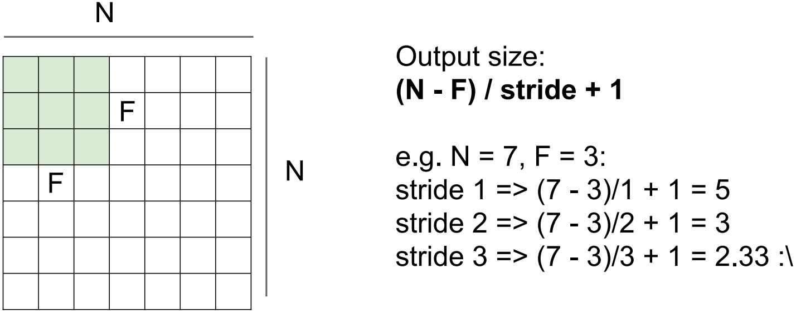

```
Padding: 원하는 사이즈의 출력을 만들기 위해 입력의 가장자리를 늘려 값을 채움.
... padding의 일반적인 목적은 layer를 거치면서 입력의 사이즈를 유지하는 것 ... 원본을 표현할 수 있는 충분한 정보를 확보하는 일.
... 가장자리에 0을 채우는 zero-padding이 일반적.
... padding을 P로 둘 때, 출력의 사이즈는 (N + 2*P - F)/S + 1.
```

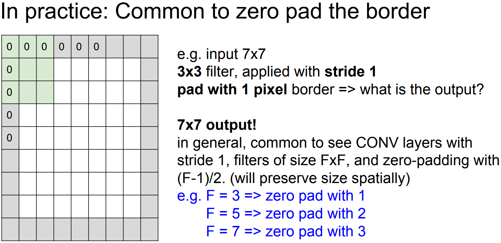

```
filter와 stride를 정하는 일반적 방법.
... filter는 보통 3*3, 5*5, 7*7를 사용.
... 각각에 stride를 1, 2, 3을 사용.
```

- Summary Conv layer

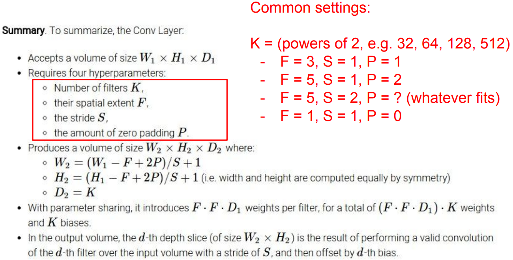

```
Conv layer를 사용하기 위해 선택해야 할 하이퍼 파라미터들.
... filter 개수.
... filter 크기.
... strider 크기.
... padding 크기.

일반적으로 사용하는 규칙이 있다.
... filter 개수: 2의 제곱수(32, 64, 128, 512, ...)
... filter/stride 크기: 3*3/1, 5*5/2.
... padding 크기: 설정에 따라 다름.
```

- 1*1 convolution

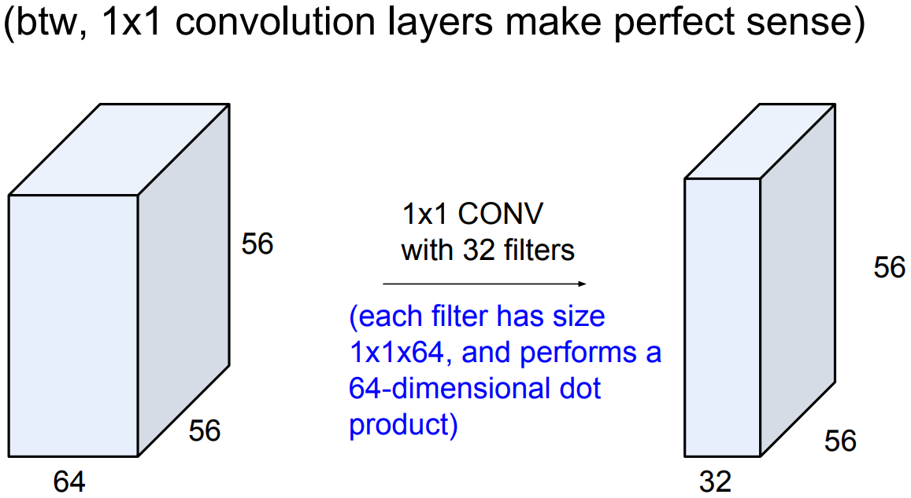

```
depth 전체에 대한 내적을 구하는 것.
```

## 2. Convolutional Neural Networks with the brain stuff

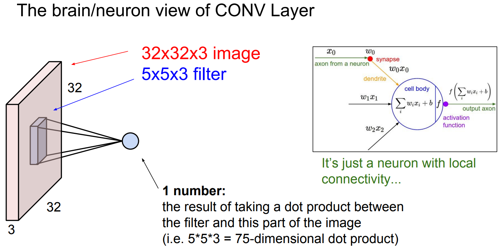

```
activation map의 각 값을 구하는 과정(FC layer)에서 뉴런과 동일한 동작을 수행.
하지만 인간의 뉴런은 Local connectivity를 가짐.
... 즉, local 정보마다 다른 filter를 적용한다는 것.
... 서로 다른 filter의 결과가 모여 이미지 정보를 처리.

용어정리.
... 5*5 filter == 5*5 receptive field
... receptive field: 뉴런이 수용할 수 있는 정보의 양.
```

### 3. CNN에 사용되는 다른 layer들

- Pooling layer

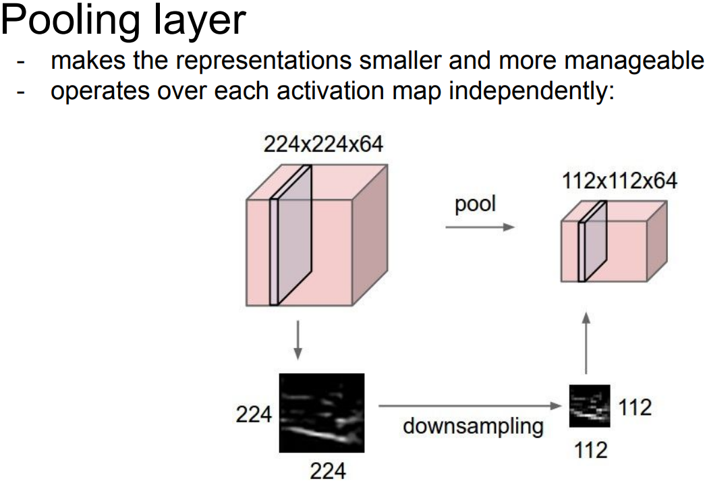

```
Pooling layer: W(파라미터)를 더 작고 관리하기 쉽게함.
... 일종의 공간적일 불변성(invaiance)도 얻을 수 있음.
... 단순히 Downsampling하는 것, 단 Depth에는 아무 짓도 하지 않음!
... 일반적으로 filter 사이즈와 stride 사이즈를 조정하여 Pooling 연산에 공간적 겹침이 없게함.
... Max Pooling이 일반적으로 사용됨.
```

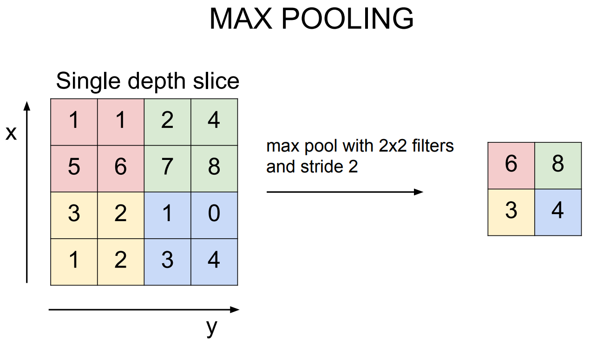

```
왜 Max pooling이 Avg pooling보다 좋은가?
... 다루는 값은 filter(뉴런)의 각 위치에서 활성된 정도.
... Max pooling은 그 지역에서 얼마나 filter(뉴런)이 활성화 되었는지 알려줌.

Pooling과 Conv의 stride는 Downsampling이란 관점에서 매 한가지 아닌가?
... Downsampling을 위해 pooling 보단 stride를 하는 추세.
... stride가 보다 나은 성능을 보이고 있음.
```

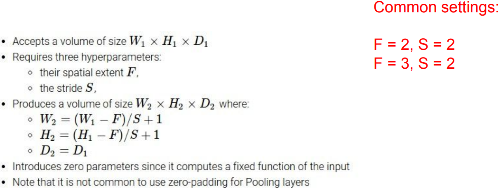

```
Pooling layer를 사용하기 위해 선택해야 할 하이퍼 파라미터들.
... 입력의 W*H*D를 통해 pooling filter 크기 선택.
... filter 크기에 맞춰 stride를 선택.
... 마찬가지로 (W - F)/S + 1의 출력크기를 가짐.

Pooling은 Downsampling을 위한 연산.
... Padding을 고려할 필요가 없다.

일반적인 설정.
... F = 2, S = 2 ... 보다 일반적.
... F = 3, S = 2
```

- Fully Connected layer(FC layer)

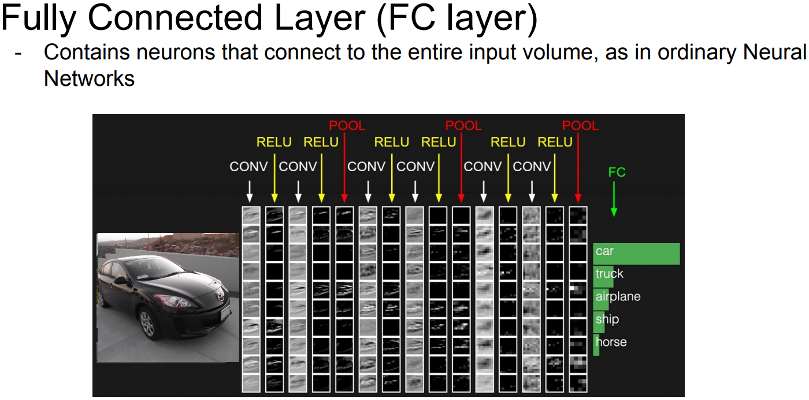

```
CNN의 마지막 layer.

이전 Conv layer 출력을 벡터화하여 입력으로 사용.
... 공간적인 정보를 신경쓰지 않아도 됨.
... 전부 통합하여 최종적인 추론을 수행.
... 추론 결과로 score를 출력.

각 열의 값들은 필터의 템플릿이 얼마나 활성화 되었는가를 나타냄.
... 각 Conv입럭은 이전 layer의 activation map ... 이전 추론으로 더 고차원의 정보를 추론해 감.
... 첫번째 열은 각 자리의 edges들이 얼마나 존재하는가를 의미.
... 두번째 열은 (edge보다 복잡한) corner 같은 것이 얼마나 존재하는가를 의미.
```