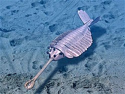
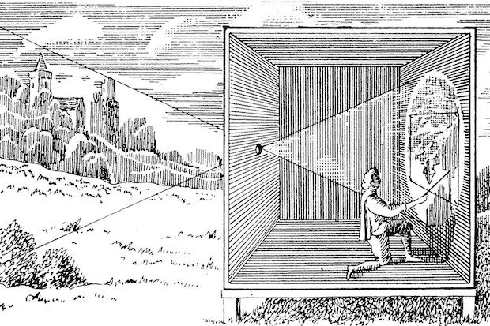
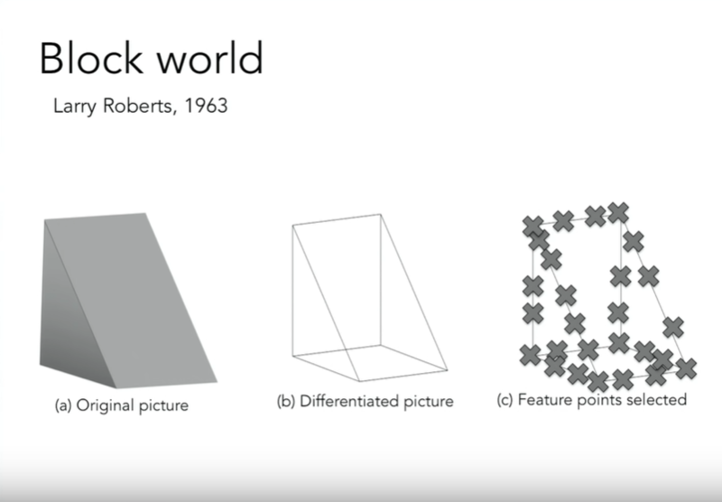
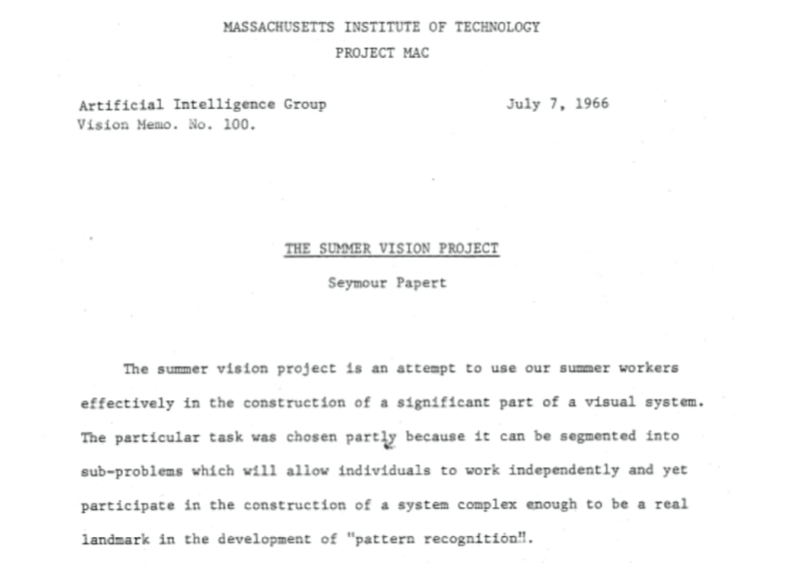
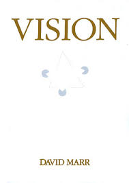
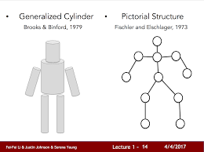
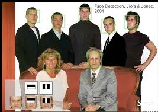
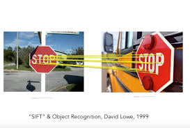
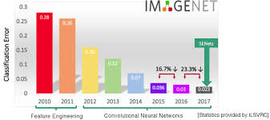

# lecture1. Introduction to Convolutional Nueral Net

## 학습목표
1. 컴퓨터 비전의 역사
2. CS231n 강의 개요

## 컴퓨터비전은 왜 중요한가?
1. 쏟아지는 시각데이터
>- 휴대폰의 카메라와 같은 센서들이 전 세계 각지에서 매일 데이터를 쏟아내고 있음.
>- CISCO의 통계(2015~2017)에 따르면 인터넷 트래픽 중 80%가 비디오 데이터.
>>- 시각 데이터들을 잘 활용할 수 있는 알고리즘 개발이 무엇보다 중요해짐.

2. 시각데이터 해석의 어려움.
>- 시각데이터를 암흑물질(darkmatter)라고도 부름.
>>- 암흑물질? : 우주 대부분의 질량을 차지하고 있는 물질, 간접적인 측정으로 존재는 확인할 수 있지만 관측이 불가함.
>>- 시각데이터 또한 데이터의 대부분을 차지하지만, 사실상 이들을 이해하고 해석하기가 상당히 어렵다.
>- 유튜브에 따르면 매초 5시간만큼으 영상이 업로드됨.
>>- 구글 직원이 아무리 많아도 이것을 직접보고 이해하고 정리한다는 것은 불가능하다.
>>- 비디오를 잘 정리해 유저들에게 제공하고 적절한 광고를 게시하려면 컴퓨터비전 알고리즘 개발이 관건.

## 컴퓨터비전의 역사
1. 생물학적 비전의 역사: 진화의 빅뱅

>- 생물의 종 수가 천만 년 사이에 폭발적으로 증가: 캄브리아기 대폭발
>>- 앤드류 파커(Andrew Parker)의 이론
>>>- 약 5억 4천만 년 전 최초의 눈(eyes)가 발생.
>>>- 볼 수 있음으로 보다 능동적인 삶을 가지게 됨.
>- 현재 비전은 모든 동물, 특히 지능을 가진 동물들의 가장 큰 감각체계로 발전.

2. 공학적 비전의 역사: 카메라
>- 초창기의 카메라: 1600년대 르네상스 시대의 카메라 Obscura

>>- 핀홀 카메라 이론에 기반
>>- 생물학적으로 발전한 초기 눈과 상당히 유사.
>>>- 빛을 모아주는 구멍이 하나.
>>>- 카메라 뒤편의 평평한 면은 정보를 모음.
>- 현재 카메라는 가장 보편적이고 강력한 센서.

3. 모든 비전 연구에 영감을 준 연구: 1950/60년대 전기생리학을 이용한 Hubel과 Wiesel의 연구

>- 연구 목표: 포유류의 시각적 처리 메커니즘은 무엇일까?
>- 고양이 뇌의 일차 시각 피질에 전극을 꽂아 일차 시각 피질 뉴런이 반응하는 자극을 확인
>- 주된 발견: 시각 처리가 처음에는 단순한 구조로 시작, 그 정보가 통로를 거치면서 점점 복잡해지며 실제 세상을 재대로 인지하게 됨.

4. 컴퓨터 비전의 역사
>- 1960s: 컴퓨터 비전의 태동, Block World

>>- 연구 목표: 기하학적으로 단순화한 사물들을 인식하고 그 모양을 재구성하는 일.

>- 1966: MIT 여름 프로젝트, The Summer Vision Project

>>- 연구 목표: 시각 시스템의 전반을 구현하기 위해 프로젝트 참가자들을 효율적으로 이용하는 것.
>>>- 1966년 여름 안에 대부분의 시각 체계를 구현하려는 야심찬 목표
>>- 그 후로 50여 년, 아직도 비전의 가장 근본적인 문제들을 전세계가 연구하고 있음.
>>>- 컴퓨터 비전은 아직 숙제가 많지만, AI 분야에서 가장 중요하고 빠르게 성장하는 분야 중 하나.

>- 1970s: 컴퓨터 비전의 많은 발전
>>- David Marr의 VISION

>>>- 비전의 정의, 발전방향, 알고리즘 개발 방향을 다룬 책

>>- Generalized Cylinder, Brooks & Binford(1979
>>- Pictorial Structure, Finschler & Elschlager(1973)

>>>- 기본개념: 모든 객체는 단순한 기하학적 형태로 표현할 수 있다.

>- 1980s: 단순한 구조로 실제 세계를 재구성/인식할 수 있을지 고민
>>- Divid Lowe, 선과 경계, 그리고 직선의 조합으로 물체를 표현

>- 1990s: 객체인식이 어렵다면 객체 분할(segmentation)이 우선이 아니었을까?
>>- 객체분할?: 이미지의 각 픽셀을 의미있는 방향으로 군집화하는 방법.
>>>- 군집화하더라도 사람을 정확히 인식할 수 없을지 모르지만 적어도 배경과 사람을 가려낼 수는 있었음.

>>>- 영상분할 문제 해결을 위해 그래프 이론을 도입.

>- 2000s: 컴퓨터비전에서 유난히 발전 속도가 빨랐던 분야, 얼굴인식
>>- 1999/2000년대 ML, 특히 통계적 기계학습이 탄력을 얻기 시작함.
>>>- SVM, Boosting, Graphcial models, Neural Network등이 있음.
>>- 얼굴인식에 가장 큰 기여를 한 연구: AdaBoost를 이용한 실시간 얼굴인식(Viola & Jones, 2001)
>>>- 컴퓨터가 엄청 느렸던 2001년에 실시간 얼굴인식을 성공시킨 엄청난 성과.

>>>- 5년 후에 Fujifilm은 실시간 얼굴인식을 지원하느 최초의 디지털카메라를 선보임.
>>>- 이는 기초 과학 연구 성과를 실제 응용 제품에 가장 빠르게 전달한 사례.

>- 2010s: 90년대 후반부터 시대를 풍미한 알고리즘, 특징기반 객체 인식 알고리즘
>>- David Lowe의 SIFT feature

>>>- 객체의 특징 중 일부는 다양한 변화에 강인하고 불변하다는 것을 발견.
>>>- 객체에서 중요한 특징을 찾아내고 다른 객체에 매칭하여 객체를 인식할 수 있음. 전체 이미지를 매칭하는 것보다 훨씬 쉬운 일.

>>- 이미지에 존재하는 특징을 사용하게 되면서 컴퓨터비전은 한단계 도약해 전체 장면을 인식하게됨.
>>- Spatial Pyramid Matching
>>>- 아이디어: 우리가 특징들을 잘 뽑아낼 수만 있다면, 그 특징들이 단서를 제공해 줄 것이다.

>>- 마찬가지로 사람 인식에도 큰 영향을 줌.
>>- Histogram Of Gradients
>>- Deformable Part Models

>- 2012: ImageNet Challenge 우승 알고리즘, CNN 모델

>>- 대회 첫 2년, 25%에 머물던 오류율을 16%로 약 10%가량 떻어트림.
>>- 이번 강의의 주제.
>>>- CNN이 무엇인지
>>>- 적용되는 법칙
>>>- 선례
>>>- 최근 동향

## CS231n 강의 개요
1. Image Classification
>- 문제 정의: 입력 이미지에 대해 몇 개로 고정된 카테고리 안에서 정답을 하나 고르는 일.

2. Object Detection & Image Captioning
>- image classification 기반하에 일궈진 것들.
>- Object Detection 문제 정의: Image Classification + 물체의 위치 추정하는 일.
>- Image Captioning 문제 정의: 입력 이미지에 대해 이미지를 묘사하는 적절한 문장을 생성하는 일.

3. CNN, convnet
>- 2012년에 CNN의 시대가 도래, 이후 CNN을 개선하고 튜닝하는 시도들이 이루어지는 중.
>- 단, 2012년에 CNN이 처음 만들어진 것은 아님
>>- 1998년, CNN 기초연구 Jan LeCun & Bell Labs 공동과제
>>- 자필 수표 자동 판독과 우편주소 자동인식에 CNN을 적용.
>>- 이미지 입력에 대해 숫자와 문자를 인식하는 CNN을 만듦.

>- 오래된 CNN인데, 왜 이제서야 유명해졌을까?
>>- 컴퓨터 하드웨어: CPU, GPU 발전(강력한 병렬처리로 계산 집약적인 CNN 모델을 고속처리)
>>- 데이터: 대용량 고품질의 데이터셋(PASCAL, Imagenet)을 얻을 수 있음.

4. 사람처럼 볼 수 있는 기계
>- 이미지 내용을 아주 풍푸하고 깊게 이해하는 일.
>- 컴퓨터 비전 분야가 진정으로 추구하는 방향.
